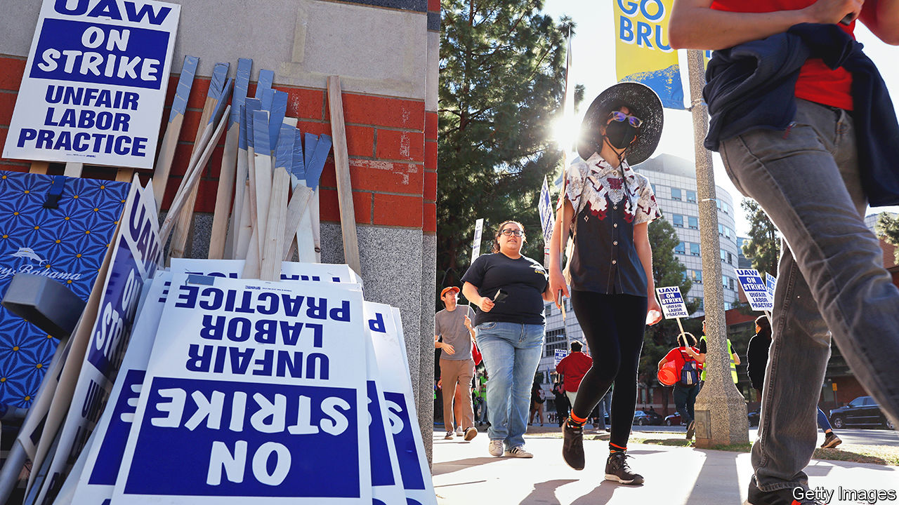

###### Picket lines and poké

# America’s unions are gentrifying 

##### Will that reverse their decline? 

 

> Dec 14th 2022 

The weather in Los Angeles on December 1st was unusually dull, with rain drizzling down and a chill in the air. This perhaps helped to explain the relatively low energy of the picketers on strike at UCLA’s campus. Instead of listening to rousing speeches, graduate students milled around, chatting to one another. In the centre of the crowd organisers had set up a projector screen showing a video conference, which almost nobody was watching. And yet the strikers are clear about what they want. “People work 60-80 hours a week, you know, in total,” said Sammy Feldblum, a geography PhD student among the picketers. “And all we’re asking for is that we should be able to live in an apartment…reasonably close to the university. We’re not asking for anything crazy.”

The strike, which covers the entire University of California system, started on November 14th and has involved roughly 48,000 workers, mostly graduate students (who teach), teaching assistants and other non-tenured researchers. Tens of thousands of undergraduates have been left untaught. On December 9th, around 12,000 of the strikers agreed to go back to work, after accepting a tentative agreement in late November. But 36,000 are still out. It is the largest single labour action to take place in America in years. But it is also an indicator of how  in America. Unions used to be associated with brawny middle-aged men standing outside factories. These days, the most active trade unions in America represent workers who have degrees and wear white collars (literally, in the case of university lab workers). As unions have evolved, their strategies have shifted too—and they hope to reverse decades of declining union power.

Across America, membership of trade unions has never been lower—at least as long as statistics have been kept. In 1983, according to data from the Bureau of Labour Statistics, roughly a fifth of all workers belonged to a union; by last year, the figure had dropped to just 11.6%. That however conceals great variation within industries. In factories, unionisation has plummeted—just under 8% of manufacturing workers now belong to one, down from almost twice that proportion in 2000. In sectors such as education, however, where almost a third of workers are unionised, the share has stayed fairly stable. And in a few sectors, such as the making of TV and movies, unionisation rates have actually climbed. Thanks to that, the decline in union membership has slowed recently; some hope it may soon go into reverse.

Nowadays, 46% of union members have a bachelor’s degree—against a figure of just 38% for the public in general. Women workers are slightly more likely to be unionised than men, and almost 40% of union workers are not white. According to Ileen Devault, a historian of labour unions at Cornell University, many of the most visible union organisers these days are young college graduates often working in jobs that may have white-collar social prestige, but do not necessarily come with white-collar wages or conditions. Unionisation has also spiked in sectors such as the media, or charities. Recent strikes have involved journalists at the and several other newspapers, as well as workers at Activision Blizzard, a video-games developer. Often these strikes are as much about winning publicity and shaming a company as they are about imposing immediate economic losses.

In fact, that may explain why overall, though there are lots of strikes at the moment, they barely show up in official data. The BLS measures only strikes involving more than 1,000 members, but on that measure the number of working days lost to labour action in America has barely budged in recent years, and is far lower than it was even 20 years ago. Yet on other measures, unions look more active than they have done for ages. In the latest fiscal year, petitions for unionisation recorded by the National Labour Relations Board, a federal agency which regulates unions, increased by 53% over the previous year. The win rate for forming new unions is the highest it has been in a decade. And more workers are winning reinstatement for being illegally fired than in years. According to the firm in Illinois that makes them, sales of Scabby the Rat, a balloon often sported at labour protests and strikes, are as healthy as they have ever been.

Unions are also having more success politically. Polling by Gallup shows support for trade unions is the highest it has been since the 1960s, when many more Americans were members. Democrats increasingly argue that the decline of trade unions in America has boosted inequality—and want to reverse it. “The middle class built America and unions built the middle class,” said Joe Biden on December 9th, just a few days after being criticised for supporting a new law passed by Congress to stop railway workers from going on strike. That was a setback for the reputation of a president who Steven Greenhouse, a fellow at the Century Foundation, a leftish think-tank, says is nonetheless the most pro-union president since Franklin Roosevelt. With their narrow margin in Congress, Democrats have struggled to pass Mr Biden’s most ambitious pro-union laws. But that conceals some quieter political successes. 

For example, under Mr Biden’s Inflation Reduction Act, subsidies for green-energy projects are higher for contractors who use “registered” workers and pay higher union-set wages. Those sorts of subtle incentives may help to explain why General Motors did not make an effort to stop the unionisation of a battery plant in Ohio on December 9th. At state and local levels, at least in Democratic states, unions have had even more success. In New York City, the construction of new hotels has all but ceased thanks to a law which, in effect, makes it impossible to build one without promising to use unionised labour. In California, new laws to make it easier to turn commercial property into housing passed with union support—and developers will have to pay hefty union wages to benefit. Minimum wages of $15 have proliferated, with roughly a dozen states and dozens of cities moving towards that level.

In November public-sector unions in Illinois pushed through a constitutional amendment that bans the state legislature from imposing a “right-to-work” law (under which workers cannot be forced to pay dues to a union even if they are covered by its contract). This also gives public-sector unions the right to negotiate with state and local government employers over very broad terms of “economic welfare”, and the contracts can supersede state law. Mailee Smith of the Illinois Policy Institute, a think-tank generally hostile to unions, says she fears left-leaning unions will use it to negotiate public policy in their contracts, bypassing legislatures. That may be overdone; yet it is clear that union leaders are delighted.

Will this be enough to turn unions round? The new laws mostly benefit long-standing unions; members in newly-unionising sectors may struggle to win benefits. Starbucks offers an example. Over the past year, hundreds of its stores have unionised. On December 9th, workers in Chicago rallied downtown with a drag performer and a Scabby to celebrate their efforts. Melissa Lee-Litowitz, who works at a Starbucks in Glenview, a suburb, says that persuading her co-workers to unionise was fairly easy. As covid-19 eased off and demand soared, their jobs had become far more stressful. But forming a union does not force the firm to negotiate with it. Starbucks has instead fairly ruthlessly pushed back—closing stores that have unions, and extending new benefits to workers at non-union stores. “We know we’re not going to get a contract overnight,” says Ms Lee-Litowitz. The main benefit for now is “joining a network of solidarity”, she says.

Yet according to Ms Devault, “it’s a time that’s really right for the growth of unions”. Labour shortages, supportive politicians and businesses that are worried about the bad publicity of union-busting all make a strong case for unionisation. Perhaps the biggest question is, what happens if they succeed? As popular as trade unions are right now, that might reflect the fact that, unlike in much of Europe, they are not yet disrupting the lives of most Americans. In Britain polling by YouGov showed support for trade unions dropping sharply earlier this year, after a  that disrupted trains and airports. It is hardly likely to improve with the current wave. When Democrats stop railway workers striking, it suggests they fear a similar effect. America’s new unions have a long way to go before they can cause such disruption—unless, that is, you are an undergraduate at UCLA.■


