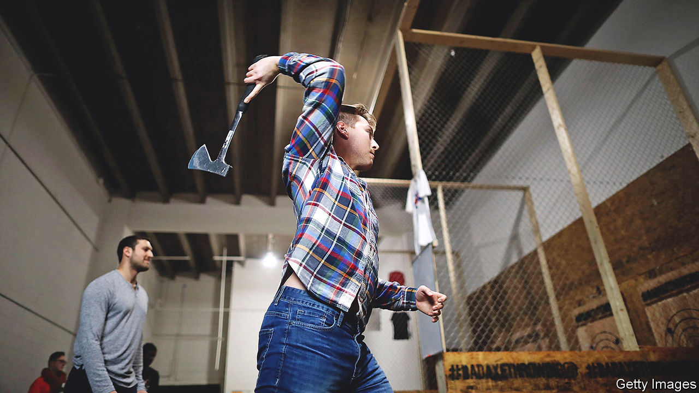

###### Chop chop

# Axe-throwing may be the friendliest new sport in America 

##### It is a particular boon to lonesome men who look like Vikings 

 

> Dec 15th 2022 

About 7,000 miles from the other World Cup, an army of supporters and athletes, most of them bearded, descended on Appleton, Wisconsin, earlier this month armed with axes. Unlike the football equivalent, no allegations of irregularities were made regarding the choice of site for the World Axe Throwing Championship. Also, in contrast to Qatar, alcohol is encouraged. “One or two beers is perfect to calm the nerves,” advises one athlete, “though when you see two bulls’ eyes you know you’ve gone too far.”

Axe-throwing is best known as a fun bar activity for bachelor parties and teambuilding get-togethers. “Divorce and break-up parties are definitely growing,” says Steven Greene, who runs a venue in a mall in upstate New York. “You put a picture of the ex up and just let them loose.” (Most such bookings are by women.) It is also a popular first date, apparently.

Revenue across the industry is about $215m a year and growing, estimates Mario Zelaya, of the World Axe Throwing League (WATL), America’s largest. Recreational axe-throwing—now taking place in around 600 venues across the country—brings in most of the cash. But the heart of the game is competitive throwing. Through WATL alone, over 20,000 throwers gather weekly at 324 “axe houses”, up from a few hundred at 16 venues in 2017.

At the World Championship, guys obsess about elbow positioning, foot stance, grip, and the benefits of cottonwood over poplar. Most do not take themselves too seriously. “It’s a chance to have a lot of fun, especially when you get to play with your son,” says Jason Norris, a white-bearded man with twinkling Santa eyes from South Carolina, as the loudspeaker in “Butcher Hall’‘ announces “The Ginger Assassins versus the Axecutioners, lane three.” 

Sportsmanship and respect are carved into the game. Opponents tap axes before each round. Strict rules restrain player and audience behaviour. In the semifinals, with thousands of dollars on the line, the defending champion at one tense point called for a “second” (a second judgment) because he thought the judge had awarded him too generous a score (he had). The crowd went wild.

Leagues have been a lifeline to many. “I get to throw sharp stuff into wood and drink beer with friends, what’s not to like?” says Dean Cooper, a retired police officer from Texas who says the sport has helped him cope with his post-traumatic stress disorder and anxiety. When he needed an expensive pacemaker, the axe-throwing community pulled together to organise a charity event. “They literally saved his life,” says his wife. A foundation, “Throwing it Forward”, raises funds for struggling members who need help.

Mr Zelaya is determined to foster the sport internationally and eventually make it Olympic. But he is proudest of the difference leagues have made to throwers’ lives. During covid many built targets in their garages or gardens; there was even a virtual league (“QATL”) to ensure that they remained connected. “It’s been such a good stress-release for him,” says Tammy Cox, from North Carolina, about her husband Brian’s newfound hobby. It has made him new friends, too. 

Male bonding is clearly a big part of the appeal. Throughout the tournament there are bear hugs. T-shirts offer “free hugs”, and one of the award winners is recognised for being “an especially good hugger”. As he puts his arm around a fellow thrower, Jason Kearney, from Got Wood Axe Throwing, in Oklahoma, says “You don’t just make friends here, you make brothers.” Ray Dales, from north Georgia, says it reminds him of the camaraderie of being in the army. Mr Zelaya has recently noticed an increase in veterans.

This is particularly good news for American men, who have seen a sharp decline in friendship groups. Those involved in organised community activities, such as bowling leagues or religious groups, weather adversity—such as unemployment—better. And regularly taking part in social activities can reduce cognitive decline by nearly half and increase life expectancy. Men, it seems, are more likely to form friendships while doing an activity together, whereas women are more likely to do so “face to face”. Axe-throwing “duals” show this male tendency in practice. “It’s just been the best thing ever to spend time by my dad’s side like this,” says Karson Norris, one of several father-son duos.

Not everyone in the sport looks like a Viking, and the sport’s governing body is focused on increasing membership among women, ethnic minorities and children. About one in ten of the 477 participants at the World Championship were female and two participants were 14. There is no upper age limit; the youngest league member is eight and the oldest 79. The handbook includes guidelines on throwing from a wheelchair; several clubs run leagues for people with learning disabilities. “We have everything from microbiologists to exhibitionists,” says Brandon Johnson from Texas. “Everyone is welcome.” ■


