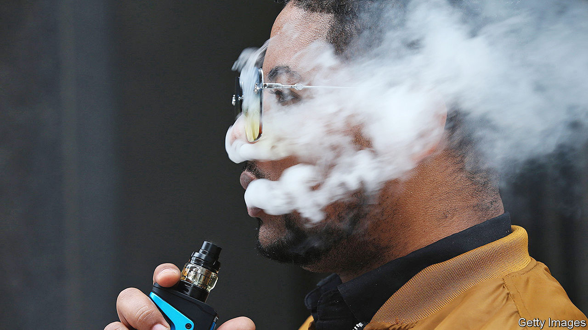

###### Smoke and mirrors

# E-cigarette taxes may reduce teenage drink-driving deaths 

##### But anti-vaping policies could also have unintended consequences 

 

> Dec 15th 2022 

E-cigarettes, also known as vapes and by brand names such as Juul, are battery-operated devices that allow users to inhale nicotine without lighting a cigarette. They were introduced to America in 2006. According to the Food and Drug Administration (FDA), more than 2m high-school pupils (about 14%) reported using e-cigarettes in 2022. The fda and others are trying to work out how to regulate them. The result may be a textbook example of unintended consequences.

Though e-cigarettes are much less harmful than traditional cigarettes, their effect on health can still be serious. Vaping has been associated with a higher risk of asthma and chronic obstructive pulmonary disease. E-cigarette exposure may be particularly harmful for young adults—there are fears that it can harm brain development and trigger a lifelong addiction to nicotine. Thirty states tax e-cigarettes and all states ban sales to minors.

One way to cut e-cigarette consumption is by imposing a tax. A study by the Centre for Health Economics &amp; Policy Studies at San Diego State University found that a $1 increase in e-cigarette taxes is associated with a 14-26% decrease in vaping among high-school pupils. Unexpectedly, the tax increase seems also to temper teenage alcohol consumption. One in ten teenagers reported binge drinking (four or more drinks for women, or five or more drinks for men, within a few hours at least once in the previous month). According to the study, a $1 increase in e-cigarette taxes is associated with a 10-11% reduction in teenage binge drinking.

Drinking and driving is especially deadly for young people. Young adults (aged 16-20) who drink and drive are 17 times more likely to die in a car accident. The study found that increasing e-cigarette taxes reduces this, too. A $1 rise in e-cigarette taxes brings a 10-14% decline in the number of alcohol-related traffic deaths per 100,000 among 16-to-20-year-olds.

Smoking and drinking tend to go together. Teenagers who drink are twice as likely as others to light up. One study found that raising the drinking age from 18 to 21 in America reduced smoking among the affected age group. It works in reverse, too. Raising taxes on cigarettes has been found to taper teenage drinking. So surely lawmakers should rush to implement an e-cigarette tax? The answer is not so simple.

Many smokers use e-cigarettes to reduce harm from their habit. Some also use e-cigarettes to quit traditional cigarettes. A review of 78 studies mostly from America, Britain and Italy found that people are more likely to stop smoking for at least six months when using nicotine e-cigarettes compared with other methods. England’s National Health Service (NHS) encourages e-cigarette use for quitting smoking. A tax increase on e-cigarettes, or an outright ban, could encourage smokers to switch to traditional cigarettes. A separate American study found that a $1 increase in e-cigarette taxes reduced daily vaping but increased cigarette smoking in young adults.

A good e-cigarette policy would discourage young adults while encouraging cigarette smokers to use them for quitting. Requiring a prescription for e-cigarettes could help. The NHS announced in October 2021 that it may do just that. But Catherine Maclean, one of the San Francisco study’s authors, warns that this could also have unintended consequences in America. Requiring a prescription could push e-cigarette users and young adults towards regular cigarettes or illicit vaping products.

Limiting e-cigarettes could also spur drug use. Raising the drinking age in the 1980s slightly increased marijuana smoking among young people. Raising the price of vaping could do the same, especially in states that have legalised the drug.

Ms Maclean recommends stacking taxes so that the more harmful products are taxed at a higher rate than their less harmful substitutes. Young people tend to be cash-strapped, so even a small tax increase could deter use. Tighter regulation is also a possible answer—Britain and the European Union regulate the amount of nicotine in e-cigarettes. “Policymakers need to think beyond a targeted outcome and think more broadly,” says Ms Maclean. ■


