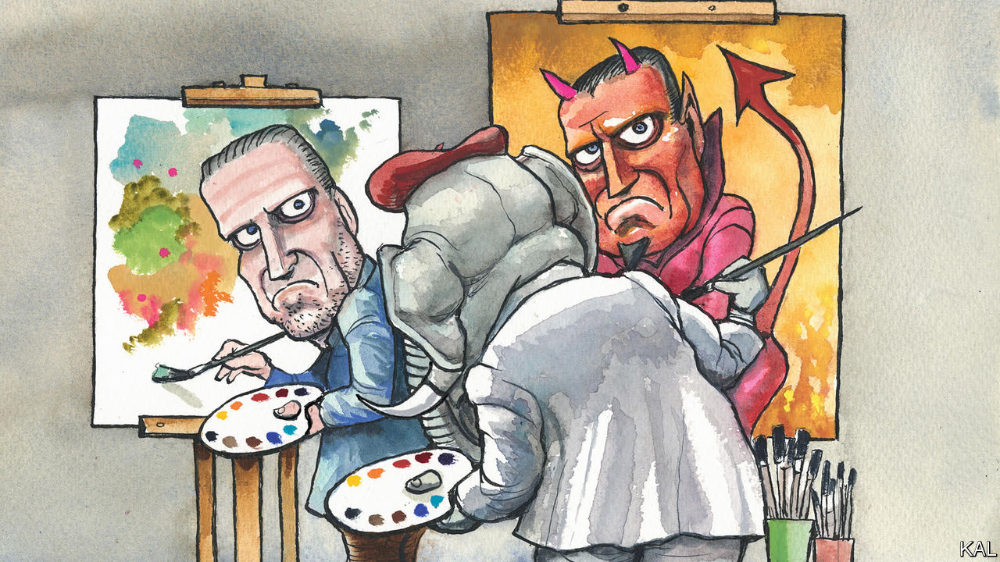

###### Lexington

# Republicans should leave Hunter Biden to his painting, and the Justice Department 

##### When it comes to presidential families, Americans have hard-earned empathy 

 

> Dec 15th 2022 

Every presidential family is unhappy in its own way. But never have the emanations and consequences of that unhappiness—and the question of which is which—been so concentrated in one person as they are in Joe Biden’s son Hunter: The bereavement of the Lincolns, the dealmaking of Jimmy Roosevelt, the addictions of Betty Ford, the renditions of “Mustang Sally” by Roger Clinton, the nepotistic climbing of the Trump offspring—Hunter Biden offers his own searing versions of all of these. 

And never has such unhappiness been so pointillistically exposed. More than 200 gigabytes of data containing Mr Biden’s texts, photos, videos and financial records fell into the hands of his father’s political opponents just before the 2020 election. In addition to such innocent if intimate fare as pictures of his children and of his dying brother, the trove included images of Hunter Biden smoking crack and having sex, and emails in which he did business with Chinese and Ukrainian firms. 

Yet this drama has been surprisingly easy to ignore, particularly if your politics and media habits lean left or you are the sort of gentle soul who prefers not to ogle train wrecks. That is about to change. Once Republicans take control of the House next month and start their promised investigations, you will be hearing the name Hunter Biden often. This is a good moment to brush up on some details, to consider the reasons it has been possible to evade them, and to ask, when it comes to a president’s relatives, what should really matter.

Family success and tragedy placed Hunter Biden in the public eye from infancy. His earliest memory, he has written, dates to 1972, when he woke up in the hospital beside his elder brother Beau, who was saying to him over and over: “I love you.” The boys had been gravely injured when a truck hit their car as their mother, Neilia, was driving them and their baby sister, Naomi, to buy a Christmas tree. Their mother and sister were dead. Joe Biden, just elected to the Senate, was sworn in at his sons’ bedside. 

While Beau would grow up to be the family’s nonpareil, Hunter—his mother’s maiden name—was in and out of trouble, drinking too much from an early age. After graduating from Yale Law School he eventually chose to be a lobbyist, a trade in which his name, nauseatingly and it may yet prove illegally, helped him make millions. After Beau died in 2015 of a brain tumour, Hunter’s life unravelled. In the spring of 2019, as his father was preparing to run for president, Mr Biden, then living in Los Angeles, gave interviews over the telephone to the . The resulting profile supplied shocking details about his descent into crack, a bleak affair with Beau’s widow, and divorce as well as his dealings with Burisma, a Ukrainian gas firm. 

“I knew what the story would really do: inoculate everybody else from my personal failings,” Mr Biden wrote in his autobiography, “Beautiful Things”, published in 2021, after his father was sworn in. No “opposition press”, he wrote, would be able to up-end the campaign with a scoop about his behaviour. (In fact, as the autobiography showed, Mr Biden withheld a lot, and the data breach revealed even more.) 

Mr Biden succeeded in making his degradation seem old news when his data was exposed in the month before the election. Further, burned by their credulity toward Russian meddling before the 2016 election, big news organisations and social media platforms were primed to suspect such a data dump as fraud. Their reticence spawned secondary conspiracy theories on the right about media collusion with the Bidens. Donald Trump is probably right that the response would have been different had one of his own children been the focal point. (Fox News, which has obsessed over Hunter Biden, would then have covered the story differently, too). But that is not much of a scandal: the initial caution was prudent, and the mainstream press, as opposed to the tabloids, generally treads carefully when it comes to a president’s relatives.

Leftish publications did eventually verify some of the data and elaborate upon the extent of Hunter Biden’s fortune-hunting in Ukraine and China, as it became clear the Justice Department was stepping up an investigation into whether Mr Biden failed to report some foreign income. Nothing has come to light to suggest that Joe Biden was profiting from or deliberating enabling his son’s dealings, the kind of link that would torpedo his presidency. 

Sort-of ordinary people

Hunter Biden, remarried and living in Malibu, is pursuing the life in the arts that, he has written, he always wanted. His latest show of paintings in New York includes a series he calls Haiku, pretty representations of flowering plants that are more spare than his previous work. His paintings sell for up to $225K; buyers’ names are kept confidential, including from Hunter Biden, in an attempt to pre-empt further suspicions he is peddling chances to buy favour with his father. On a recent Friday afternoon, the gallery owner, Georges Bergès, puzzled over the criticism of his client. “His story could be a really positive, redemptive story that would help people,” Mr Bergès says. “He is America, whether it’s addiction, or any of that—he is who we are.” 

That is taking things a bit far: most family woes do not come in the form of millionaire crack-smoking lobbyists. Yet Mr Bergès’ observation does speak to why Republicans would be wiser to leave Hunter Biden’s troubling record with the Justice Department, where a Trump appointee is leading the investigation. History suggests Americans judge presidents on other grounds than their prodigal relatives. “I don’t know what to do,” Mr Biden says, imploring his wayward son to get help in a voicemail from 2018 that was leaked along with the rest of the data. “I know you don’t either. But I’m here no matter what you need. No matter what you need. I love you.” Voters have private heartaches of their own, and they seem to feel presidents are entitled to them, too. ■


