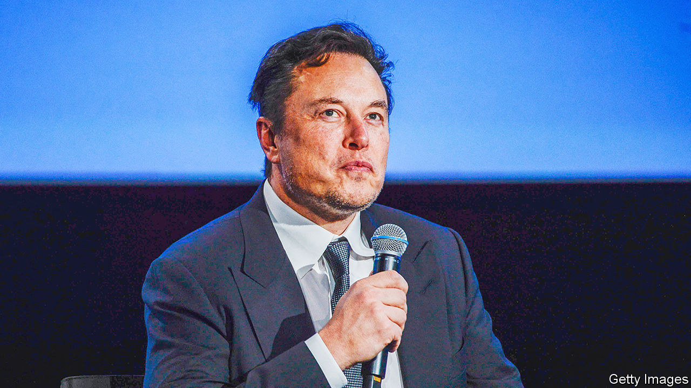

###### Mr Musk’s moderation

# What to make of the Twitter Files? 

##### They contain two accusations: one seems true, the other does not 

 

> Dec 14th 2022 

“Twitter”, Elon Musk wrote on December 10th, on the website he owns and runs, “is both a social-media company and a crime scene”. Mr Musk’s crime scene is described in the “Twitter Files”, a set of screenshots of the social-media company’s internal communications. They were taken mostly from Slack, a workplace messaging app, and given to three freelance journalists by Twitter’s current staff, at Mr Musk’s direction. They relate to moderation decisions taken by Twitter before Mr Musk bought the company. The “Files” have been published in a hard-to-follow stream of at least 225 tweets over the past two weeks, the most recent set emerging on December 12th.

To understand what is important about the Files, it helps to be clear about what they are not. They are not a systematic examination of Twitter’s content-moderation choices. This has not stopped Mr Musk, and the journalists to whom he has given access, claiming that the files offer damning evidence of Twitter’s institutional bias against Republicans, driven by a staff who wanted to censor ideas and people who made them uncomfortable.

Perhaps the most important thing the Files do is demolish the notion that a centrally controlled entity can write down a set of rules to facilitate the control of a public digital space in which hundreds of millions of users send billions of messages a day. In reality the rules, like the discourse they are meant to guide, are constantly shifting. Twitter’s employees are seen scrambling to interpret and apply an ever-changing slew of rules to tweets which those rules do not quite cover. In a blog post published on December 13th in response to the Files, Twitter’s former boss Jack Dorsey called this focus on centralised moderation rules his “biggest mistake”. He wrote that the right approach was to build “tools for the people using Twitter to easily manage it for themselves”.

Some of the screenshots are damning. They show Twitter employees using the thinnest of pretexts to block a  about material found on Hunter Biden’s laptop because the story was based on hacked material, only to see that justification unravel. They stick to their guns for a few more days, then do a u-turn, but the damage to their credibility is done. It is hard to argue that a set of employees who were more right-wing would have made the same decisions. 

The section of the Files on the banning of Mr Trump’s account, while titillating, tells a story that is almost identical to the account that Twitter published itself on January 8th 2021, shortly after the decision was taken. Mr Trump was banned for violating Twitter’s policy against Glorification of Violence because of links between his social-media emissions and the actions of the January 6th rioters. One thing the Files do show is that this connection was made in the face of significant internal pressure to ban Mr Trump’s account, but if anything they validate Twitter’s own account of the ban; staff appear to genuinely believe that Mr Trump’s tweets are inciting violence.

Both cases create strong emotional responses; the presentation of the Files is designed to elicit it. But they do not tell the world anything about biases that may have existed across Twitter as a whole. Indeed, a much more representative dataset,  by  in November 2021, showed that the algorithm which chooses what tweet-users see in their feeds tended to give tweets from-Republicans a significant boost over those from Democrats. There was no conspiracy. Some Republicans just tweeted less accurate information. Less accurate information tends to attract more engagement online, because it allows more room for the sort of emotional language that drives attention. 

There are straightforward ways for Mr Musk to provide good evidence of bias against Republicans (or to refute that idea). But when Alex Stamos, a well-regarded internet researcher, asked Mr Musk to allow access to data necessary to verify the claim that Twitter’s rules “were enforced against the right, but not against the left“, Mr Musk dismissed Mr Stamos as a propagandist. That was an odd response for a man engaging in a radical transparency campaign. ■


