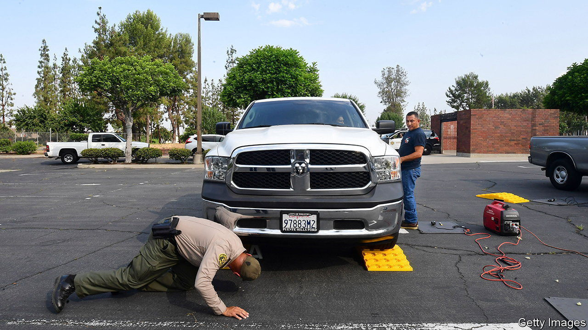
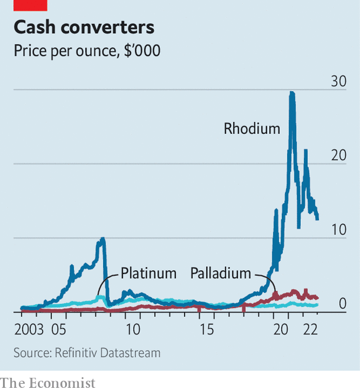

###### Crimes of fashion

# Why catalytic-converter theft has soared in America 

##### Ease, speed and economics are making stealing a once-obscure car part more common 

 

> Dec 15th 2022 

ONE SIGN of a crime’s prevalence is when even police officers fall victim to it. So it goes with the spike in the theft of catalytic converters, a component attached to a vehicle’s underbelly that helps process and control fuel emissions. In September thieves sawed-off catalytic converters from four trucks and vans owned by the San Francisco Police Department, which were parked outside a “special operations” bureau. Earlier this year, an off-duty sheriff’s deputy was shot dead in Houston when he tried to stop thieves stealing his truck’s catalytic converter.

It does not take a detective to piece together what is going on. Nationally, the theft of catalytic converters has rocketed, becoming one of America’s fastest-growing crimes. Data from this year are not yet available, but are likely to show converter theft at record highs. In 2021 the National Insurance Crime Bureau, a non-profit that combats insurance fraud, tracked more than 52,000 reported incidents, about 13 times more than in 2019. The total is probably much higher.

 


The main reason for the spike is the rising value of precious metals that are contained in catalytic converters, including rhodium, whose price per ounce has quadrupled since January 2019 (see chart). It only takes a few minutes to remove a converter, and has been made simpler thanks to stronger battery-operated saws that are on the market, says Chris Crabtree, a retired police officer with Oakland Police Department. The covid-induced decline of tourism in urban centres also encouraged thieves to shift from stealing things inside cars to stealing bits of cars instead.

It is both illegal and loud to drive a car without a catalytic converter, but replacing a stolen one costs from a few hundred to several thousand dollars. Some victims are installing cages around their converters to make them harder to steal. In a cruel twist, the climate-conscious are punished most often. Hybrid vehicles often have two catalytic converters and can contain more precious metals, which has led to Priuses and other hybrid cars being targeted more frequently. Hardest-hit has been California, which has about a quarter of the country’s hybrid cars and tougher emissions standards (contributing to most cars, not just hybrids, sold in the state containing more precious metals in their converters). In 2021 the Golden State accounted for 37% of catalytic-converter thefts.

These thefts are at least somewhat organised. In November the Department of Justice charged 21 people in five states as part of a catalytic-converter theft ring. People sold stolen converters to an auto shop in New Jersey, which in turn sold the extracted metal powders to a refinery for nearly $550m. This year at least 22 states passed legislation, up from the dozen that did so in 2021, says Amanda Essex of the National Conference of State Legislatures. The solutions run the gamut, from requiring new rules and documentation to sell catalytic converters to increasing the penalties associated with their theft.

Some states, such as Maine, have started requiring car dealers to engrave identification numbers on catalytic converters. This makes it easier to trace them and prove that they have been stolen. In California two new laws, including regulations about who can sell them, will go into effect in January. A proposal to require identification numbers to be etched on converters was defeated after lobbying from car dealers, who said it would be expensive. But without ID numbers, it can be difficult to prove beyond a reasonable doubt that someone in possession of catalytic converters has stolen them, says Gregory Totten, chief executive of the California District Attorneys Association.

Despite the flurry of new laws, the thieving continues. A law in Texas passed last year places some restrictions on the sale of catalytic converters and increases the punishment, so now thieves steal them in Texas but sell them in states where sales restrictions are looser. “Perhaps at its core, it’s a national issue,” says Mr Totten, who thinks the federal government needs to get involved. One proposed bill, called the Preventing Auto Recycling Theft (PART) Act, would require identification numbers to be etched on converters and establish stealing them as a federal offence. Already the bill enjoys bipartisan support, suggesting that converter theft may make for some hybrid political alliances.■


