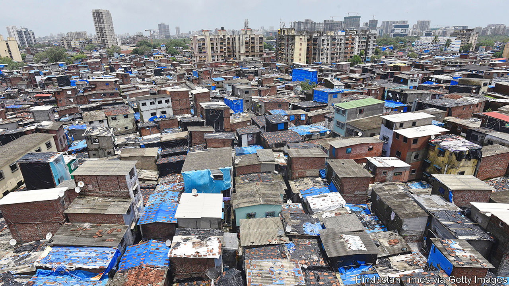

###### Slum-mop billionaire

# Can India’s richest man remake Mumbai’s biggest slum? 

##### Gautam Adani takes on India’s essential, impossible job: redeveloping Dharavi 

 

> Dec 20th 2022 

Dharavi is a square mile of corrugated iron, concrete blocks and plastic sheeting in the middle of Mumbai, crammed with humanity. With perhaps 1m residents, the slum is one of the world’s biggest. As a setting for outlandish rags-to-riches stories, it may be the best-known. In “Slumdog Millionaire”, which won eight Oscars in 2009, a Dharavi youth’s hardscrabble experiences helped him win the Indian version of “Who Wants to be a Millionaire?” In “Gully Boy”, a more recent Bollywood potboiler, a slum-dwelling rapper overcomes prejudice to win the hearts of the city’s Westernised overclass. But Dharavi’s latest saga may be its most dramatic yet.

Slap bang in the middle of India’s space-constrained financial capital, the slum is a huge obstacle to Mumbai’s—and therefore India’s—development. The state government of Maharashtra, in which Mumbai sits, has for nearly two decades therefore been trying to entice private developers to Dharavi with promises of rich returns. Yet it has failed, chiefly because of the main impediment to most big infrastructure projects in India. Many of the slum-dwellers don’t want to move. And in India poor people have votes.

Redeveloping the slum in a way that avoids political meltdown while generating an attractive return is a formidable endeavour. S.V.R. Srinivas, the official in charge of the project, has called it “by far one of the most complex tasks ever to be undertaken in the world”. Yet last month came news of a possible breakthrough. A fresh contract to fix up Dharavi was awarded to Gautam Adani, Asia’s richest and perhaps India’s best-connected man.

Mr Adani, a former diamond trader whose vast conglomerate controls ports, solar farms, food processing, coal mines and much else, has released few details of the deal, which is expected to be signed in the coming weeks. But the long-standing plan is to rehouse those Dharavi residents who settled in the slum before 2000 in new flats built within its borders. Most others will be offered new public rental housing within a 10km (6.2-mile) radius, with an option to buy the properties over time.

Many of the slum’s thousands of cottage industries, which churn out textiles, leather and metal goods by the truckload, will also be relocated within Dharavi’s boundaries, even if they may have to downsize. Those considered to be polluting will be excluded. Whatever former slumland remains will be for Mr Adani. Superbly located on three suburban railway lines, an upcoming metro line and adjacent to Mumbai’s prime commercial district, it could be worth 30,000-40,000 rupees ($360-480) a square foot at today’s rates, reckons Gulam Zia of Knight Frank India, a property firm. 

Dharavi’s location and fame make it a powerful example of a much bigger problem. India’s cities are home to over a third of its population, or around 480m people, and are the engines of its growth. Yet the poor conditions in which most city-dwellers live, learn and labour are a blight and significant speed limit. Around half live in slums and a third without a connection to piped water, according to the un. In 2016 a third of India’s urban-dwellers lived more than three to a room. In Dharavi’s hutments, as its slum shacks are called, a dozen people to a tiny room is not uncommon. “To live in a proper home, to have a toilet, it is a matter of dignity,” says Raju Korde, an entrepreneur in Dharavi.

As so often in India, if the problem is allowed to fester it will grow. The un reckons India’s urban population will rise to 43% of the total by 2035. So there is a lot riding on Mr Adani’s plan—and the tycoon will embark on it with two great advantages. First, a capacity to finance its large upfront costs in the absence of any return for several years. Mr Adani secured the contract by guaranteeing a minimum investment of 50.7bn rupees ($614m). Pankaj Kapoor of Liases Foras, a real-estate research firm, reckons the total cost of the project will be around 230bn rupees.

Second, Mr Adani will have strong support from the Bharatiya Janata Party (bjp), which is the power behind Maharashtra’s state government as well as in Delhi. The bjp has made infrastructure development central to its agenda. And Mr Adani is a close ally of its leader, Narendra Modi, India’s prime minister. Where previous failed redevelopments of Dharavi were “developer driven”, notes Mr Srinivas, the state government will now be more involved. It will form a special-purpose vehicle for the venture with Mr Adani’s group and take a 20% stake in the project. 

Even so, the giant slum remains daunting. “We are not in a dictatorship,” says Mr Srinivas. “Doing this project requires consensus.” Yet so many Dharavi residents will lose out to the redevelopment that consensus is hard to imagine. Slum-dwellers who are eligible for a new home worry that they will lose their current good access to schools, meeting-places and the sense of community that is richly evident in Dharavi’s caste- and ethnically-based quarters. Many do not trust the government’s promises. Mumbai abounds with cases of former slum residents stuck in so-called transit housing after the developers of their new homes went bust.

The slum’s small-business owners are even more afraid of being uprooted, especially those who face being dispatched far away. “No one is against development,” says Mehmood Khan, who runs an aluminium-recycling business in Dharavi’s industrial cluster. “But if the residents are being resettled locally we should be, too.” In fact, only around 30% of the slum-dwellers are eligible for free rehousing. And among the rest are many Dharavi residents who have spent thousands of rupees to buy a slum dwelling which, lacking title, now looks worthless. They will not be dispossessed without a fight.

The slum does not feel braced for conflict, at least. There has been little organised opposition to the latest redevelopment plan. Decades of failed schemes have bred a certain fatalism, or complacency, in Dharavi. Mr Adani will have seven years to complete the public-housing part of the project after the contract is signed; he will have another ten years to develop the outstanding slumland. “Ask anyone in Dharavi and they will say, ‘Why talk about it? If it does happen maybe it will happen in 20 years,’” says Laxmi, a third-generation resident, who works in a crèche for the children of ragpickers. The combination of Mr Adani and his Hindu-nationalist allies looks like an unprecedented force for change in Dharavi. But many locals think they have seen this film before.■


