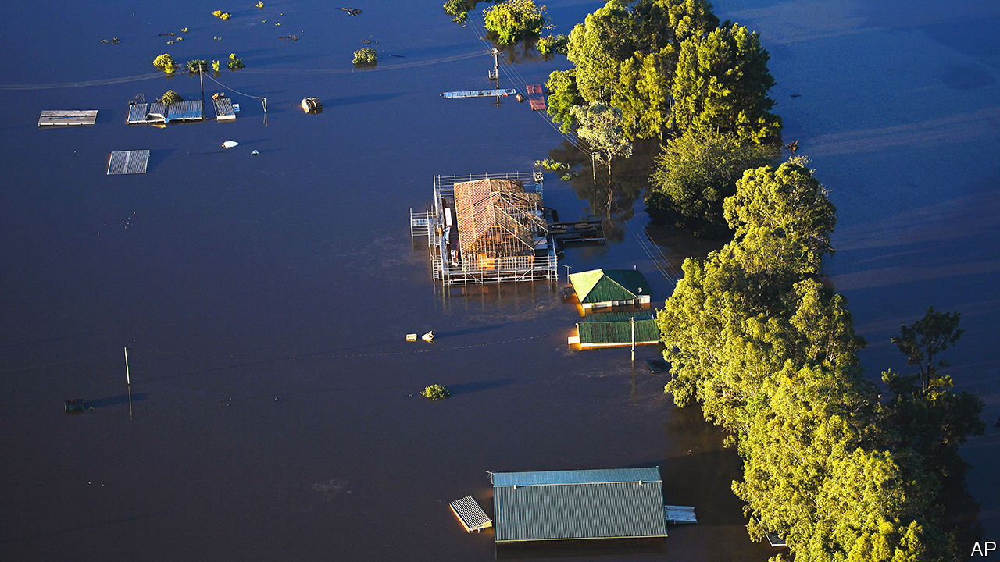

###### Moving house

# Extreme weather is making parts of Australia uninhabitable 

##### Some towns and suburbs will have to move to higher ground 

 

> Dec 20th 2022 

From her balcony in Lismore, a town in northern New South Wales, Maralyn Schofield surveys the wreckage of her neighbourhood. Located at a confluence of the slow-moving Wilsons River, her house was erected on 13-metre stilts to preserve it from seasonal floods. Yet when Lismore was inundated last February, after days of torrential rainstorms, the floodwaters poured into Ms Schofield’s sitting-room.

She was rescued by boat and deposited on a neighbour’s roof. At least her house, now patched up with blankets and election billboards for walls, is still standing, she bravely notes. The house next door is in a crumpled heap. Another was washed away.

Australia’s extreme climate makes it especially vulnerable to global warming. Much of its vast interior is semi-arid and, with temperatures 1.5°C above the long-term average, increasingly beset by wildfires and drought. A warmer atmosphere can also hold more moisture, which makes the country subject to record-breaking precipitation—such as the massive rainfall and flooding it has suffered this year.

Brisbane received almost a year’s worth of rain in five days last February, costing A$656m ($444m) in damage. Suburbs west of Sydney were subsumed in July for the fourth time in 18 months. Vast quantities of water recently gushed through the Murray-Darling basin, a giant river system in eastern Australia, swallowing several towns. This year’s floods have claimed the lives of at least 27 people and destroyed or damaged well over 28,000 houses. And as this article went to press South Australia was threatened by a fresh inundation.

Conservative politicians, often in hock to the coal industry, denied for years that such disasters were getting worse. This not only stopped Australia curbing its emissions, it also prevented it from taking effective measures to adapt to the warming they cause. The government “muddled through with easy options”, says Jamie Pittock of the Australian National University. It built levees, raised homes and splurged on post-disaster clean-ups. Australia is estimated to have spent almost 50 times as much responding to disasters in the past couple of decades as on building more resilient houses and other infrastructure. 

But as the cost of climate-related damage rises, it is becoming harder to ignore. According to the Climate Council, an advocacy group, about one in 25 Australian homes could be uninsurable due to excessive flood risk by 2030.

The Labor government of Anthony Albanese, elected in May, has set stiffer emissions-reduction targets. Having campaigned on a promise to increase funding for climate-related disasters, it has also helped launch a more serious debate on how Australia’s towns and suburbs can adapt to the effects of warming. Some will have to be abandoned. There is a “recognition that we actually have to undergo managed retreat and pay people to move,” says Mr Pittock. Many in Lismore’s battered suburbs concur. “I love my house,” says Ms Schofield, but living in the flood-zone has become “just too risky”.

One solution is for governments to “buy back” untenable homes in order to take them off the market. In October state and federal governments launched an A$800m “resilience” fund that will buy 2,000 properties in northern New South Wales from people facing a “catastrophic risk to life”. The fund will also provide money for owners to raise or waterproof their flooring. A similar scheme, of A$740m, has been established in Queensland. 

Another approach is to help locals to exchange their ruined plots for safer ones, as happened in Grantham, a small town west of Brisbane. After floods in 2011 killed 12 people and destroyed much of Grantham’s infrastructure, the local council bought fields on higher ground and moved dozens of families to them under a land-swap agreement. Some homeowners simply cut their properties free of the foundations and carted them uphill.

Where Australians choose not to leave disaster-prone areas, state governments may end up forcibly acquiring their land. Meanwhile, the short-termism that has got Australia into this fix endures. Even as New South Wales and other states are trying to nudge people out of some high-risk areas, they are funnelling them into others. Thus, for example, the intensive development taking place on the floodplains west of Sydney.

In 2017 a federal infrastructure agency predicted that the number of people living on its floodplains could double by 2050, to over 260,000. Yet the city’s western suburbs already see regular heavy flooding. The state’s premier, Dominic Perrottet, recently promised to impose some building restrictions, but only in the most dangerous areas. “People have to live somewhere,” he says. Yet fire and water will increasingly limit their options.■

