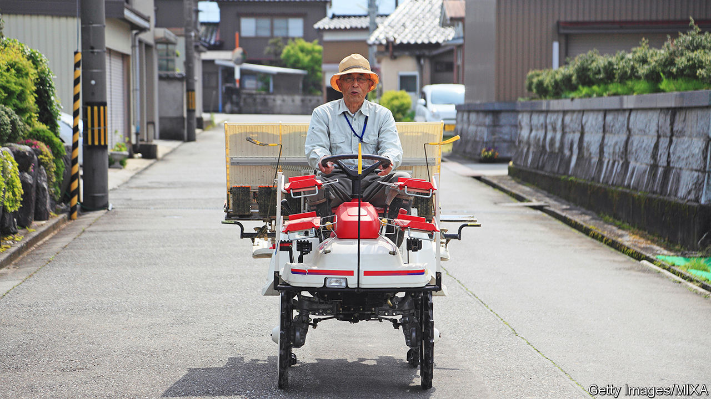

###### Dumplings and skewers

# Japan’s cities are being remade for an ageing population 

##### The coastal city of Toyama is a global exemplar of “compact living” 

 

> Dec 20th 2022 

Toyama nestles between a deep blue bay and snow-topped peaks, some 250km northwest of Tokyo. In many ways, it is a quintessential regional Japanese city: its residents are greying, its industry is stable but sclerotic, its cuisine is exquisite. American firebombs targeting its steel mills wiped out 99% of Toyama’s centre during the second world war. Afterwards, the city was rapidly rebuilt and sprawled as its population grew. But that was then. Since the 1990s the city of 414,000 (and falling) has been battling the ills of an ageing population: ballooning bills, falling tax revenues and an out-of-date urban plan.

Yet Toyama has battled much better than most—even managing a modest revival. A sleek new light rail line, Japan’s first, snakes through its city centre. Skirting a spruced-up medieval castle, walls white as snow, the line runs to a formerly neglected port neighbourhood further north along the bay. A former elementary school, its classrooms surplus to requirement, has been turned into a snazzy old folks’ centre with hot-spring exercise pools. On a new central plaza stands the crown jewel of the renewed Toyama: a cultural complex designed by Kuma Kengo, a star architect, containing an extensive library and a glass art museum.

The city has adopted what urban planners call a “compact city” policy. Recognising that sprawl is expensive to build, maintain and service, planners try to make cities smaller, denser and less car-reliant. These aims, long pursued in Europe, are relatively new to Japan. Local governments consider them a means to “triage municipal liabilities” amid demographic change, says Andre Sorensen of the University of Toronto. The World Bank calls Toyama “a global role model” for compact cities.

Planners there have pursued what they call a “dumpling and skewer” structure, in which denser hubs (the dumplings) are linked by public transport (the skewers). Making it work required first winning over lots of recalcitrant locals. Mori Masashi, who was Toyama’s mayor from 2002 to 2021 and spearheaded the transformation, held hundreds of town hall discussions of the plan. “I had to convince people to think 30 years into the future,” he explains. He also travelled widely to learn from cities as far afield as Amsterdam and Portland.

Thoughtful design helped. The new light rail has carriages that align flush with station platforms, eliminating the steps that can trip up elderly riders. Lest youngsters feel left out, the city also built a skatepark, a rarity in Japan. Such projects made canny use of the city’s existing resources. Old rail tracks were repurposed for the new light rail, a move that reduced costs by 75%, according to the World Bank. While the government handled construction, it farmed the rail network out to an expert private firm. It also offered subsidies to entice people to move into the dumplings.

The policy, though no panacea for the demographic squeeze, changed Toyama’s trajectory. The city arrested the outflow of people from its centre: net migration into the downtown area was negative before 2008 but has since been growing. In 2005 only 28% of Toyama residents lived along public-transit corridors; by 2019 nearly 40% did. The new developments have made property more attractive. Land prices in the city centre had been declining by around 2% a year until 2012; in the decade since, they have grown by an average of 2% per year, with gains in some areas reaching as high as 6%. Using increased tax revenue from the revived city centre to support more remote parts of the region is a “basic model for other cities”, says Nitta Hachiro, the governor of the surrounding prefecture, also called Toyama.

The new urban design may have other long-term benefits. Public transport use among those aged 60 and older has more than trebled. Sakamoto Kazuko, a 73-year-old local, says the new network has made life “more convenient”. She goes out more often than before, using a discount rail pass for the elderly to visit the city centre and stroll while her grandchildren are at school. Small-scale studies show promising results: old folks who stay active by using their discount transit passes need less nursing care than those who do not.

For those living far from the centre, the benefits are less clear. The compact city is a “bubble” which people outside it look on with “cold eyes”, says one 73-year-old shopkeeper in the suburbs. Local governments with ageing, shrinking populations face hard choices about where to keep water and sewers running and where to close schools and clinics. Even as cities strive to become more compact, they may fail to reach the density necessary to keep businesses profitable, says Okata Junichiro, also of the University of Tokyo. But they must try. Japanese cities once grew boldly. As the population ages and declines, they must learn to shrink with grace. ■

