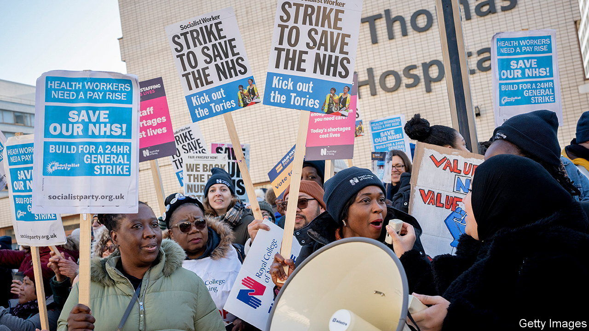

###### Nursing a grievance

# British nurses launch unprecedented strikes 

##### They are the first in the Royal College of Nursing’s 106-year history 

 

> Dec 19th 2022 

Only the River Thames separates St Thomas’s hospital in London from the Houses of Parliament. Yet for the nurses who picketed outside the hospital, it might have been an ocean. On December 15th around 100,000 nurses across England, Northern Ireland and Wales went on  for 12 hours. Another strike in England and Wales took place on December 20th. Pat Cullen, the general secretary of the Royal College of Nursing (rcn), has warned that the walkouts—the first in the organisation’s 106-year history—may continue into January and beyond. 

The rcn’s chief demand is . It has asked for a pay rise of 5% above inflation as measured by the retail price index (rpi). Given that rpi inflation is 14%, that seems a tough ask. The average basic salary for a full-time nurse in England is around £36,000 ($45,000). Comparisons with the pay of other British workers is tricky because the range is wide. Yet nurses point out that their pay fell by 6% in real terms in the decade to 2021, compared with a 3% fall for private-sector workers. Their pay also lags behind that of nurses in most other rich countries. Ms Cullen has said the rcn’s demand is a “starting point”.

The government has said it will . In 2022 it followed the recommendation of a pay-review body in offering most nurses a rise of 4-5%. It has said more money would have to cover other nhs staff (apart from doctors, dentists and senior managers) and come out of front-line nhs services. Yet on December 15th a former head of the pay-review body acknowledged that its recommendation would probably have been more generous had it come later in the year, taking higher inflation into account. In Scotland, where, as in Northern Ireland and Wales, health is devolved, the government pre-empted strikes by offering a pay rise of 7%. To fund this and other nhs costs, it is raising the higher and top rates of income tax by 1%. 

Yet the strikes are about . “Pay is the lightning rod, it’s attracting all the energy,” says Jim Buchan of the Health Foundation, a research charity. But it “cannot be disentangled” from working conditions. During the covid-19 pandemic, many nurses left the nhs. Figures published by the nhs in September revealed a shortage of 47,496 nurses, meaning nearly 12% of jobs are unfilled. Those left must work harder, as they tackle an nhs waiting list that has ballooned to 7.2m from 4.6m in early 2020.

Such pressures are felt throughout the nhs. Some 10,000 ambulance workers in England and Wales, and midwives in Wales, are planning industrial action. Junior doctors may follow. Their union plans to hold a ballot in early January.

nhs employees say that it is patients who pay the price for poor working conditions. In a recent rcn survey, only 18% of nurses said that they had enough time to provide the quality of care they liked. “We’re so short-staffed, I cry for my patients,” says Kafelat Adekunle, a community matron. Ambulance delays are at record highs. “People are only interested now, because as an absolute last resort, the ambulance workers have said we’re not carrying on any more,” says Paul Turner, a paramedic with the North West Ambulance service. 

On December 15th a survey by YouGov, a pollster, found that almost two-thirds of Britons supported the nurses’ strikes. Near St Thomas’s picket lines, cars crossing Westminster Bridge honked their horns in support. Yet if the walkouts are seen to harm patients, the goodwill may vanish. Nurses in acute services, such as chemotherapy, paediatric intensive care and high-risk mental-health services, are scheduled to work throughout the walkouts. In other departments, staffing levels are reduced roughly to those typical for night-time and on Christmas Day. Ambulance workers have said they will respond to life-threatening cases, though it is not always obvious which those are.

No amount of planning can prevent the anguish and inconvenience caused by cancelled procedures. They affect nurses too. “My operation was cancelled today,” says Ms Adekunle, the matron. “But I don’t mind. We’re fighting for everyone.”■


