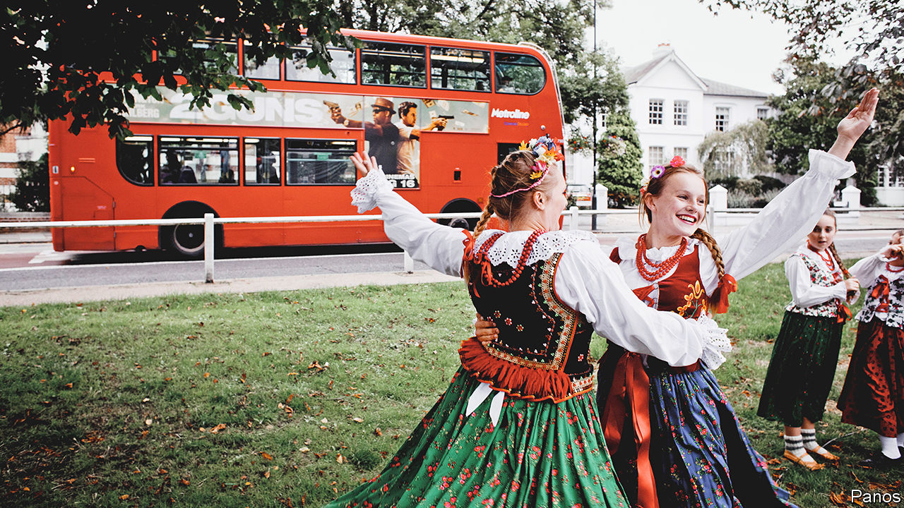

###### The new Britons

# The children of Britain’s eastern European immigrants are changing the country 

##### They are an optimistic, confused bunch 

 

> Dec 20th 2022 

It is the last day of term at the Polish Saturday school in Welwyn Garden City, north of London. A group of teenagers spills from a classroom into the hallway. Most are the children of Poles, and can speak the language fluently. But as soon as they cross the threshold they slip into English, inflected with the mild Cockney accent of Hertfordshire. It happens a lot, says the headteacher, Iwona Pniewska. 

Similar scenes occur across the country. In 2004 Britain  to citizens of the Baltic and eastern European countries that had just joined the eu. Many young adults came, especially from Lithuania and Poland—and, a few years later, from Bulgaria and Romania. They soon settled down and had children. In 2008 one in 27 babies born in England and Wales had a mother from one of the new eu countries; last year the proportion was one in 14. Others have grown up in Britain after arriving as young children. Some are British citizens; some have been granted settled status since Britain left the eu. All are now folding themselves, more or less easily, into British society. 

has interviewed more than a dozen children of eastern European immigrants, from age 13 to 20. Because most are children, we have kept all of them anonymous. They are geographically spread, from south-west England to Scotland. They display a mixture of optimism and confusion about Britain and their place in it. The same is true of many immigrants’ children—but in some ways the children of eastern Europeans are unusual. 

All seem to understand that their parents  because they saw few opportunities in eastern Europe. As one young woman, who was born in Bulgaria, puts it: “We belonged to a class where, no matter what you do, you end up in the same place.” Migration brought little improvement at first. Their parents frequently worked desultory jobs in warehouses and cafés, and as cleaners. One girl remembers seeing a picture of her parents crammed into a house in London with other Poles. 

Their parents’ progress since then has been rapid, but somewhat uneven. Several say that their mothers’ working lives have changed more dramatically than their fathers’. One child of Polish immigrants says that her father works the night shift as a delivery driver, as he has done for years. By contrast, her mother began by working as a cashier and a waitress and is now an architect. Another says that her mother worked for several years as a cleaner; she is now an estate agent. 

Many eastern European men landed well-paid manual work in Britain, often in the construction industry. Women, by contrast, had to learn English and retrain. The upshot is a unique employment pattern. The latest Labour Force Survey, covering July to September 2022, shows that women who were born in eastern Europe are more likely to hold managerial or professional jobs than men born in eastern Europe. The opposite is true of workers born in Britain, western Europe, Africa or Asia. 

Their parents’ climb from the very lowest rungs of the employment ladder may have shaped the teenagers’ views of the world. In a generally glum country, they are strikingly optimistic about their economic prospects. “One hundred per cent”, replies a young man, when asked about the chance that he will be able to live a more comfortable life than his parents. Three girls answer the same question so quickly that it seems unlikely the possibility of faring worse than their parents has even entered their minds. 

Because their parents moved anywhere that jobs could be found, the teenage children of eastern Europeans have grown up dispersed. The 2021 census shows that 612,000 people in England and Wales mostly speak Polish, making them three times as numerous as Bengali-speakers (who are mostly Bangladeshi) or Gujarati-speakers (who are Indian but may have arrived from east Africa). Yet the most Polish-speaking place in England is Boston, a town where only 6% of people speak the language. By contrast, 11% of people in the London borough of Tower Hamlets speak Bengali and 13% of people in Leicester speak Gujarati. 

They tend to go to schools without many people from the same background. And they frequently ignore the others anyway. “I do have Polish people in my form, but I’m not friends with them,” explains one child of Polish immigrants. A 19-year-old man who was born in Lithuania describes his school in London as a wash of cultures, in which he knew as many Pakistanis as Lithuanians. He was untroubled by that. “I never thought: ‘I need to know Lithuanians’,” he says. 

Not all of their parents are so sanguine. Many send their children to Saturday schools to make friends and learn about the homeland in a (theoretically) monolingual environment. Other parents find churches or outfits such as Karma Leicester, a Polish football team that runs a youth academy. “They don’t want us to forget our roots and stuff,” says a girl in the Welwyn Garden City school, with a barely detectable eye-roll. 

There is indeed some danger of that. Even those who are fluent in their parents’ first language say that they tend to think in English and then translate their thoughts. And not all are perfectly fluent. In one family the older sister speaks excellent Lithuanian but the younger does not, because her sister often speaks English with her. As they grow older, roots can wither. “It sounds bad to say, but sometimes I forget that I’m Polish,” says a 20-year-old who arrived in Britain as a young child. 

A few have mulled moving to the country where their parents were born. But those teenagers seem to be motivated by little more than pleasant memories of annual trips to visit their grandparents, and they have no real plans. By contrast, those who have decided against moving are firmly committed to Britain. “I’m getting worse and worse at Polish, so I don’t think I’ll be doing that,” says a boy, flatly. 

Their identities are fluctuating and complicated. “I consider myself Lithuanian”, says one girl, who goes on to explain that she considers England her home country. Her identity seems to be a way of expressing closeness to her family rather than national allegiance. “I don’t feel entirely British,” says the Lithuanian 19-year-old from London. “But I don’t feel entirely Lithuanian either.” 

Unlike America, Britain does not offer hyphenated identities off the peg. You cannot be Polish-British as easily as you can be Italian-American (although you can be a British Indian, because “Indian” is a widely acknowledged ethnic group). As a result, members of the new generation of eastern-European-descended Britons must use labels that do not capture the way they feel, and sometimes make them feel like they belong nowhere. That is regrettable. But perhaps they will be able to bend the language in time. They are a confident bunch, and they have the numbers.■


