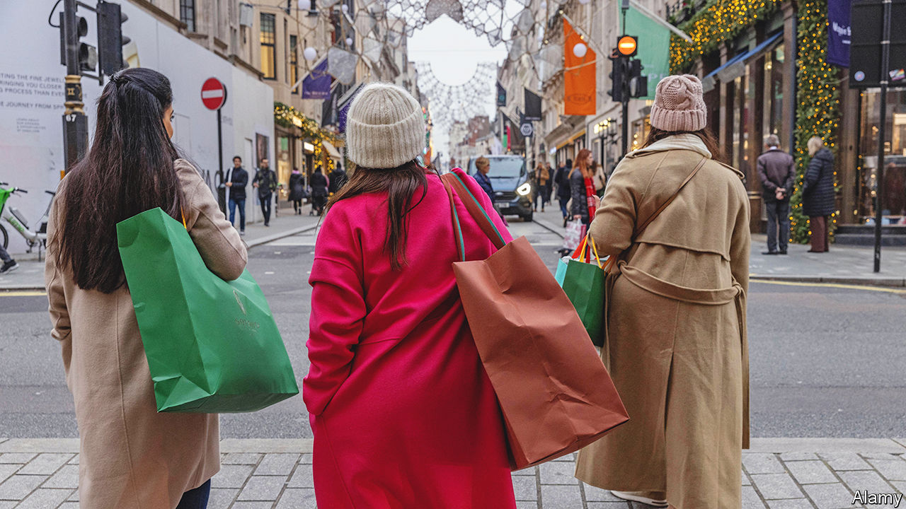

###### Gift-giving economics

# The inefficiencies of Christmas 

##### Should you forget presents and give cash? 

 

> Dec 20th 2022 

‘Tis the season to be jolly—and to feign delight at disappointing Christmas presents. The average British adult splurged around £550 ($667) on gifts in 2021, according to one survey. But a back-of-the-envelope calculation by Ian Stewart of Deloitte, a consultancy, suggests that the volumes of unwanted stuff in effect destroyed around £3bn of the £25bn value. Though many see Christmas as a time of generosity and cheer, others see waste. A small number study its inefficiencies. 

In 1993 Joel Waldfogel of the University of Minnesota identified a “deadweight loss” when he studied the difference between the cost of seasonal gifts and how much their recipients valued them after they had accounted for exchanges and put sentimental value aside. Today he says that on average cash spent on another person yields around 85% of the benefit of cash they spend on themselves. Although gift-giving may make some people happy, it’s “a lousy way to allocate resources,” he says.

There are ways to reduce Christmas losses. One is the use of gift cards, which give recipients some choice. But Britons don’t seem to like them much. A survey of adults from Ipsos, a pollster, found that 43% of Americans, 40% of the French and only 29% of Britons were planning to give them for Christmas 2022. Making it easier to return unwanted gifts should help. Al Gerrie, chief executive officer of ZigZag, a returns platform, says that when a gift message or gift wrap is used in fashion retail (that is, for a present) return rates tend to be considerably higher. 

As e-commerce has expanded, so too have ways of sending stuff back. But returns are a headache for retailers. On average it costs between £5 and £10 to put a product back on the shelves, says Mr Gerrie, thanks to the shipping, inspecting and repackaging required. (In January, Father Christmas’s elves must conduct “sniff tests” to see if a garment has been worn.) Increasingly, retailers are charging shoppers to return goods. ZigZag’s data suggest the number of paid-for returns has more than doubled since last year, while the number of free returns has fallen. That, though, may mean more consumers are stuck with unwanted gifts. 

Another Christmas inefficiency for retailers is the fact that it comes but once a year. Gary Grant of The Entertainer, which sells toys, jokes that he would love it if festive sales were spread throughout the year rather than being crammed into the final quarter. He is understaffed, he says, during the holiday season, when he expands his workforce by 50%, and then overstaffed the rest of the year. Shipping companies, warehouse operators and sorting centres must also organise themselves to meet peak demand; that can mean unused capacity at quieter times of the year. Data from Metapack, a logistics software company, suggest that in December the volume of posted parcels is more than double the level in September.

Over time, it does seem that consumers are spreading their spending a little more thinly across the year. In 1986 25% of the year’s spending on clothing was in November and December. In 2019 the share was 22%. Seasonality in retail spending, which includes restaurants, is also falling. Seasonal employment as a share of the total between October and December has been decreasing since 1997, according to the Office for National Statistics. A new study by Mr Waldfogel found that since 2000 growth in the American economy has been associated with a smaller seasonal bump in December’s retail sales. 

While some dream of , others may yearn for mandatory exchanges of cash, or even a mechanism to randomly allocate the celebrations evenly across months of the year. Much would be lost if such a system were adopted, not least the that can accompany the exchange of carefully (if badly) chosen presents. But creating a fresh batch of unintended consequences for economists to analyse might yield some happy returns.■


