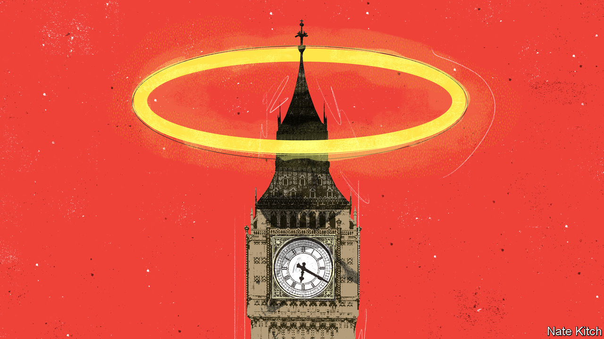

###### Bagehot

# Westminster’s other cathedral 

##### A religious constitution suits a godless country surprisingly well 

 

> Dec 20th 2022 

“Once in royal David’s city, stood a lowly cattle shed.” The soloist’s voice sliced through the Chapel of St Mary Undercroft, a small church in a corner of the Palace of Westminster, before a congregation of mps, lords, cabinet ministers, aides, it support staff and your correspondent.

Amid the singing, a woman marched down the aisle with a green piece of paper marked “VOTE”. Sacred matters had to wait; profane politics called. There was a division over whether to carry out an impact assessment on the effect a free trade deal with Australia and New Zealand would have on Britain’s farmers. “And our eyes at last shall see Him,” bayed the assembled singers as mps gathered their winter coats and rushed to the voting lobbies. 

Religion is entwined with Britain’s Parliament. The House of Commons begins its day with prayers. Since attendance at prayers is the way to guarantee a seat for the day, even the godless turn up. Britain has a religious constitution, with church and state fused, rather than separated.  is head of the Church of England; Catholics may not ascend the throne. Head to the House of Lords, Britain’s upper chamber, to find 26 Bishops from the Church of England debating everything from welfare to defence policy. At times, Parliament—filled with cloisters, saints and stained glass windows—is as much a cathedral as a place of politics. 

Devotion in Westminster is not matched by the country at large. , only a minority of people identify as Christian in some form, according to the 2021 census. In 2001, 72% did. Now only 46% do. Weekly church attendance is now under 1m in a country of 67m. Meanwhile, the ranks of the godless grow. In 2011, a quarter of people expressed no religion. Now 37% do. A religious constitution suits a godless country surprisingly well. 

A gap between politicians and voters on religion has always existed. Before the second world war, British prime ministers tended towards scepticism even when Britain was still relatively devout, points out Mark Vickers, in his new book “God in Number 10”. Clement Attlee, the post-war Labour leader, declared: “Believe in the ethics of Christianity. Can’t believe the mumbo jumbo.” Organised religion was associated with joyless Sundays, which was anathema to the ambitious and often hedonistic men who ran Britain in the first half of the 20th century. David Lloyd George, the Liberal prime minister, said that “the thought of Heaven used to frighten me more than the thought of Hell”. 

Now, the opposite applies. It is the norm for leading politicians to be people of faith, even if their voters are not. Rishi Sunak, the prime minister, is a Hindu and keeps a statue of Lord Ganesh, the elephant-headed God, on his desk in Downing Street. Among the great offices of state, only James Cleverly, the foreign secretary, is not particularly religious. Even Boris Johnson, once labelled a pagan by one admirer, called himself a “very, very bad Christian”. Sir Keir Starmer would be the first avowedly atheist leader of Britain since Jim Callaghan, the Labour prime minister who led the country five decades ago. (Mr Johnson, the very bad Christian, chided Sir Keir with scripture: “‘The foolish man has said in his heart, there is no God.’ I’ll leave it at that.”)

Sociological rather than ecclesiastical reasons explain Britain’s surplus of godly mps. Parliamentarians are joiners by nature. Turning up to church every Sunday and sitting alongside people one may not particularly like is good training for a career in politics. Geography plays its part. A country’s capital cannot help but shape a country’s politics. Despite its reputation as a hotbed of metropolitan liberalism, London is the most devout place in the country. One in four attends a religious service in the city each month, compared with one in ten outside the capital. 

Political calculation rather than constitutional limit stops faith from playing too large a role in British politics. There are few votes to be gained by scooping up a devout minority. (Likewise, there are few to be gained by railing against the role of religion in public life.) Mr Sunak plays down the fact he is the first non-Christian leader of the country. “It’s also wonderful that it’s not that big a deal,” he told the  Most voters do not care either way, as long as religion does not intrude into day-to-day politics. When it does, the results are rarely good. Tim Farron, a former leader of the Liberal Democrats and a devout Christian, spent much of the 2017 general election being grilled on whether he thought homosexuality was a sin. 

We do do God 

Since the state does not separate religion and politics, mps are left to do it themselves. Jeremy Hunt, the chancellor, has expressed unease over abortion after 12 weeks. During his pitch for leader in 2019, he said he would not touch the limit of 24 weeks. “I don’t think it defines my politics,” he said of his faith. A sense of restraint is necessary for all parts of the constitution to work and faith is no exception.

Britain’s settlement on religion and politics may look ridiculous. But a secular constitution is no guarantee against neuralgic debates on faith. America divides church and state, yet religion infects politics. A narrative of exclusion is a potent thing, which evangelical Republicans have whipped up for decades, with great success. In Britain, religion permeates the constitution and daily life of politics to such an absurd degree it is hardly there at all. And so theocracy in theory becomes secular democracy in practice. 

Instead, religion in British politics is like nitrogen in air: inert and ignored but there nevertheless. The devout can tell themselves that Britain is still a Christian country; the secular can console themselves that this has no effect. In the Chapel of St Mary Undercroft, lawmakers crept back in after the motion was defeated (Ayes 192, Noes 296) to belt out more carols and hear a sermon. Keep religion in Parliament. It is the best way of keeping religion out of politics.■


