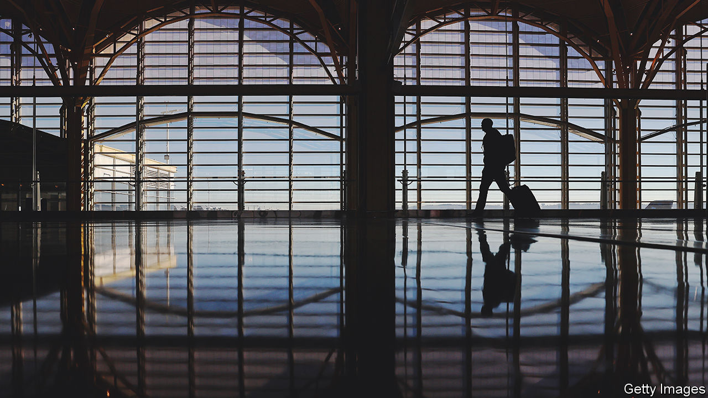

###### Parting of the clouds

# Airlines are closing in on their pre-covid heights 

##### But a cold winter could dent longer-term optimism 

 

> Dec 20th 2022 

The aviation industry is a useful altimeter for the lingering impact of covid-19. Air travel ground almost to a halt in 2020, as virus-induced restrictions kept people at home. Since then it has clawed its way upwards as lockdowns have eased and travellers who had been denied holidays, visits to loved ones and business trips have gradually returned to the air. Capacity, measured by available seats, is set to end 2022 at around 4.7bn, according to oag, a consultancy. Although that remains down by 12% on 2019, before the pandemic struck, it is nearly a third higher than at the end of last year.

Flying is not likely to hit pre-covid levels until 2024. Nevertheless, carriers’ confidence in the victory over the virus, and in the unshaken yearning for travel of the growing global middle-class, is evident in their longer-term plans. America’s United Airlines has recently placed a big order for new aircraft. Air India, a poorly run flag carrier acquired in early 2022 by Tata Group, a rather better-run conglomerate with a turnaround plan, is rumoured to be close to ordering 500 planes from Europe’s Airbus and its American planemaking arch-rival, Boeing. Healthy demand for passenger jets means that both aerospace giants are planning to increase production in 2023, and get back to pre-pandemic levels within a couple of years.

Aircraft sales will get an extra boost from deep-pocketed newcomers. As part of its attempts to diversify its economy away from oil, Saudi Arabia is poised to launch a new national airline, ria, to compete with incumbent Gulf carriers: Emirates, Etihad and Qatar Airways. The kingdom hopes to raise $100bn, including from its sovereign-wealth fund, for aviation. It is planning to build one of the world’s biggest airports, in Jeddah, to serve 120m domestic and connecting passengers by 2030.

For such grand schemes to work, international travel must rebound in Asia. There, too, the news is encouraging. The recent loosening of covid restrictions in China, the region’s dominant aviation market, led to a 30% jump in domestic capacity in a matter of days. International flights to and from China are stuck at less than 5% of levels from 2019, so 2023 won’t break records. But if Chinese are allowed to restart foreign travel, 2024 could be the most profitable year yet for China’s airlines, reckons John Grant of oag.

American and European carriers, responsible for the bulk of the industry’s profits in recent years, may get there sooner. They have exploited passengers’ rush to get back in the air and used canny management of capacity to keep ticket prices high. Some are already making money again. After three awful years, when airlines worldwide suffered a combined cumulative net loss of $187bn, the winners will propel the global industry to a profit of $4.7bn in 2023, forecasts iata, a trade body. 

As for the (more numerous) lossmakers, high fuel prices, looming recession and $220bn in additional industry debt accumulated during the pandemic may force some of them into bankruptcy—or, for a lucky few, consolidation. ita, the successor to Alitalia, Italy’s perennially disappointing flag carrier, could be snapped up by Germany’s Lufthansa; iag group, parent of British Airways and Iberia, may bring Portugal’s tap into its fold. Better that than permanent flightlessness. ■


