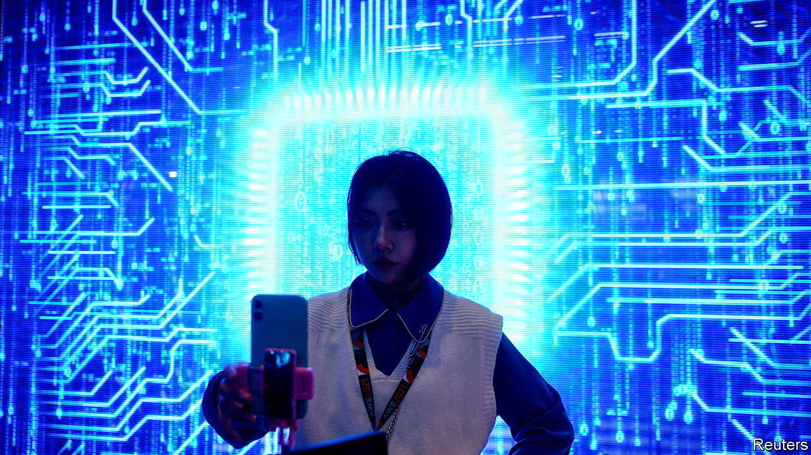

###### More Sino-American business tensions

# America tries to nobble China’s tech industry. Again 

##### Despite a thaw in some areas, Sino-American business relations feel frosty 

 

> Dec 20th 2022 

For YEARS regulators in Washington have been trying to gain access to the books of Chinese companies listed in America, to ensure they are in good order. Their counterparts in Beijing have refused, invoking vague national-security considerations. This summer it seemed as though Chinese firms with nearly $1trn-worth of shares traded in America would be forced to delist from American bourses as a result of the stalemate. On December 15th America’s auditing regulator announced a breakthrough: its team has been allowed to conduct inspections in Hong Kong.

The beancounters’ success belies a bilateral commercial relationship that is getting increasingly tetchy. On the day of their announcement, America’s Commerce Department said it had added 36 Chinese companies to its “entity list”, a designation that makes doing business with them near-impossible. The previous day a bipartisan group of lawmakers in Congress proposed a ban on TikTok, a Chinese-linked social-media platform with 100m American users. The day before that, Democratic and Republican senators introduced a bill that, if passed, would add Huawei and other Chinese telecoms companies to another list, maintained by the Treasury, of “specially designated nationals”. This would deny them access to American banks, in effect freezing them out of the global financial system.

The American government has been ratcheting up pressure on Chinese business since 2019, when Donald Trump first blacklisted Huawei. His successor, Joe Biden, is even less coy that the policies’ ultimate goal is to hobble a geostrategic rival. In October Mr Biden’s administration announced sweeping measures that block Chinese artificial-intelligence (AI) ventures from gaining access to American technology and talent. Among the latest additions to the Commerce Department’s entity list is YMTC, China’s most advanced memory-chip maker. 

In order to do business with blacklisted companies, American firms need express permission from the federal government, which is difficult to obtain. Because the restrictions apply to any American technology, even non-American businesses whose products are partly derived from it are caught up. This month the  reported that Arm, a British chip-design firm, has stopped supplying its most advanced blueprints to Alibaba, China’s e-commerce giant. The halt came after Arm decided it would be unable to obtain licences for those exports.

Recent media reports suggest that Japan and the Netherlands may join America in applying sanctions. Japan is the second-biggest seller of semiconductor equipment to China behind America. By signing up to Washington’s sanctions it closes a “major loophole” in the current restrictions, according to Jefferies, an investment bank. Analysts wonder if ASML, the Dutch monopolist in the market for chip-etching machines, will keep selling equipment to China. A halt in sales of ASML’s deep-ultraviolet lithography devices would devastate China’s semiconductor industry, since no alternative supplier exists. Foxconn, the Taiwanese firm that assembles iPhones, said on December 15th that it would sell its small stake in Tsinghua Unigroup, a Chinese chipmaker with state links. Taiwan’s government had pressed it to do so.

To avoid Uncle Sam’s cudgel, some Chinese firms are trying to distance themselves from their country of origin. TikTok has moved its headquarters to Singapore and downplays its links to ByteDance, its Chinese parent company. But severing those links is hard: engineers working on TikTok algorithms are still being hired in China, according to the . A few American states are seeking to ban the app from government-issued phones. Some have filed lawsuits alleging that TikTok makes sensitive data accessible to the Chinese government (which TikTok denies). The beancounters may be getting along. But make no mistake: technological decoupling between the world’s two biggest economies is proceeding apace. ■


