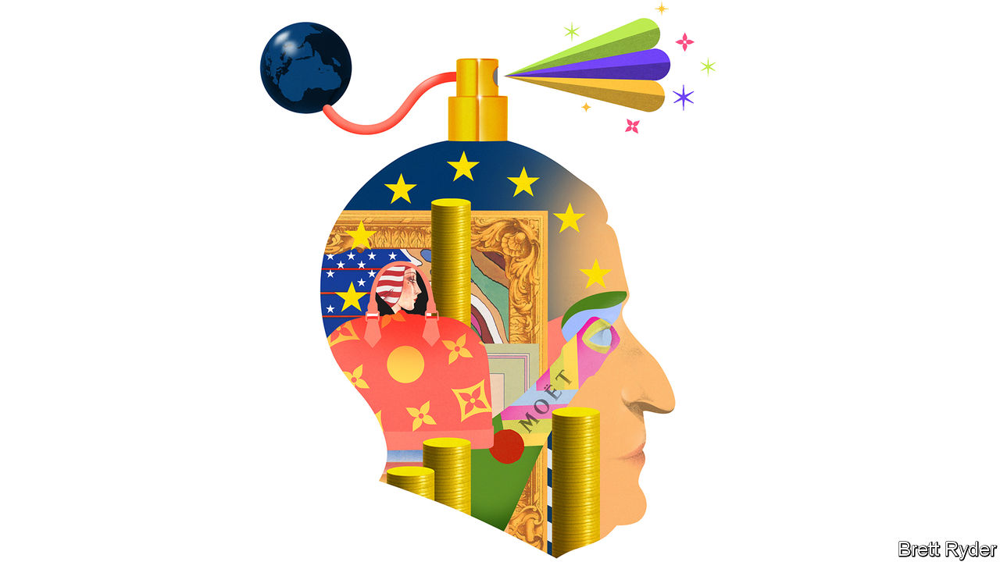

###### Schumpeter

# How Bernard Arnault became the world’s richest person 

##### The lord of luxury is a model European capitalist—but with American characteristics 

 

> Dec 20th 2022 

A story Bernard Arnault likes to tell is of a meeting with Steve Jobs, the late co-founder of Apple and father of the iPhone. Jobs was on the verge of launching the Apple Store. Mr Arnault, a Frenchman whose company, LVMH, provides high society with its Louis Vuitton luggage, Christian Dior couture, Tiffany jewellery and Dom Pérignon champagne, knows more than most about turning storefronts into temples of desire. As they talked, the conversation turned to their products. Mr Arnault asked Jobs whether he thought the iPhone would still be around in 30 years’ time. The American replied that he did not know. Jobs then asked the same question about Dom Pérignon, whose first vintage was in 1921. Mr Arnault, the story goes, assured him it would still be drunk for generations to come. Jobs agreed. 

In many ways Mr Arnault, the first European to rise to the top of the world’s rich lists, is the epitome of how to do business in the old continent. As his remarks to Jobs suggested, he thinks about the distant past and decades into the future, not just about next year’s profits. He relishes craftsmanship, championing outré designers, perfumers and cellar masters, while often reserving for himself the last word on product details. His own presence as a business titan is understated. Unlike Elon Musk, Jeff Bezos and Bill Gates, his most recent predecessors as the world’s richest people, he is not a household name—unless the household is a , or palatial. He is a regular on the Parisian fashion-show circuit, yet lets the clothes and those that wear them grab the spotlight. He is soft-spoken but is no soft touch. As a writer on this newspaper put it back in 1989, he has “a charming smile but teeth, apparently, of steel”. That reputation, which goes well with his lupine looks, is one he has never seemed to mind. 

Mr Arnault has been high on the rich list for more than 15 years. Some might think that his rise to the top this month, with a net worth, according to , of $180bn, is a cyclical fluke, the result of American technology stocks falling out of vogue, Mr Musk immolating his fortune, and analogue stuff—when untouched by the cost-of-living crisis—having a moment of glory. Yet however different the 73-year-old Mr Arnault is from a tech mogul, he, too, has remade the world of business. In the words of Luca Solca of Bernstein, an investment firm, he has invented a paradox: “selling exclusivity by the million”. To achieve that, he has brought American-style business tactics to one of the most traditional of industries and equipped it for a global, premiumised, Instagrammable world. It is an approach others should emulate.

His indoctrination into swashbuckling capitalism came in New York in the early 1980s, where he fled from French socialism. Little is known about his time there, but when he returned to France in 1984, he was quick to deploy the barbarian tactics emerging on Wall Street. First came the leveraged buy-out. He spotted a down-at-heel Christian Dior buried within a struggling textile conglomerate. He sold the dross and polished up Dior, the 38-year-old crown jewel. Then he went hostile, targeting Moët Hennessy-Louis Vuitton in the late 1980s, and ultimately ripping it away from the old money behind it. He was not always successful. Gucci, the Italian fashion house, continues to elude him. But his modus operandi is consistent. Make crafty use of the balance-sheet to buy musty fashion houses and turn them into megabrands. LVMH, worth almost €350bn ($372bn), now has 75 . 

He is more than just a dealmaker. He is a master of hype, recruiting eye-catching designers, many from outside France, to shake up the fashion establishment. Their shock value is not just confined to the catwalk. It provides publicity for high-margin fashion accessories, such as perfumes and handbags, that are LVMH’s more mainstream bread and butter. Moreover, he imposes a machine-like efficiency on the group, modernising production processes, mainly selling through LVMH’s own stores rather than licensees, and recruiting the best in the business. 

His discipline extends to profits. Though he has his eye on long-term brand equity, quarterly results rarely miss a beat. Louis Vuitton is the flagship. Mr Solca estimates it generates €20bn in sales (about a third of LVMH’s revenues in 2021), with operating margins close to 50%. Gucci pales in comparison. The cashflow enables him to outspend rivals on the fanciest stores and the splashiest marketing campaigns. An advertisement in the run-up to the World Cup, shot by Annie Leibovitz, showing footballers Lionel Messi and Cristiano Ronaldo playing chess on a Vuitton briefcase, is a case in point (even if Kylian Mbappé, the French striker, would have been a more inspired choice than Ronaldo).

Pitchforks and silver spoons 

LVMH has vulnerabilities. Mr Arnault was early to spot the promise of globalisation, first identifying the Japanese taste for luxury, and then the Chinese one. Asia, which had more than 2,200 LVMH stores in 2021, is by far its biggest source of revenue. However, Russia’s invasion of Ukraine has highlighted geopolitical threats. If the firm had to pull out of China, it would be a disaster. Moreover, premiumisation has accompanied the rise of social inequality around the world. While people believe they can emulate the rich, that is good for business. But if they feel they will never be able to join the monogrammed elite, frustrations may rise. 

Yet Mr Arnault’s European heritage gives him an extra edge in the wealth stakes. He has an old-world faith in bloodlines. Unlike Mr Musk, who has squandered some of his Tesla stock on Twitter, Mr Bezos, who surrendered part of Amazon to his ex-wife, and Mr Gates, who has sold most of his Microsoft shares, his number-one priority is to retain control of LVMH, in which his family holds an unassailable 48% stake. His five children all work in the business—albeit in what Mr Solca calls a “Darwinian contest” to succeed him when he eventually retires. No one knows better than the lord of luxury the value of keeping hold of the family silver. ■


