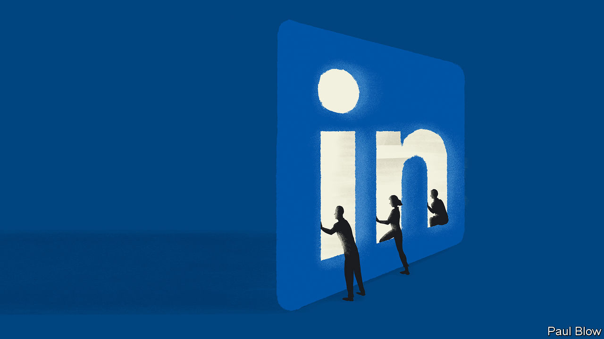

###### Bartleby

# How to make the most of LinkedIn 

##### A guide to surviving and thriving on the business world’s favourite social network 

 

> Dec 20th 2022 

SOCIAL MEDIA and career development typically don’t mix. Doom-scrolling Elon Musk’s tweets or getting sucked into the latest TikTok craze do not exactly enhance your work prospects. Unless, that is, the social network in question is LinkedIn. Founded in 2003 in Silicon Valley as a platform for professional networking, and purchased in 2016 by Microsoft for $26bn, it has become a fixture of corporate cyberspace, with more than 800m registered users worldwide. Its 171m American members outnumber the country’s labour force. High-school students are creating profiles to include with their college applications. The chances are you probably have one, too. How do you make the most of it?

For those who have yet to link up with LinkedIn, the first, critical, step is fashioning your profile. First, choose a slick photo: think visionary resolve meets empathetic authenticity. Next, list your educational and professional history. Remember, nothing is too trivial. Went to a selective kindergarten? Say so; it illustrates that you were a winner from a tender age. As you draw up your list, make sure that it reads in the most deadpan way possible: no adjectives, no personal touch. The mechanical and the matter-of-fact is at a premium.

Armed with your profile, you can get down to business and begin creating your network. You need to have 500 or more connections in your profile to be taken seriously. To achieve this, you need to step out of your comfort zone and accost complete strangers. Do not treat it as you would inviting classmates you do not know to your birthday party, which in real life makes you look desperate. On LinkedIn, cringeworthy is not part of the lexicon. Your columnist, a guest Bartleby, has amassed 6,315 connections, of whom she actually knows maybe 300.

Remember that cousin Dimitris your mother always mentions on the phone, who works at Bain Capital in Boston? What better way than an innocuous LinkedIn invite to reconnect—and get a toehold in his private-equity network. And that man who sat next to you on the red-eye back from Chicago? Even if you recall only his first name and the company he works at, LinkedIn’s algorithm should be able to let you track him down with relative ease.

If you are an analyst at Goldman Sachs, connect with every analyst in JPMorgan Chase, Morgan Stanley and UBS. Don’t worry, they are thinking the same thing, so are likely to oblige. While you are at it, you might as well approach everyone with a pulse at Goldman, too. If a higher-up—best of all, the CEO— happens to accept, you have struck gold. The boss’s existing connections will treat you as more of an equal; those desperate to get one degree of separation closer to the top dog will come begging. Your network will explode.

Next, flaunt your every success. LinkedIn is to white-collar workers what Instagram is to fashionistas: a way to present the most envy-provoking version of yourself. “Deeply honoured to have been ranked in the Global Elite category of Thought Leaders by [insert name of obscure organisation which hands out random titles].”

If you want everyone to know that you were a speaker at the Bloomberg Global Regulatory Forum, attach photos of yourself on the podium—and own it. Posting is, in essence, showing off, so any attempt to mitigate invariably comes across as humble-bragging (“I was told by colleagues I should be sharing my successes. So I am proud to announce that I was invited to participate in the Innovation Leaders panel.”). Bartleby posts only her columns (such as this one) with zero commentary. 

While you are feeding the app your achievements, do not pay too much attention to those of others—that will allow you to appear poised and unflappable, not envious. Ignore automatically generated prompts like “Congratulate Dimitris on starting a new position as co-head of European Private Equity at KKR”. These are designed, as if by your mother, to rub it in your face and motivate you to be more ambitious (come to think of it, she did mention your cousin had moved to London).

You need to play it cool so disregard all automatic prompts such as “Take a moment to recognise one year of being connected to your co-worker”. That time is better spent forging fresh connections to rack up the numbers—which, in the gratification-seeking, gamified world of social-networking, is ultimately a big part of what LinkedIn is all about. According to the latest notification, “You appeared in 178 searches this week.” So you must be doing something right. 


