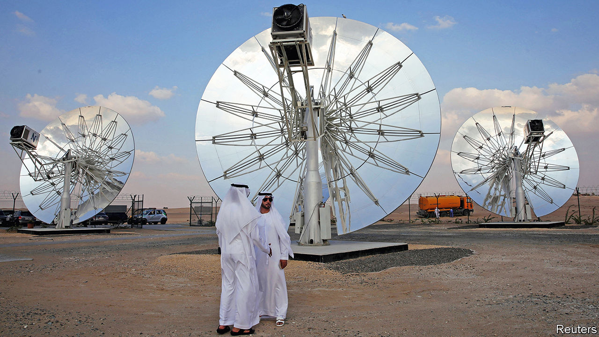
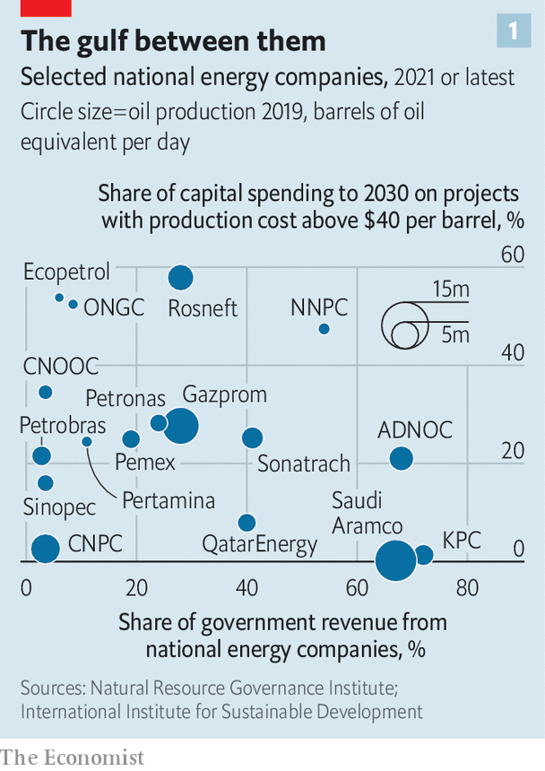
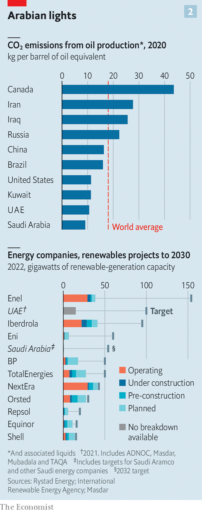

###### When brown meets green

# Why the Gulf’s oil powers are betting on clean energy 

##### Aramco, ADNOC and others are placing multibillion-dollar wagers on the energy transition 

 

> Dec 19th 2022 

THE UNITED ARAB EMIRATES sits on a rich fossil bounty. ADNOC, the national oil company, is one of the world’s top hydrocarbon producers. Two months ago the uae hosted some 140,000 delegates at the planet’s largest oil-and-gas jamboree. Against the backdrop of the worst energy crisis in decades, you might have expected much gloating about how the Persian Gulf’s carbon-spewing exports helped avert a bigger shock. That made the keynote address by Sultan Al Jaber, the UAE’s minister of industry, all the more remarkable. Mr Al Jaber repeatedly highlighted the importance of greening this brownest of industries. “ADNOC is making today’s energy cleaner while investing in the clean energies of tomorrow,” he intoned. 

In the past the grandees of the Gulf’s energy industry limited themselves to defending fossil fuels. Now many, like Mr Al Jaber, profess a commitment to decarbonisation. Saudi Arabia and Kuwait have announced targets of net-zero emissions of greenhouse gases by 2060. The UAE and Oman say they will get there by 2050. Qatar has no net-zero target, but says it will cut emissions by a quarter by 2030 relative to a scenario that assumes business as usual. All the Gulf countries have signed the Global Methane Pledge, which commits them to reduce emissions of that potent greenhouse gas. The UAE will even host the annual UN climate summit in 2023. 

 


Some suspect this is greenwash: all soothing noises and toothless targets after years of denying climate science and obstructing efforts to tackle global warming. On this view, the Gulf’s governments are too reliant on the revenues generated by the national energy firms—which account for a big share of state budgets (see chart 1)—to be serious about decarbonisation. Yet an examination of the leading companies’ investment plans reveals a genuine—and in some cases rather large—bet on green technologies. 

This is worth scrutinising, because the firms behind the effort matter beyond their region. National energy companies in other parts of the world look to the Gulf behemoths, and especially to ADNOC and Saudi Aramco, the Arab kingdom’s oil colossus, as examples to emulate. Where two of the world’s biggest energy firms go technologically and strategically, their state-run peers elsewhere often follow.

The Gulf oil champions’ approach rests on two pillars. The first is deep brown: it involves doubling down on oil and gas. Bolstered by high crude prices, the region’s energy firms are investing heavily to expand output. Aramco’s capital expenditure in 2022 will come to $40bn-50bn. It is promising even bigger sums in the next few years, as it aims to lift its oil-production capacity from roughly 12m barrels per day (b/d) to 13m by 2027. ADNOC will spend $150bn on capital projects by 2027 with the goal of boosting capacity from roughly 4m to 5m b/d. Qatar Energy will plough $80bn between 2021 and 2025 into expanding production of liquefied natural gas (LNG) by two-thirds by 2027. 

For most energy firms, doubling down on fossil fuels during the transition to a carbon-constrained world would be financial folly. Every national oil company in the world “wants to be the last one standing”, observes Patrick Heller of the Natural Resource Governance Institute, an American NGO. Naturally, “not all of them can be.” The Gulf giants, with their vast, low-cost reserves, are the likeliest to prevail. As such, their huge investments in new production could pay off, Mr Heller thinks, “even if global demand declines dramatically in the years to come”.

Oilmen betting on oil is nothing new. But the Gulf giants’ latest wagers suggest they no longer have their heads in the sand about the future of oil demand. They are keenly aware that their best customers in the developed world are going to crack down on carbon emissions, argues Mariam Al-Shamma of S&amp;P Global, a research firm. Policies like the EU’s carbon border tax, the details of which member states approved on December 18th, are a sign of things to come. “To be the last producer standing, you need more than just the lowest cost,” Ms Al-Shamma says. To ensure their longevity, the Gulf’s oil champions also intend to be the cleanest producers of fossil fuels. 

 


They enjoy a natural advantage. Their hydrocarbon reserves are among the least carbon-intensive to extract (see chart 2). The Emiratis and the Saudis have also made an effort to reduce this carbon intensity further with high operational efficiency and low gas flaring, notes Olga Savenkova of Rystad Energy, a research firm. ADNOC is spending $3.6bn on subsea power cables and other kit to replace natural gas burned at its offshore facilities with clean energy from onshore. This is both green and, potentially, good business. Ms Al-Shamma reckons that grades of crude made with fewer emissions will fetch a premium, a trend already seen in the LNG market.

The second pillar of the Gulf’s strategy is more intriguing. It involves investing part of today’s fossil windfall in the clean-energy technologies of tomorrow. The region’s governments are making some of the world’s biggest bets on carbon capture and storage, renewables and hydrogen. “A wave of low-carbon projects is building in the Middle East,” marvels one analyst.

“Saudi Arabia holds major advantages in decarbonisation,” says Jim Krane of Rice University in Texas. He points to vast tracts of empty, sunny land with a geology tailor-made for storing carbon emitted in adjacent industrial areas. Aramco plans to develop capacity to capture, store and utilise 11m tonnes of carbon dioxide a year, and to install 12 gigawatts (GW) of wind and solar power by 2035. 

Overall, Saudi Arabia aims to build 54GW of renewable capacity by 2032. Not to be outdone, the UAE is eyeing 100GW of renewable-energy capacity by 2030, at home and abroad, up from a cumulative investment in 15GW-worth in 2021. That would make Masdar, a state-controlled clean-energy outfit in which ADNOC has a stake, the world’s second-biggest developer of clean energy. It recently bought a British firm developing energy-storage technology. 

The Gulf’s biggest green bets concern hydrogen. If it is made using renewables as opposed to natural gas, hydrogen is a clean fuel. Investments in the needed infrastructure are proliferating the world over, from Gujarat to Texas. In 2021 the UAE inaugurated its region’s first such “green hydrogen” plant. ACWA Power, a Saudi utility, has almost completed financing for a $5bn green-hydrogen project. Oman, whose oil reserves are smaller and costlier to exploit than those of its bigger neighbours, is talking of a $30bn investment in what could be the world’s largest hydrogen plant. It has launched a state-owned hydrogen entity to offer green-hydrogen projects concessions in its special economic zones.

The Saudis and Emiratis are also looking abroad. Masdar is investing in a $10bn hydrogen venture in Egypt; developing 4GW of green-hydrogen and renewables projects in Azerbaijan; and has invested in a firm working on green hydrogen in northern England. ACWA Power is eyeing multibillion-dollar green-hydrogen projects in Egypt, South Africa and Thailand. By 2030 both the UAE and Saudi Arabia want to control a quarter or more of the global export market for clean hydrogen.

Ben Cahill of the Centre for Strategic and International Studies, a think-tank, sees the two countries moving aggressively on hydrogen and ammonia (which can serve as a less fiddly medium to transport the gas). They want to acquire first-mover advantage by securing deals with buyers from Asia and Europe. Qatar is spending more than $1bn on a plant to make “blue ammonia” from natural gas. It is scheduled to open in 2026. If the hydrogen economy takes off, estimates Roland Berger, a consultancy, it could produce between $120bn and $200bn in annual revenues for Gulf countries by 2050. That is far less than they now make from oil and gas; Aramco alone had sales of more than $300bn in the first half of 2022. But it is serious money—and, given the real risk of an end to the oil bonanza, suggests that the Gulf’s green efforts ought to be taken seriously.■


