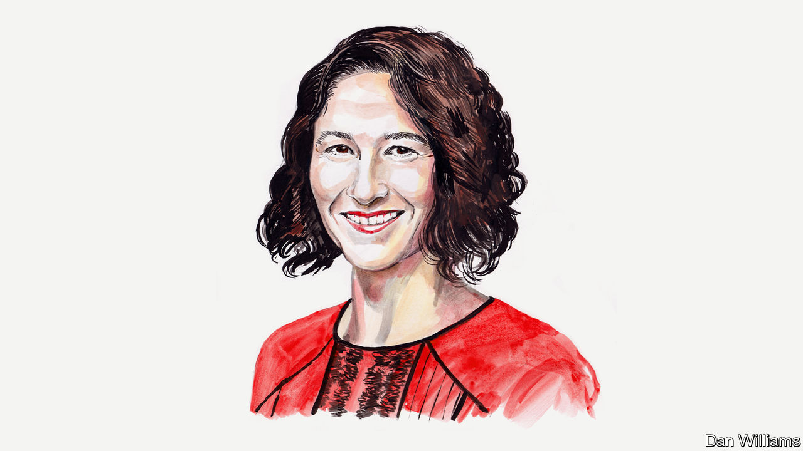

###### Biotechnology

# Jaime Yassif on the need for better safeguarding of bioscience 

##### An expert says bad-faith actors can too easily get hold of dangerous biotechnology 

 

> Dec 19th 2022 

AS A RESULT of advances in bioscience and biotechnology, synthetic DNA—the potential building blocks of a dangerous pathogen—could be just an online order away. In recent years, the cost of DNA synthesis has continued to plummet, new suppliers have emerged in countries around the world, and bench-top synthesis devices that make it easier for scientists to print DNA in their own labs are now commercially available. Safeguards have not always kept up. 

Even more concerning, one of the main barriers to a step-by-step blueprint to assemble that DNA into a transmissible, lethal virus could be no more than a paywall in a peer-reviewed academic journal. Many journals continue to publish the latest science on how to tinker with pathogens to make them more transmissible or virulent, and how to make them from scratch. 

These developments are taking place in the context of accelerating bioscience and biotechnology advances that are revolutionising the capability to engineer living systems. These can have real potential benefits in improving human health, fostering economic development, and combating climate change. However, these advances also pose significant risks of deliberate exploitation by malicious actors or through inadvertent misuse. 

Growing concerns about potentially risky dual-use bioscience research were highlighted most recently around research at Boston University involving an engineered variant of the covid virus. Earlier controversies included experiments on the lethal H5N1 avian-flu virus that made it more transmissible among humans, and an article showing how to use mail-order DNA to synthesise the horsepox virus—a close cousin of smallpox—from scratch. These incidents raised troubling questions. Could engineered pathogens be accidentally released with catastrophic consequences? And could the publication of this kind of work provide a roadmap for terrorist groups to engineer the next pandemic?

Such questions are being asked against the backdrop of rapid international expansion of research into the covid virus that caused the most recent pandemic, and other pathogens with pandemic potential. This includes work to modify these pathogens or synthesise them from their genetic components. The questions also come amid the construction of new high-containment labs to house this work, some of which may not have proper safety and security systems in place. According to GlobalBioLabs.org, a website, there are now at least 69 “biosafety level-4” labs—the highest risk classification—that are operational, under construction or planned around the world. This is a significant increase on ten years ago, and contributes to growing risks of biological catastrophe, through accidents or deliberate misuse. So, what can be done to protect against an outcome that could be far worse than the destruction wrought by covid-19?

One major challenge is that the barriers to entry for engineering biology are falling, making it possible for a broader range of actors, including those with nefarious intent, to use these technologies. For example, it is now easier than ever to read, write, and edit DNA and RNA—the underlying blueprint for all life on earth—and to shape the fundamental properties of biological systems or even build them from scratch. Though new tools for engineering biology offer tremendous potential benefits, stronger guardrails are needed to prevent misuse as they become more broadly accessible. This work is urgent. Bioengineering capabilities will continue to advance in the coming years—including through integration with AI-based-tools and robotics-enabled automation—and it will be critical to ensure that biosecurity safeguards keep up with accelerating developments.

Unfortunately, the world is nowhere near establishing strong enough guardrails. Many national governments have failed to make sufficient investments in biosecurity, and much of the work that has been done has focused on traditional approaches—including protecting labs and securing pathogen stocks. These steps are important but not sufficient. Biosecurity efforts need to incorporate new approaches to guard against emerging biological risks, but governments, not known for nimble responses, are struggling to keep pace. 

According to the Global Health Security Index, which measures biosecurity and pandemic preparedness capacity across 195 countries, as of 2021, 94% of countries had no national-level oversight measures for dual-use research. There is also no international organisation dedicated as its top priority to reducing these risks, notwithstanding the critically important work of the WHO and the Biological Weapons Convention. International leadership and collaboration is essential for advancing promising approaches and raising the bar globally for biosafety and biosecurity. Bioscience governance gaps anywhere can leave the world vulnerable everywhere. 

Building a better system of safeguards will require intervention at every step of the bioscience research and development life cycle: from funding, through research execution, and on to publication or commercialisation. For example, public and private funders who support bioscience research and innovation should incorporate more rigorous biosecurity review processes into their grant-making and investment decisions. At the same time, scientific journals should institute more rigorous pre-publication review processes to ensure that they are not publishing “information hazards” that could make it easier to engineer a biological weapon.

Industry also needs more effective—and universal—practices for screening orders of synthetic DNA to ensure that the building blocks of dangerous pathogens don’t fall into the hands of malicious actors. While some of these funders, publishers and others have voluntarily stepped forward to put strong guardrails in place, too many have not, and these groups need much better tools to guard effectively against deliberate or accidental misuse. 

Tackling this challenge will require co-ordination between governments, the biotechnology industry, the academic bioscience-research community, publishers, funders, and many others. To jump-start this effort, NTI, where I work, is co-operating with international partners to incubate and launch a new independent, international organisation called the International Biosecurity and Biosafety Initiative for Science (IBBIS). This will help to equip those on the front lines of biosecurity with practical tools and solutions to undertake the types of interventions described above, so biotechnology can flourish safely and responsibly. 

IBBIS will be the first international organisation dedicated to reducing emerging biological risks associated with technology advances. It will work with key players across the public and private sector and is designed to be agile, risk-tolerant and innovative. Its initial focus will be to support the implementation of more robust DNA-synthesis screening practices globally, but the scope of its work will expand over time.

The 21st-century bioscience revolution is creating incredible opportunities to help us all live healthier, longer lives on a thriving planet. The international community—with governments, industry, and the research community working in tandem—must take bold steps now to safeguard bioscience so the world can benefit from its promise and prevent its perils.■


