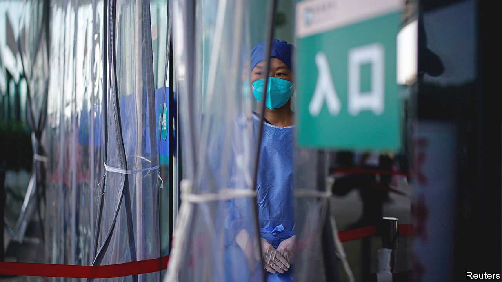
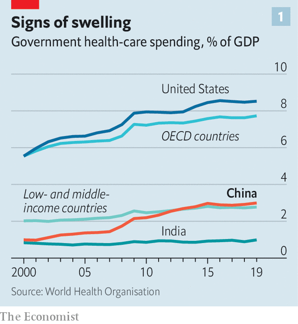
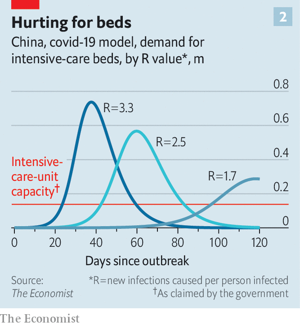

###### A pandemic stress test

# A wave of covid-19 reveals flaws in China’s health system 

##### It is better than it used to be, but still needs reform 

 

> Dec 19th 2022 

Within the next month, China’s medical institutions will face their “darkest hour”. This warning by Zhang Wenhong, a prominent infectious-disease expert, has been circulated by state media. It reflects a view that not long ago would have been treated as heresy in “zero-covid” China. But with the virus now sweeping the country, including its hospitals, talk of crushing it has ceased. People are queuing for hours at fever clinics. Medical staff are falling sick in droves. In the coming weeks deaths will rise rapidly as the disease takes its toll on an undervaccinated population. 

For much of the past three years, since cases of covid-19 were first detected in the central city of Wuhan, the government has viewed its handling of the pandemic with pride. It had succeeded in keeping covid at bay and deaths to an astonishingly small number compared with many other countries. It had also managed to turn this to great propaganda advantage. At least until late this year, when the virus began to run loose and protests erupted over often-brutally enforced lockdowns, many people appeared to buy the official line that China’s accomplishments were the product of a superior political system, one said to be uniquely capable of mobilising people and resources on a scale needed to prevent the virus from spreading. 

With zero-covid now all but abandoned and streets near-emptied not by lockdowns but by fear, the public’s attention is turning to the health-care apparatus. In recent days calls in Beijing to 120, the number for medical emergencies, have risen to five or six times the normal level. “Covid chaos”, as a newspaper in Beijing called it, has broken out in hospitals. People in many cities have been flocking to them, terrified even by mild infection with the virus. They were once told that it posed a grave threat to their lives. Now, dismissively, officials are calling the current Omicron variant flu-like. But immunity to covid is low in China, so the ballooning number of cases will result in many deaths: about 1.5m in the next few months, by ’s worst-case estimate. 

Fatalities on such a scale would still be lower, as a share of the population, than seen in many other countries as a result of covid. But they will raise questions in China about weaknesses in the country’s health-care system and whether they may have contributed to people’s suffering and the ordeal of medical staff. 

It would not be the first time for such soul-searching. An outbreak of SARS, which was first detected in China in 2002 and killed hundreds, mostly within China, prompted much debate about the system’s failings. Having initially covered up the emergence of SARS, officials became more open. Henk Bekedam, then the World Health Organisation’s chief representative in Beijing, recalls a study by Chinese government researchers, funded by the WHO, that was completed in 2005. , a state-controlled newspaper, revealed details of it with an eye-catching headline: “China’s health reforms have not succeeded”. It was “quite something” to see those words, says Mr Bekedam. 

Under Xi Jinping, who became China’s leader a decade ago, public acknowledgment of policy error would be harder to imagine. Perhaps, he may feel, there is less need of one. Much has been done to remedy the problems that SARS highlighted. 

A big one was the public’s fear of any contact with the health system because of the high cost of getting treated. Before SARS, community-level care had crumbled. Many state-owned enterprises and the “people’s communes” that had once provided health services had been dismantled. Hospitals remained under state control but had become market-driven. To pad their budgets and the wallets of their staff they could set their own prices for drugs and treatments. In cities, only people with formal job contracts had access to insurance. Most of China’s 900m rural dwellers had to pay for their own medical expenses.

 


After SARS, officials ramped up efforts to enroll rural residents in a government-funded health-insurance scheme. In 2007 they did the same in cities among those without formal jobs. Two years later the government unveiled a plan for health reform that aimed to provide affordable, basic care for everyone (“universal health coverage”, as the WHO calls it) by 2020. It involved a big increase in government spending. The government’s annual outlay on health as a share of GDP tripled to about 3% compared with the amount being spent at the time of SARS, the WHO reckons (see chart 1). By 2011 more than 95% of China’s population had some form of government-financed health insurance. By 2017 the number of health workers per person had increased by more than 85% and the number of hospital beds by nearly 145%. 

Lessons from Wuhan

Much, then, to crow about. But the eruption of covid in 2019 showed that a lot remained to be done. The SARS outbreak, tiny by comparison, had revealed woeful inadequacy in China’s disease-surveillance apparatus. With American help, China tried to remedy this by training hundreds of people in how to respond to such events. But covid was rampant in Wuhan by the time the chief of the Chinese Centre for Disease Control and Prevention, George Gao, learned about it, according to reports. 

What unfolded in Wuhan in 2020 exposed wider problems in the health-care system. The government’s efforts to rebuild community-level care, and make it act as a gateway to hospitals like Britain’s general-practitioner (gp) clinics, had clearly made little progress. Terrified residents of Wuhan, often with only mild symptoms of covid, rushed straight to hospitals—disdainful (as many Chinese are) of neighbourhood health centres where doctors tend to be less well-trained and equipment inferior. Writing in the , four academics in Wuhan described the scene as “chaotic”, like a bank run. Community health centres proved of little use. Their doctors were summoned to help out in hospitals. A national plan for health-care development had called for community clinics to have 3.5 health workers per 1,000 residents served by 2020. At the start of the pandemic, Wuhan’s had only 2.7, the scholars noted. Stripped of their bare-bones staff, some clinics had to close as the virus swept the city. 

Days after the first covid-related death was announced, the tide began to turn. A citywide lockdown was imposed. The city’s government began demanding that citizens with symptoms be escorted to community health centres for checks. This helped to ease some of the pressure on hospitals. But the clinics struggled to cope. Many people with chronic conditions such as high blood pressure or diabetes had been getting their medicine and check-ups at hospitals. When hospitals stopped providing such services to limit the flow of people, community facilities were supposed to take up the reins. They were unprepared. “Throughout the city, it became difficult for outpatients with chronic diseases to see a doctor or get their medicine,” the academics said. 

As the virus runs rampant again, officials are trying to show they are better prepared. The city government in Beijing says that by the end of November—a week before the main mechanisms of zero-covid were dismantled—240 of the capital’s community health centres had set up fever clinics. Within another few days the remaining 110 or so had opened them, too. 

But until recently they had not been busy vaccinating people. Amy, a vlogger in the city of Kunming, says she was fully vaccinated at her local clinic six months ago, but has heard nothing from them since about a booster. (Chinese-made vaccines, the only type permitted in China, are less effective than the ones commonly used in rich countries.) She has just tested positive, with mild symptoms. Were it to get more serious, official advice is that she go first to her community clinic. But Amy insists she would go to hospital, despite the queues and brevity of consultations. The quality of care is better there, she says.

Trick or treatment?

Amy’s view is not surprising. China’s health-care system, and the ability of its health-care institutions to respond to emergencies such as covid, are still saddled with many of the same problems that were evident during SARS. In 2017 the government stopped allowing hospitals to sell essential drugs at a mark-up as a way of generating revenue—a practice that had been causing huge public resentment. But hospitals still find other ways to make money, such as by prescribing unnecessary treatments, including expensive inpatient care. To attract customers they buy shiny, imported MRI scanners and other diagnostic tools, and charge patients steep prices for tests, as less glamorous but important areas of care are neglected. 

Since 2001, thanks to the government’s insurance schemes, out-of-pocket payments for health care have dropped from about 60% of households’ health spending to 30%, according to “Healthy China”, a report in 2019 by the WHO, the World Bank and the Chinese government. But this was still higher than the average of about 20% in the OECD, a club of rich countries. 

The profit motive in hospitals has created a blizzard of distortions. One is evident in the country’s shortage of intensive-care beds, a problem that will worsen as serious cases of covid rise. Before the pandemic, hospitals had pondered their worth. Why spend money on installing them and training specialist staff when a far steadier stream of revenue could be created by focusing on the predictable needs of patients with non-communicable diseases, such as cancer and heart ailments? These are fast-growing as the population ages, lifestyles change and pollution undermines health. 

In early December the government ordered hospitals to ensure their critical-care beds were ready for use by covid patients, including beds earmarked for other kinds of illnesses. This month the government said there were now about ten per 100,000 people—a big increase from recent official figures of about four. 

 


But ’s modelling suggests that is still only about one-third of the number that may be needed to cope with the covid wave (see chart 2). A paucity of intensive-care capacity had been one of the main reasons for maintaining a zero-covid policy. Ramping it up now will not be helped by a chronic shortage of nurses with the necessary skills. Those who suffer most from the critical-care deficit will be people living in places other than the biggest cities, where the fanciest hospitals are concentrated. In the countryside many village “doctors” do not even have a university degree.

The government is clearly aware of the problem. Its latest health-reform plan, published in 2016, stresses the need for an effective primary-care system. It has spent billions of dollars on beefing up community-level facilities. But recruiting talent for the medical profession is hard enough—salaries are relatively low, as is public respect for doctors. Violence against medical staff is common, often triggered by high prices for their services. Persuading doctors to work in general practice outside hospitals is even tougher. With fewer expensive facilities and medicines at their disposal, community GPs have less opportunity to augment their salaries.

Neither they, nor doctors in hospitals, have much incentive to make the system work better. Ideally, primary-care facilities should refer people in need of special care to hospitals, which in turn should send patients back for routine follow-up treatment. But referrals can deprive those making them of customers, and doctors are reluctant to lose business. George Liu of La Trobe University in Melbourne notes that the volume of care delivered by community health workers in China has increased in the past decade, but their share of the total has declined. “That’s because they are still competing with hospitals,” he says. 

As covid cases rise and local governments scramble to beef up primary-care facilities to divert patients from overstretched hospitals, some see a glimmer of hope. On WeChat, , the health ministry’s mouthpiece, said the shift of attention to community clinics had created an “opportunity”. Their fever departments should become a permanent feature, not just a covid-related one, it suggested, so that people with high temperatures would no longer feel a need to go to hospital. 

It is astonishing that China, a country that has hosted two Olympic games and boasts of landing spaceships on the Moon, is still debating how to build community health clinics that patients trust and want to use. If the covid pandemic can accelerate long-needed change, some of the suffering it is causing will not have been in vain. ■


