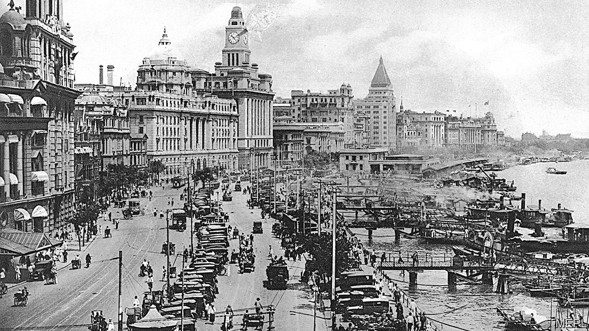

###### Way back when

# Bertrand Russell and “The Problem of China” 

##### A sage’s century-old look at a country on the rise 

 

> Dec 20th 2022 

Upon arriving in China in 1920 Bertrand Russell, a British philosopher, was overwhelmed at the welcome he received. “They hail me as the second Confucius, and invite me to tell them exactly what they are to do with their country,” he wrote to a paramour. “It is a terrible responsibility.”

Still, Russell took up the challenge. After a sojourn lasting nearly ten months, he returned to England and in 1922 published a book called “The Problem of China”. It remains relevant a century later, offering enough wisdom to offset its occasional lapses into folly.

Russell’s observations are at times prescient. He described, for example, how “the most urgent problem in China’s relations with foreign powers is Japanese aggression.” He also noted that Russia’s Bolsheviks enjoyed “the enthusiastic sympathy of the younger Chinese students” and might gain wider appeal. 

One young person whom Russell met during his stay was Mao Zedong. The future Communist leader’s name does not appear in the book. But Russell declared that “a vigorous reformer possessed of literary skill could carry with him the great majority of Young China.”

Russell thought China was being held back by Confucianism’s emphasis on filial piety, which, he argued, led to corruption and “prevented the growth of public spirit”. He foresaw a booming Chinese textile sector, with the potential to be “as great as that of Lancashire”. He thought that contact with the West would help China’s industrial development, which he expected to “proceed rapidly throughout the next few decades”. But he warned China that “development should be controlled by the Chinese rather than by foreign nations.”

Critics knock Russell for failing to spend much time in the countryside and holding China to different standards from other countries. Some of his observations are quaint, such as his description of Shanghai as “a vast city, about the size of Glasgow”. Others are cringe-worthy, such as his view of the Chinese as “gentle, urbane, seeking only justice and freedom”. Compared with “white races”, they have “much less desire…to tyrannise over other people,” he wrote. Tibetans and Uyghurs might disagree.

“I don’t think I shall write on China. It is a complex country, with an old civilisation,” Russell stated in correspondence, before changing his mind. In his letters he often sounds like a detractor. In one, for example, he describes China as “decaying and rotten, like the late Roman Empire”. He also gripes that “most of the students are stupid and timid,” whereas in the book he calls them “able and extraordinarily keen”.

“The Problem of China” was widely read in the country and praised for its largely positive assessment. (It is still available there today.) Russell believed that China, with its resources, population and patriotic spirit, could become “the greatest Power in the world after the United States”. But he also offered a warning: “The danger of patriotism is that, as soon as it has proved strong enough for successful defence, it is apt to turn to foreign aggression.” 


