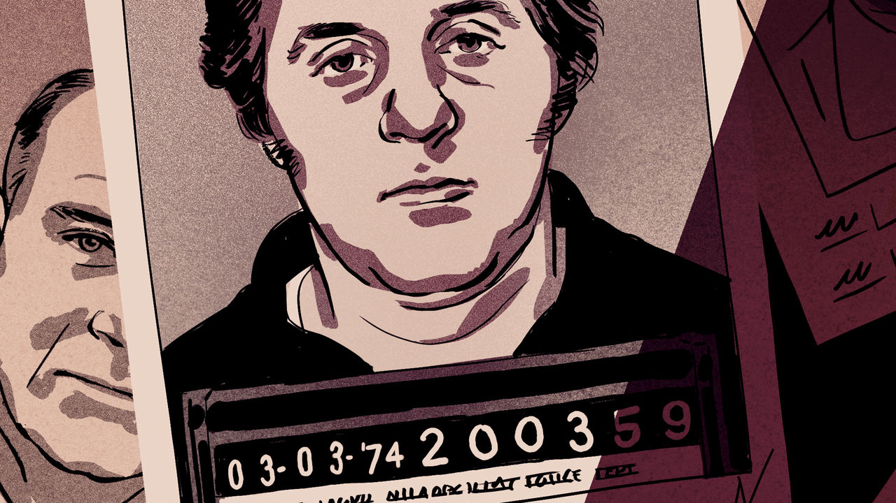

###### Secrets of the shallows

# A megadrought has revealed a possible mafia murder mystery 

##### Las Vegas has a long history with the mob 

 

> Dec 20th 2022 

The metal barrel was rusted and broken. Mud from the drying lake bed obscured its contents, but did not hide them entirely: a woman standing on the shore of Lake Mead screamed when she spotted it. Bones stuck out of the barrel, as if whoever was shoved inside was trying to claw their way out and get to shore. About 300 people have drowned in Lake Mead, a man-made reservoir 30 miles east of Las Vegas that supplies much of the city’s drinking water. This was different: the victim was shot to death.

His clothes were from the late 1970s or early 1980s, when Lake Mead’s water level was around 100 feet higher than it is today. The barrel would have sunk to the bottom. But more than 20 years of punishing drought have taken their toll. A white ring stains the rust-coloured canyon walls, leaving a visual marker of how far the water has dropped. The emergence of Hemenway Harbour Doe, as the body became known, is the weirdest manifestation of the megadrought so far.

Armchair detectives pondered who was in the barrel. Officials kept schtum while they tried to identify the body, creating an information vacuum that let speculation run wild. Las Vegas was a mafia-run town for decades, and the details of the crime—gunshot, barrel, desert—seem pulled from a Martin Scorsese film. Could it be Jimmy Hoffa? The labour leader with mafia ties disappeared in 1975 and has never been found. Or perhaps someone local? Several men connected to the mob disappeared around the same time Hemenway Harbour Doe was murdered. The barrel’s discovery, and the murder mystery it contains, has awakened a curious nostalgia for Vegas’s seedy past. 

Some think Las Vegas struck a deal with the devil. For years, officials left the mob and their casinos alone because they made so much money for the state. Mob operatives pilfered money from the cash boxes at poker tables and from the “count room”, where the house’s winnings were tallied. 

By the 1970s, the Chicago Outfit was the city’s most powerful mob faction. But  could never get a licence to run a casino themselves; they needed a front man. That was Allen Glick, a developer from San Diego. Argent Corporation, Glick’s company, bought several dubiously financed casinos in the 1970s, including the Stardust and a resort at Echo Bay, out at Lake Mead. 

A man named Johnny Pappas ran the Echo Bay property for Glick’s company. He even kept his own boat at the marina. In 1976 Pappas went out to meet someone interested in buying it. He never came home. His family say he feared for his life before he disappeared. If bookies offered odds on the identity of Hemenway Harbour Doe, Pappas would be the favourite—narrowly ahead of George “Jay” Vandermark.

Vandermark oversaw the slot machines at the Stardust, which by the 1970s was run by Frank “Lefty” Rosenthal, a sports-betting genius—and the model for Robert De Niro’s character in “Casino”, Mr Scorsese’s 1995 film about the mafia’s reign in Las Vegas. Glick was his boss on paper, but he probably answered to the mob. The slots made a lot of money for both the Stardust and the Outfit. The Nevada Gaming Control Board alleged that Vandermark stole $7m-15m from Argent. He fled Vegas in 1976 when officials cottoned on to his racket, and was last seen in Phoenix later that year. 

But who was the trigger man? Back then cash was everywhere, and the bosses in Chicago needed someone to make sure their money actually made it all the way back to the Midwest. They needed an enforcer. 

Enter Tony Spilotro, who arrived in Las Vegas in 1971. He made up for his short stature with prodigious belligerence (Joe Pesci in “Casino”). When Spilotro was coming up on Chicago’s west side, his gang allegedly put an ice pick through another man’s testicles, and he squeezed his head in a vice until an eyeball popped out. His reign in Vegas was bloody. In 1974, the  reported that there had been more mob killings and violence in the past 24 months than in the previous 24 years. The fbi suspected Spilotro of about two dozen murders, but he was never convicted. He owed that to Oscar Goodman, Spilotro’s defence attorney, and, later, a three-term mayor of Las Vegas. 

A mafia lawyer turning mayor may seem odd. Not in Vegas. The mafia was part of the fabric of the city. Neighbourhood kids would play baseball with Spilotro’s son, or ride to school in Rosenthal’s Cadillac. Gangsters would pay for gamblers’ chicken dinners at their local casino. Anyone who objected knew to keep quiet. As Michael Green, a historian at the University of Nevada, Las Vegas (and a rare Vegas native), puts it: “There were people who knew it and lived with it. There were people who didn’t think about it and lived with it. And there were people who thought about it, had problems with it, but what could they do?”

 


The Outfit’s heyday didn’t last forever. By the late 1970s and early 1980s the fbi had all but declared war on Spilotro. Wiretapping investigations exposed the rampant theft at Argent’s casinos, leading to the indictments of several Midwestern mob bosses. While they awaited trial, they worried about their allies turning into government informants. Frank Cullotta, one of Spilotro’s henchmen, once described the bosses’ paranoia to Nicholas Pileggi, a writer who specialises in mob tales. “I’ve heard them go around a room,” Cullotta said. He imitated their conversation: “‘Joe, whadda you think of Mike?’ ‘Mike’s great, balls like iron.’ ‘Larry, whadda you think of Mike?’ ‘Mike? A fuckin’ marine’…‘Charlie, whadda you think of Mike?’ ‘Why take a chance?’ And that’s the end of Mike.” 

Around the same time this paranoia was spreading, Hemenway Harbour Doe was murdered. 

Both Vandermark and Pappas had been insiders. Did they know something they shouldn’t? Were the bosses worried that they would talk in exchange for immunity? Was Spilotro sent to keep them quiet? Maybe they met peaceful ends nowhere near Lake Mead. Or perhaps if Hemenway Harbour Doe is ever identified, one of them will at last be found. 

Past meets present

Vanishingly few Las Vegans who remember the 1970s are still around. Mr Green was just a kid when his father dealt cards at the Stardust. Rosenthal fired him personally during one of his regular power trips. He would line employees up, Mr Green recalls his father telling him, pointing to each worker in turn as he decided whether they could keep their job that day.

Those days are long gone. Spilotro and his brother were found buried in an Indiana cornfield in 1986. By the mid-1990s, the mob had been priced out of the casino business, and casino security had become too sophisticated to beat. The Stardust was levelled in 2007. Its 1,000 hotel rooms seem quaint compared with the 4,000-room behemoths built by billionaires and multinationals. Once just a centre for sports gambling, Las Vegas now has its own professional sports teams. 

These days, Mr Goodman, now 83, is the unofficial mascot of Las Vegas. Every few months he hosts a dinner at a hotel steakhouse where he regales his guests (who pay at least $300 a table) with stories about Rosenthal, Spilotro and his other clients. Martini in hand, he reminisces about playing himself in “Casino”. He marvels at Mr Pesci’s mimicry of Spilotro’s mannerisms. He still uses the vocabulary of old Vegas, when women were “broads” and men were “fellas”. 


Mr Goodman chafes at the speculation that Spilotro may have had something to do with Hemenway Harbour Doe’s death. He rails against reporters and law enforcement for describing his friend as a cold-hearted killer. He prefers to remember the softer side of Tony, recalling how the mobster would check on his wife Carolyn (now in her third term as mayor) when he was out of town defending the Syndicate. If the mob wanted to get rid of a body, he muses, they would just dig a hole in the desert. Why go all the way out to the lake? It is tempting to believe him. He probably understands, better than most, how the mob worked. Or maybe he just zealously defends his clients, dead or alive. 

Mr Goodman’s storytelling and Hemenway Harbour Doe’s emergence have something else in common. They link the city’s mafia days to the modern metropolis it has become. Today the mafia isn’t feared; it’s kitsch. The Mob Museum (Mr Goodman’s idea) opened in 2012. Nearly 400,000 people visit each year. They can buy “I know a guy who can take care of it” t-shirts, or key chains with their names engraved on a bullet.

Hemenway Harbour Doe reminds locals that less than one lifetime ago their city was a centre of the criminal underworld. Lake Mead may offer more reminders: since the corpse appeared, five more sets of remains have emerged. No foul play is suspected. But the drought will worsen, the shoreline will retreat, and the waters will give way to dry, cracked earth. What other secrets lie waiting in the shallows? ■

ILLUSTRATIONS: Patrick Leger


