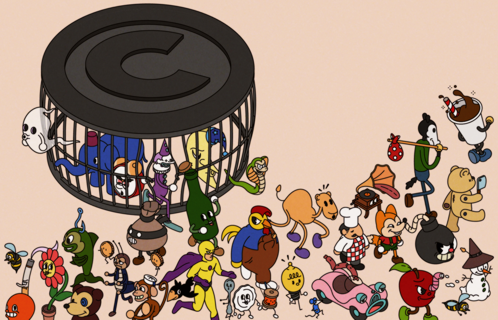
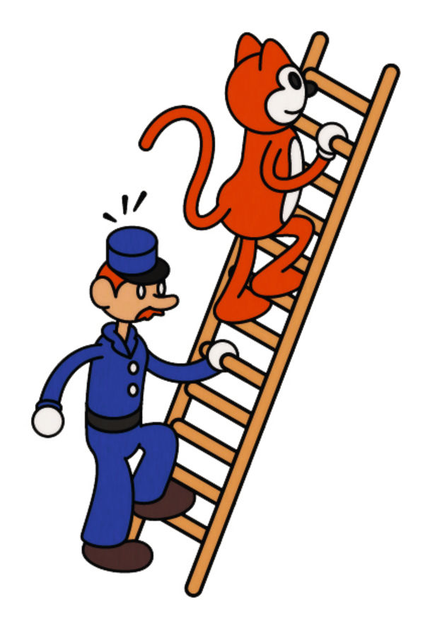

###### Taking the Mickey

# A treasure trove of Hollywood intellectual property is heading for the public domain 

##### Mickey Mouse is about to be set free 

 

> Dec 20th 2022 

Trouble is afoot in the Hundred Acre Wood. Christopher Robin, now grown up, returns to his childhood stomping ground to find Eeyore dead, Piglet grown into a snorting wild hog and Pooh wielding a sledgehammer. The feral animals murder anyone in their path—mostly young women, some in bikinis.

A.A. Milne, who created Pooh in 1926, might not have approved of “Winnie-the-Pooh: Blood and Honey”, a low-budget slasher film due out in February. But no approval from his estate was needed. In January 2022 the copyright on “Winnie-the-Pooh” expired in America and the work entered the public domain. Since then the bear has also featured in a mobile-phone advertisement as “Winnie-the-Screwed”, complaining to Rabbit that his mobile bill is too high.

Every year a new haul of creative work leaves copyright and becomes free for anyone to adapt and exploit. In America, where copyright for older works is usually 95 years, recent entries to the public domain include Ernest Hemingway’s “The Sun Also Rises” and F. Scott Fitzgerald’s “The Great Gatsby”. 

But a new era in copyright is now dawning. As the limit begins to expire for works created in the late 1920s, the public domain is starting to receive not only works of literature, art or music, but video, too. Hollywood’s intellectual property, some of it still wildly valuable, is increasingly up for grabs.

In January “The Jazz Singer”, one of the first successful “talkies”, will go out of copyright. Warner Bros, which released the film in 1927, is unlikely to worry much about losing the rights to what is today a historical curiosity. But a year later “Steamboat Willie”, the first film featuring Mickey Mouse, who sits at the centre of Disney’s merchandise business which brings in more than $5bn a year, will be there for the taking. In the 2030s Disney films including “Snow White”, “Bambi” and “Fantasia” will slip out of copyright. So will some of the comic-book heroes who are among the most successful performers at the modern box office. The latest Batman movie took more than $770m at the box office; Warner has two sequels planned. Yet from 2035, anyone will have the right to make one.

For Hollywood executives 95 years may feel all too fleeting, but copyright terms used to be much shorter. The first modern copyright law in the English-speaking world, published in 1710, gave rights-holders in England up to 28 years’ ownership of their work. America followed suit with its first federal copyright law in 1790. By 1909 the term was 56 years. This held until the 1970s. Then, just as Hollywood’s treasures were about to become public property, Congress stepped in to lengthen the term to 75 years. In 1998, as Domesday approached once more, Congress passed the “Mickey Mouse Protection Act”, as it was mockingly known, extending the copyright term to 95 years.

Many expected a further extension. None has materialised. The reason, in a number of ways, is the internet. First, it has turned voters into copyright liberals. In the 1990s the subject of copyright was of interest only to “educators, historians and librarians”, says Mitch Stoltz of the Electronic Frontier Foundation, a free-speech pressure group. With the advent of the internet, people saw how easily information could be copied, and how copyright rules curtailed their ability to share music or images, or to post on social media.

The internet also changed the balance of lobbying power. Publishers, record labels and film studios had always pushed for lengthy copyright terms; no commercial interest had reason to push hard against them. That is, until the arrival of companies such as Google and YouTube, which make their money by sharing other people’s content. Google won legal battles over its use of copyrighted pictures in its image search. Record labels sued YouTube for hosting clips featuring their music, before the labels decided to settle.

More recently, America’s culture wars have made Congress more hostile towards Hollywood. Josh Hawley, a Republican, has called for copyright to be shortened to punish “woke corporations like Disney”. That is unlikely, but another extension is less likely still.

As valuable properties slip towards the public domain, film studios are shoring up their legal defences. One comfort to Hollywood is that more recent, better-known versions of their characters are still off-limits. “Steamboat” Mickey is black and white and doesn’t wear white gloves. The Winnie-the-Pooh now in the public domain is the version drawn by E.H. Shepard in 1926, rather than the red t-shirted, bare-bottomed creation that Disney popularised in 1966. Batman will go out of copyright in 2035 but the Batmobile will be protected until 2037, since for his first couple of years Batman drove a pedestrian red sedan.

As the copyright deadline approaches, Hollywood is preparing another defence. Lawyers for studios such as Disney are getting ready to make the case that characters like Mickey Mouse are not just literary works, but logos. Brands and emblems fall under trademark law, which exists to help consumers identify products as originating from a certain company. And while copyright expires, trademarks can last for ever.

The pioneer of “double-wrapping” creative works in both copyright and trademark was Edgar Rice Burroughs, who locked up both sets of rights to “Tarzan of the Apes”, which he wrote in 1912. Today “Tarzan” is out of copyright, meaning anyone is free to write a Tarzan story. But anyone putting Tarzan’s name or image on a piece of merchandise can expect a complaint of trademark infringement from Edgar Rice Burroughs, Inc., which has licensed the Tarzan name for everything from video games to casinos. In practice, this is enough to put big names off creating unlicensed Tarzan stories. Today, such spin-offs are an essential part of the economics of film production.

That sure is swell

Disney holds Mickey Mouse trademarks for a wide range of commercial uses and might argue that his appearance on a t-shirt, say, would fool consumers into thinking the apparel was a Disney product. Yet this argument only goes so far, suggests Eric Perrott of Gerben, a firm of trademark lawyers. From 2024 a company will be within its rights to use a frame from “Steamboat Willie” on a t-shirt, he argues. And the vendor would be allowed to use the words “Mickey Mouse” to describe such a product, just as a used-car dealer can use a brand name like Volvo without permission.


But anyone selling Mickey merchandise can expect a bruising time. “Even if you’re right, [when] fighting Disney in a legal battle you’ve already lost because of how expensive it will be,” Mr Perrott cautions. Hollywood takes no prisoners when defending its intellectual property. In 2015 a court upheld Warner Bros’ complaint against a mechanic who had been making and selling replicas of the Batmobile for $90,000. The judge cited Batman in her ruling: “In our well-ordered society, protection of private property is essential.”

As copyrights near their sell-by dates, Hollywood is getting ready. Studios are wringing value out of properties like Batman while they still can, says Dan Mayeda of the University of California, Los Angeles, while also building up spin-offs whose copyright will last longer. Trademarks are being beefed up. Since 2007 Disney’s animation arm has incorporated a few seconds of “Steamboat Willie” into the logo that pops up at the beginning of its movies in an effort to establish that specific Mickey as a trademark, believes Mr Stoltz.

 


Defenders of long copyright terms argue that they encourage creativity by forcing artists to make original content rather than rehashing that of others. Yet no industry has demonstrated better than Hollywood how reimagining an old work is an art in itself. Disney raided the back catalogues of public-domain writers like Hans Christian Andersen for material that its animators turned into original films such as “The Little Mermaid” and “Frozen”. It drew on Arabian folk-tales for “Aladdin” and Polynesian mythology for “Moana”. Since acquiring Marvel it has taken tired comic-book heroes from the 1960s and turned them into the most popular movies of the 21st century. 

The shifting of Hollywood’s cultural treasure into the public domain promises to spark more such creation and recreation. Some of the resulting output should add more value than “Blood and Honey”. Meanwhile, fans of Pooh’s gruesome new adventure will delight in its producers’ next project: a horror reimagining of “Peter Pan”, whose stage-adaptation rights enter the public domain in America in a year’s time. ■

ILLUSTRATIONS: Emile Holmewood


