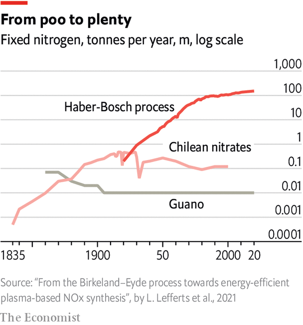

###### The wibbly-wobbly circle of life

# Deadly, dirty, indispensable: the nitrogen industry has changed the world 

##### It lays waste to ecosystems, allows wars to kill millions and has kept billions from starvation 

 

> Dec 20th 2022 

It used to be a marvel; it remains, in its way, a subject of awe. Between the River Tees and the town of Billingham in the northeast of England there is a sprawling chemical works just over 100 years old. In the 1920s, as part of the newly formed Imperial Chemical Industries (ici), it was feted as a miracle of modernity; to a visiting Aldous Huxley it was “one of those ordered universes that exist…as pure logic in the midst of the larger world of planless incoherence”, a forerunner of the sort of future he would explore and deplore in “Brave New World”. In the 1940s its strategic importance made it a target for the German Luftwaffe; by the 1960s it employed 20,000 people, the largest plant of its sort in the world.

Today cf Industries, the American firm which now owns the site, employs just 200 people on Teesside. Behind its perimeter fences much of the once thronged area borders on the derelict. But the plant can still fulfil the function for which it was first built. Billingham fixes nitrogen. 

“Fixing” nitrogen means turning the element’s chemically inert gaseous form, which makes up 78% of the atmosphere, into a more reactive compound. Only after this is done can the nitrogen-containing compounds fundamental to agriculture and industry be created. Plants such as Billingham perform this crucial step by distilling nitrogen from liquefied air and reacting it with hydrogen generated from methane and steam to make ammonia, a gas in which every nitrogen atom is bound to three hydrogen atoms.

The mixture of temperature, pressure and catalysts needed in order to make this happen was first demonstrated by Fritz Haber, a German chemist, in 1909; the means of providing them on an industrial scale were developed by Carl Bosch of basf, a German chemicals firm. In 1913, at a plant in Oppau, outside Ludwigshafen on the Rhine, the Haber-Bosch process got to work. At the end of the first world war the treaty of Versailles required the details of the process to be revealed to the victors, and chemical engineers descended on Oppau to understand how it might best be copied at places like Billingham. Huxley found the result awe inspiring:

The scene of [the final transformation] is a huge building…church-like by reason of the silence that reigns there, its solitude and the long line of vast steel cylinders receding, like the columns of a Norman cathedral, into a distant twilight. It is within these cylinders that the mystery is finally consummated. Brought into contact with a catalyst, the hot compressed gases suffer a last sea change. That which, a quarter of a mile away, was air, emerges from the cylinders as ammonia.

Ammonia has many uses; it can be a cleanser for water supplies or a way of scrubbing toxic gases from exhausts. It is a chemical feedstock that can be turned into nitric acid, necessary for the synthesis of explosives such as trinitrotoluene (tnt), or cyanide, which the chemical industry uses to make polymers such as nylon. And it can be used to make fertilisers.


Poke around on a British farm and you will probably see blue bags of the Nitram-brand ammonium-nitrate fertiliser pellets made in Billingham. If it were possible to poke around inside the crops growing in those farms’ fields, you would find that much of the nitrogen they contain had come from such pellets. And if you are a Briton who does not source your food almost entirely from organic farms (which eschew chemical fertilisers) something similar is true for you, just as it is for most people in rich and middle-income countries. The human body typically contains a few kilograms of nitrogen, an amount which, lumped together, would weigh about as much as your arm from finger tip to a bit above the elbow. In most people, in most parts of the world, a good kilo of that nitrogen has passed through the reaction vessels of the Haber-Bosch process. A factory-made forearm’s worth of flesh.

Without the Haber-Bosch process it is estimated that 30-50% of the world’s harvest would be lost; it is fundamental to feeding the world’s 8bn people. Like electricity and the internal combustion engine, it is one of the preconditions of modernity. 

And just as the fossil-fuel use that has provided most of the world’s electricity and mobility has rearranged the planet’s carbon cycle, so the drive to fertilise has upended its nitrogen cycle. About 90% of the nitrogen fixed into fertiliser at a plant like Billingham fails to get into humans. Much of it builds up in the environment rather as carbon dioxide builds up in the atmosphere. As with the carbon dioxide, this causes problems. It kills people, reduces biodiversity and affects the climate. Its effects are less disturbing than those of carbon dioxide; but given the scale of carbon dioxide’s threat to the climate, that is no great comfort.

Nitrogen fixation is, at the moment, closely tied to that fossil-fuel use; perhaps 2% of fossil-fuel use is in nitrogen fixation plants like Bellingham. And like fossil-fuel use, it ties together disparate parts of the world. That Russia is rich in natural gas, the source of almost all the hydrogen used to make ammonia, as well as phosphorus and potash, other crucial plant nutrients, makes it a fertiliser superpower, the only country in the top-five exporters of all three products, which are often sold mixed together in specific proportions. Its invasion of Ukraine resulted in these fertilisers no longer flowing west to Europe, where farmers use them more efficiently than almost anywhere else.

That drove up fertiliser prices, and when fertilisers have risen in price faster than their crops, farmers often choose to use less of the stuff, reducing input costs to protect their margins, or grow other crops. High fertiliser prices might be expected to stimulate production at places like Billingham. But again, margins matter; Billingham’s natural gas now costs more too. And so prices stay high, encouraging farmers to use less and, in poorer parts of the world, increasing the number that use none at all. Politics, pipelines and factories halfway around the world affect the harvest as surely as the sun and rain. 

Natural cycles that have been at work for billions of years are now shackled to human politics and economics in ways that span the planet, shape its ecosystems and reach into human nerves and hearts. The notion of an “Anthropocene” world, in which human needs, relationships and politics have reshaped the most fundamental planetary processes, can seem very abstract. Seen through the lens of nitrogen it is as immediate as the meal on your plate.


In 1843, the year  was founded, a rich English farmer, Sir John Lawes, started a long-running experiment in a field called Broadbalk. Both beginnings were driven by concerns about wheat.  wanted tariffs on wheat imports which benefited English landowners—the Corn Laws—lifted so that free trade could bring down the price. Lawes wanted those landowners and their tenants to be more productive, and thus more competitive, and to make money by helping them become so. 

To that end he embarked on a carefully controlled study of the benefits of fertilisers both natural and artificial. On his Rothamsted estate, about 50km (30 miles) north of London, he divided a played-out wheat field into a set of parallel strips, each to be fertilised differently. The study of soils and yields thus begun continues today, the longest-running experiment in the world. 

In the sunny late afternoon of an otherwise rainy October day, Broadbalk’s 4.5 hectares (11 acres) of just-ploughed and -seeded soil stretch black and rich up a gentle slope, a ditch at the bottom, a stand of trees at the top. Ian Shield, who manages the agronomy experiments at what is now Rothamsted Research, apologises for the fact that the low sun, the recent ploughing and the residual rainwater make the long-built-up differences between the soils in the various strips hard to discern by eye.

Come spring, though, the difference will be manifest. The strips will flourish according to how they have been fertilised. And those which will do best will be the ones that have received heroic amounts of manure and those which received a lot of Nitram.

When Lawes began his experiment at Broadbalk he was particularly interested in the benefits of a fertiliser produced from bones and sulphuric acid known to work in rich soils, and which Lawes was producing for sale at a works in London. The Rothamsted work showed that, on its own, the concentrated phosphorus in this product did little. When applied along with “ammoniacal salts”, however, it achieved a lot, increasing the yield by a third—the same as the improvement provided by rich farmyard manure. As Lawes wrote a couple of years later, in an article enthusiastically reported on by this newspaper: 

The absolute necessity of supplying nitrogen to enable the soil to produce more wheat than it could do in a natural state, is so apparent throughout this series of experiments, that it is difficult to entertain the slightest doubt upon the subject. 

Lawes had shown what has come to be known as Liebig’s law of the minimum. In his work on agriculture Justus von Liebig, then the world’s greatest chemist, argued that plant growth was limited by whichever of their necessary nutrients was in shortest supply; providing more of any other nutrient would be of no avail. In Broadbalk, nitrogen was the limiting nutrient. 

 


The same, it has since been discovered, is true not just in British farms; it is true in most farms across the world, and in most of the world’s land-based ecosystems. This is, at first blush, surprising. Billions of years before Haber and Bosch got to work, some types of bacteria had evolved the ability to fix nitrogen from the atmosphere. The supply of other vital nutrients, such as phosphate and potassium, depends mostly on the abundance of minerals which contain them in the rock from which the soil is made; in some places they will be scarce. Nitrogen is available wherever the bacteria capable of fixing it from the atmosphere can live—which means pretty much anywhere.

There are, however, some basic biochemical constraints; life needs a great deal of nitrogen; and fixing that nitrogen requires a lot of energy.

Of the four types of large molecules on which life depends, two—proteins, which catalyse chemical reactions, and nucleic acids, which embody genetic information—are composed of lots of nitrogen-bearing subunits. This means that living things require more atoms of nitrogen then they do of any other element save carbon, hydrogen and oxygen.

One of the reasons nitrogen is such a good building block for big molecules is that nitrogen atoms are capable of forming three chemical bonds to their neighbours. Each nitrogen atom in the backbone of a protein is connected to two carbon atoms and a hydrogen; in nucleic acids they may make one bond to one carbon atom and two bonds to another. 

 


This versatility, though, is inseparable from the chemical quirk that makes nitrogen hard to fix. Nitrogen atoms can use their capacity for making three chemical bonds to tie themselves to each other very tightly. Molecules of N, the gaseous form of the element which makes up most of the atmosphere, are pairs of atoms which share such a “triple bond”—the threefold strength of which explains why prying them apart in a Haber-Bosch reactor requires high pressure and a lot of heat.

Bacteria are far better chemists than Haber, Bosch or any of their human successors. The catalyst they use to fix nitrogen, a protein called nitrogenase, has been fashioned by evolution to do so without high temperatures and pressures, twisting and coaxing the molecules apart rather than breaking them with brute force. That said, it is complex to make, fussy about its working conditions (it cannot abide the presence of oxygen) and an energy hog; keeping it going requires a lot of metabolic juice. The ability to fix nitrogen thus extracts a high price from the bacteria that do it. 

Adding nitrogen to an ecosystem is hard work; losing it from one is distressingly easy. Fires remove nitrogen more thoroughly than they do other nutrients (it is because potassium is left behind when the fire is done that it is called, in agricultural applications, potash). Water leaches soluble forms of nitrogen out of soils when other elements prove more recalcitrant. And there are also bacteria which, instead of making fixed nitrogen, feed on it, eventually turning it back into N or NO—nitrous oxide, also known as laughing gas—and returning it to the atmosphere.


Evolution has encouraged other organisms to support the nitrogenase using ones in their endeavours. Many plants exude sugars to feed the nitrogen-fixing bugs in the soil; some, the legumes, build up symbiotic nodules—rhizomes—in which the bacteria can fix their little socks off. Some 19th-century crop rotations included legumes as a way of restoring nitrogen, and Lawes recommended them. He also saw that wheat’s need for nitrogenous manure meant those rotations should contain fodder crops so the farm’s livestock could produce an adequate amount of it. The ammoniacal salts bought from chemists to use at Broadbalk were all very well for experiments, but there was nothing like enough of them for the industry as a whole.

Change, though, was afoot. As anyone who has stood too long beneath sea gulls can attest, birds can be very good at depositing nutrients from the oceans thick and white upon the land. The best such deposits in the world, at that time, were those on islands off the west coast of South America. The nutrient-rich upwelling waters of the Humboldt current make the seas there peculiarly fecund, and persistent high pressure makes the climate particularly dry, allowing droppings rich in concentrated nitrogen, phosphate and potassium to build up for centuries.

In 1840 the Peruvian Republic granted Don Francisco Quiroz, president of the Lima chamber of commerce, a monopoly on the exploitation of the guano on the shittiest of its islands, the Chinchas. He was backed by British and French investors who knew that men of science, such as the current’s namesake, Alexander von Humboldt, spoke highly of the stuff. 

In March 1841 a ship called the  unloaded the first reeking cargo of guano in Liverpool; all told, 8,000 tonnes were imported that year. By the end of the decade the tonnage was 70,000. In 1847 Lawes calculated that if farmers were to provide the wheat fields of Norfolk with as much nitrogen as was made available by crop rotation using guano instead, they would have to apply 76,000 tonnes. Within ten years Britain imported three times that amount every year. Guano had gone global.

This was the pivotal moment in what Francis Thompson, a British historian, called the “second agricultural revolution”—the shift, as he put it, from farming as a sort of extraction to farming as a sort of manufacture. Before, farms had been akin to living mines, their production limited but self-renewing. After, they became more like factories, their owners and managers concerned with inputs as well as outputs. The essentially local and closed nature of the farming economy was opened up—as it had to be, given the fact that fewer and fewer people were living on the land. 

Britain, in the fore of this second revolution, was initially the main market for Peru’s “white gold”; but America and continental Europe followed. In 1856 America’s Guano Islands Act made it a national policy that claims which citizens staked to uninhabited guano-coated islands would be protected by the navy. The objections of those who saw such seizure as a route towards the imperialism which the republic so detested in others were waved aside. 

When, by the 1860s, many of the best guano deposits had been depleted, the trinity of nutrients it had provided in a user-friendly bundle began to be procured singly. Phosphate came from bones and fossilised dung. Potash was produced in the backwoods of Canada; after the discovery of huge deposits of potassium-bearing mineral salts in Prussia it was mined, too. 

As for nitrogen, most came from mineral deposits in the Atacama Desert, not that far from the guano islands off Peru. In 1879 competition for control of the nitrate deposits saw a war break out between Bolivia, Chile and Peru. Chile won, and for the rest of the century it completely dominated trade in fixed nitrogen. 

But its supplies were not unlimited. In 1898 (the year America’s guano-begotten non-imperialist expansion across the Pacific saw it annex Hawaii and the Philippines) Sir William Crookes, a chemist, alerted the annual meeting of the British Association for the Advancement of Science to a coming nitrogen crisis. Crookes noted that the number of people around the world gaining sustenance from bread, and thus wheat, had been 371m in 1871. Less than three decades later the number was 146m larger. And it was continuing to grow exponentially; in another 30 years there would be 230m more.

Existing means could not meet such demand. Crookes believed the world to offer no great new tracts of land suitable for wheat farming. And at the then current extraction rate of 1m tonnes a year, Chile would run out of nitrate within a generation or so. 

Replacing wheat was not an option. “The accumulated experience of civilised mankind”, Crookes wrote, had “set wheat apart as the fit and proper food for the development of muscle and brains.” If the world was forced to depend on lesser grains like rice and maize, “races to whom wheaten bread was not the staff of life” would squeeze the “Great Caucasian race…out of existence”. 

That made the fixation of atmospheric nitrogen “one of the great discoveries awaiting the ingenuity of chemists…vital to the progress of civilised humanity”. On the basis of the latest figures from Rothamsted he calculated that eventually as much as 12m tonnes a year would be needed. 

There was, as Crookes mentioned in an aside, another imperative, too. The chemists of the second half of the 19th century had not restricted themselves to plant nutrition and dyes. They came up with a range of compounds in which, if given the right push by a detonator, nitrogen atoms would quit their places tied to oxygen atoms in order to form triple bonds with each other, thus creating a hot, rapidly expanding explosion of N, carbon dioxide and steam. Nitroglycerine, stabilised in the form of dynamite, was revolutionising civil engineering. In guns, the development of “smokeless powders” that produced much less soot than old-fashioned gunpowder made it possible for the gases produced when one bullet was fired to drive a mechanism which would chamber the next. Such automatic weaponry chewed through flesh, and used up ammunition, as never before. 

The increasing military need for fixed nitrogen driven by these developments was particularly worrying to Germany. Imperial ambition was near its peak, making war with one or more of Europe’s other great powers more and more likely. The chemical industry was acutely aware that its imports from Chile came mostly through British traders—and that even if that were to change, the Royal Navy could stop the trade by force. Hence the urgency with which Haber’s discovery was industrialised.

The Haber-Bosch process is widely taken to have prolonged Germany’s ability to fight the first world war. It also made possible the extremities of the second, including the murder of more than a million in Auschwitz by means of Zyklon B, an industrially produced form of cyanide. It has been calculated that 6m tonnes of high explosive were used in that war, and that over the 20th century explosives used in war killed as many as 150m people. Internal-combustion engines may have driven the tanks, planes and ships. Fixed nitrogen made them into killing machines. 

The effects of industrially produced nitrogen fertilisers were not so quickly felt. By the 1930s Billingham, a wonder when opened the decade before, had come to be seen as a drain on ici’s resources. The gains in agricultural productivity seen in the first half of the 20th century mostly came from the mechanisation of field work by tractors, combine harvesters and the like. 

In the second half of the century, though, nitrogen really came into its agricultural own, and plants like Billingham became Anthropocene farming’s . The biggest factor in this was that plant breeders—notably Norman Borlaug, working in Mexico for the Rockefeller Foundation—learned how to breed crops particularly adept at growing in highly fertilised soils. The task was, again, an urgent one. The population was growing quickly, the risk of famine was taken to be high. And, again, it had geopolitical ramifications; American policymakers treated feeding Asia with a “green revolution” as a way of averting the possibility of red ones. 

Crops better at using nitrogen drove demand for nitrogen and other fertilisers; abundant nitrogen drove demand for crops better at using it. As new strains became available yields and nitrogen use climbed inexorably; yields in India more than tripled between 1960 and 2000. By the end of the century the researchers at Rothamsted were finding that roughly 80% of the new varieties’ impressive yield was down to nitrogen fertiliser.

Human industry now fixes about 150m tonnes of nitrogen every year; more than all the bacteria in all the soils of all the world. 


On one side of Grebbeweg, a road just outside Veenendaal in the central Netherlands, there is a bright grassy field. On the other side, a meadow known as Hell. A nature reserve just a few hectares in area, in the early winter De Hel has, at best, a melancholy charm. The surface is waterlogged, the foliage an array of the world’s least vibrant shades of green. In spring, though, says Wieger Wamelink, an ecologist from nearby Wageningen University, it sparkles with orchids and buzzes with insects, an ecosystem revived thanks to what its soil now lacks: nitrogen. 

The natural nitrogen cycle balances itself; over time the amount of nitrogen fixed from the atmosphere by bacteria equals the amount of nitrogen stripped out of compounds in the soil and water and returned to the air as N by “denitrifying” bacteria. 

In their eagerness to fertilise the land humans substantially increased nitrogen fixation around the world while doing nothing to increase the rate of denitrification: it currently runs at only 40% or so of the rate at which nitrogen is added to the environment. As a result, fixed nitrogen is building up in the planet’s soils and waters, as carbon dioxide is building up in its atmosphere.

And humans have fixed nitrogen unwittingly, too. The innards of internal-combustion engines get hot enough to burn some of the nitrogen in the air they take in along with their fuel. Forest fires and biomass-burning put nitrogen from plants back into the air, too. The total tonnage produced this way is a lot lower than the amount of nitrogen fixed for use as fertiliser, but it adds disproportionately to some of the problems: nitrogen oxides created this way go directly into the air, which is where they do the most harm to human health. 

Airborne nitrogen oxides increase the concentration of ozone, which at ground level is a threat both to human health and to the health of crops. Roughly 60% of the increase in ground-level ozone seen across the 20th century can be associated with nitrogen-oxide emissions, and current levels of ozone are held to be shortening over 150,000 lives worldwide every year. According to Wim de Vries, another researcher at Wageningen, they are costing the world between 3% and 16% of its cereal production. They can also create little aerosol particles that damage lungs, sometimes reacting with ammonia to produce tiny particles of ammonium nitrate; in cities, roughly 30% of the smallest, most-damaging particles contain nitrogen. Though car exhausts dominate the production of these particles, modelling suggests that halving Europe’s agricultural emissions would reduce the number of lives shortened by particulate air pollution on the continent by 19%, sparing some 70,000 lives a year. 

Eventually almost all of this airborne effluvium comes to the earth, there to join the nitrogen added by farmers but spurned by their crops. Unlike the carbon dioxide in the atmosphere, the nitrogen in the soil does not just accumulate. It builds up in particular places; it acidifies soils and it changes its chemical form. It does stuff. It might return to the atmosphere as ammonia, or nitrous oxide; it might dissolve in run-off as a nitrate ion and travel through streams and rivers to the sea. Nitrogen given up by the soil in the form of ammonia in one place can create an ammonium-nitrate particle in the atmosphere, then fall back to Earth to fertilise a plant hundreds of kilometres from where it started. After that plant dies and decays, the nitrogen finds a bacterium keen to turn it into nitrous oxide, in which form it then rises to the stratosphere. A century later—over the span of which, because nitrous oxide is a powerful greenhouse gas, it will have warmed the planet 300 times more than a molecule of carbon dioxide would—a stray photon of ultraviolet light turns it back into an ion, chemistry turns it into nitrogen dioxide and rain washes it back to the soil. 

One overarching aspect of this superabundance is the reduction of biodiversity. Dr de Vries reckons that nitrogen deposition is, after habitat destruction and climate change, the third greatest destroyer of biodiversity in the world. A principal reason for this is that some plants are better at using nitrogen than others. If nitrogen levels are increased the plants that are good at using it get a bigger boost than the rest, and outcompete them. Overall biomass may well increase; biodiversity does not.

 


The most spectacular examples of this effect are the dead zones now frequently found where rivers that drain large agricultural basins flow out into the sea. Nitrogen and phosphorus from farmlands stimulate exponential growth in some species of algae, which bloom until they have used up all the oxygen in the water. Creatures from throughout the water column either die or come to the surface—there to die at a later date. Over the second half of the 20th century such dead zones became ten times more common as nitrogen flows into the sea from farming grew by about half. 

On land the same dynamics play out more subtly. The difference between the orchid-free field dominated by a single type of grass on one side of Grebbeweg and the multi-hued complexity on the other side is that the nitrogen stocks of De Hel have been systematically reduced, allowing species which are less good at using the nutrient to hold their own better. To restore the nature reserve to a pre-industrial state, conservationists stripped it of its topmost layer of soil, in which most of the residual nitrogen was to be found. They also started mowing it in early summer when the growing blades of grass are nitrogen rich and making hay thus removes more nitrogen than it would at other times. 

For all this, De Hel still contains more nitrogen than it would have centuries ago, when its sodden infertility won it its disparaging name. And the amount is increasing, as more nitrogen is deposited from the air. The same is true for most Dutch nature reserves, and that has plunged the country into a complex and peculiarly anthropocene crisis that feels like a forerunner of the future world. 

After the famine the Netherlands suffered during the last winter of the second world war, boosting food production became a national priority, and that urgent desire for self sufficiency produced farms that could expand on the country’s historical success as a dairy exporter. Today the Netherlands, which houses roughly 0.1% of the world’s cows on just 0.008% of its land surface, produces 4% of its cheese. The remarkable productivity comes from fertilised meadows and protein-rich concentrates which provide the cattle with all the nitrogen they can use and more—a surplus they get rid of. Cowpats and piss, particularly when mixed and left on the floor of a shed, are a potent source of ammonia. 

In 2015, after booming Chinese consumption saw enduring concerns about overproduction ease, European Union caps on dairy production were lifted and farmers invested in new cows and cowsheds. These expansions received permits as part of the Dutch government’s “integrated approach to nitrogen”, the pas, under which any activity which will lead to nitrogen deposition, including building new homes, needs a permit, and new permits are in principle balanced out by reduced emissions elsewhere. In 2018, the European Court ruled that the pas permits were not limiting nitrogen deposition on nature reserves as well as eu law required. As a result of that decision, the next year the Dutch high court ruled that no new permits could be issued. No farms could expand; no new building works could be undertaken. According to abn amro, a bank, projects worth €14bn ($15.7bn) were put at risk.

The government made room for some construction permits to be issued by cutting the speed limit on the country’s motorways from 130kph to 100kph, thus modestly reducing nitrogen-oxide emissions from cars. But it also realised that it needed to do something about ammonia from farms, which accounts for far more of the total deposition. Fearing for their future, dairy farmers staged protests, with tractors blockading city streets (and the Wageningen campus) and muck spread around ministers’ houses.

At the end of November 2022 the government sketched out the latest of its approaches to the problem. It will look to 2,000 to 3,000 farms in particularly sensitive areas to volunteer to be bought out. It will encourage other measures to reduce ammonia production, including more outdoor grazing and lower-protein concentrates in food. Jan Willem Erisman of Leiden University says that, in principle, this could be a way out of the immediate crisis—but warns that much could still go wrong. And in the longer term, Dutch farmers are not wrong to worry about a world in which their practices come under increasing pressure, and in which the country’s total herd is significantly reduced.

The Netherlands has a particular history and geography, with soils vulnerable to ammonia-induced acidification and the sort of dense settlement to be expected around the delta of a major river such as the Rhine. Its situation has been shaped by the quirks of Europe’s common market, subject to one-of-a-kind transnational regulation, and the possibilities implicit in a world-trade system which makes it easy to source nitrogen-rich concentrate from around the world and ship dairy products to whoever most wants them. And it reflects a distinct set of regulatory choices on arcana such as the maximum permitted nitrogen-loading per hectare for various ecosystems and whether a bulldozer’s emissions matter more when starting a new project than when finishing an old one.

But it is a particular instance of a pervasive set of issues: how to deal with the fact that human politics and regulations are now intimately involved in the flows of the fundamental stuff of life on a scale that has impacts throughout the living world. The archetype of these issues is that of carbon dioxide. Yet it is also, at the moment, a conceptually simple one; the primary prescription is to decouple human industry from the carbon cycle by renouncing fossil fuels. The means of doing this lie within the human world of economics and politics: do things differently or do things less. 

Nitrogen is different. You cannot feed 10bn people without providing them with nitrogen, and choices made about how that nitrogen is provided will change life off farms as well as on it—not least because, if you use less nitrogen, you will tend to use more land. In most of Africa, the fastest growing continent, nitrogen remains as yet too scarce. How is it to be made plentiful without a recapitulation of the problems it has caused elsewhere?

A world which ate fewer animals would have less of a problem, because the conversion of plant protein to animal protein is notoriously inefficient, as the ammonia rising from cowsheds makes clear. But it remains the case that, to many (including many who currently enjoy only very little access to meat), life in a meat-free world is as hard to reconcile with ideas about the good life as Crookes thought life in a wheat-free world was. 

So if a modern-day Crookes were to survey the world of nitrogen surplus as their predecessor did the world of incipient nitrogen shortage, with what mission should they charge their fellow scientists? A reversal of what happens at Billingham—industrial denitrification on the same scale as industrial nitrogen fixation—is not possible. The nitrogen molecules in the mostly-nitrogen atmosphere are infinitely fungible; whether you distil them from the air over Teesside or Maharashtra makes no difference. The fixed nitrogen is doing more harm in some places than others. And even when it is concentrated, it is very diffuse. Fixation can start with an atmosphere that is 78% N. The pollutants denitrification would need to deal with are measured in parts per billion. 

Instead, look at moving from a macroscopic human intervention in the cycle to a microscopic one: enlist the bacteria as allies. Pivot Bio, an American startup, has identified strains of nitrogen-fixing bacteria with which seeds can be treated before they are sown in order to ensure that there is lots of nitrogen fixation going on in the soil where they set their roots. Bayer, an agrochemical giant, has been working with Ginkgo, the only big synthetic-biology firm, to design bacteria that might do even better, and could be added to seed before it was sold. In theory such treatments could provide crops with as much nitrogen as they get from current fertilisers while losing much less to the surrounding environment. 


Biologists armed with new gene-editing techniques have a more ambitious scheme: endowing plants that are not legumes with the means to build rhizomes, the symbiotic nodules in which legumes host their own bespoke colonies of nitrogen fixers. This is hard. It requires not just developing the genetic circuits needed to build the right structures, but also those needed for plants to lure the bacteria into those structures and respond to their needs. 

Giles Oldroyd, who leads an effort to this end at Cambridge University, sees it as a question of setting up a dialogue between forms of life divided by billions of years of evolution. That gives the science a pleasing symbolic resonance with its possible application, breaking down the binary of plant and bacteria in order to help bridge the rift between natural and industrial. 

A world in which the human interaction with the nitrogen cycle is dominated not by a few hundred Haber-Bosch plants, or a few hundred million car exhausts, but instead farmed out to countless trillions of bacteria in soils and rhizomes would be more efficient and responsive, making the adaptation to local conditions that is hard for users of today’s fertilisers far easier. 

Bulk production of ammonia might still go on, perhaps on a far greater scale. It is possible that in a post-fossil-fuel world hydrogen made by splitting water electrically could be traded internationally. And because liquid hydrogen is tricky stuff, some think that trade may take the form of ammonia; use the hydrogen for Haber-Bosch in one place, transport the resultant ammonia over an ocean in a tanker, crack it back into hydrogen and N at the end point. But such a trade would be designed to bypass life’s nitrogen cycle, putting all the inert nitrogen sucked up at one end back into the air at the other. 

In feeding plants and preserving nature there could be ever more care to national circumstances, local soils and particular seeds. Not exactly a repudiation of the muscular, commoditised modernity that Haber-Bosch made possible, allowing the agriculture of inputs and outputs to go global. But a radical rethinking of it, one suited to an age where biological ways of doing things are becoming more important than chemical ones, and where the environment is treated as part of the process, not just a resource to strip and a dumping ground for what has not been used.

Ambivalent as he was about the planned world he thought it heralded, Aldous Huxley saw in Billingham:

a vast co-operative work of art, the joint product of many separate creations, the visible manifestation, in a single co-ordinated whole, of countless individual thoughts…a poem of which the technicians and administrators are joint authors.

The Anthropocene nitrogen cycle is nothing like a work of art, let alone a good one—not yet. It is overwrought, deformed and damaging, shaped by necessity and desire, not care or grace. But it is, happily, a work in progress. At the level of the field and the world, jointly authored by farmers, citizens, microbes, landscapes, consumers, forests, scientists and fields, not to mention technicians and administrators, it may yet achieve a poetry of its own. ■

ILLUSTRATIONS: Ibrahim Rayintakath


