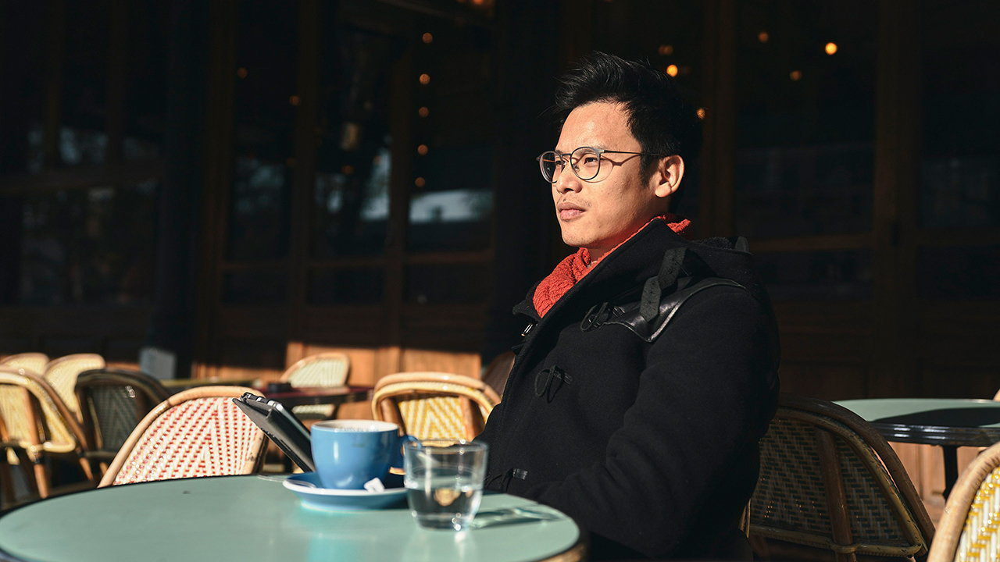
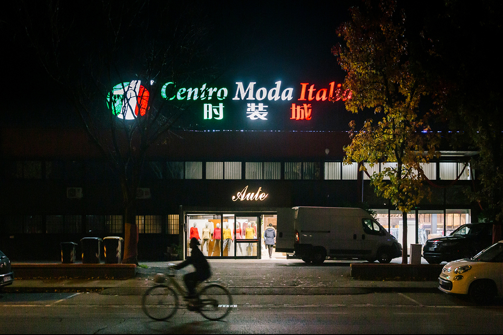
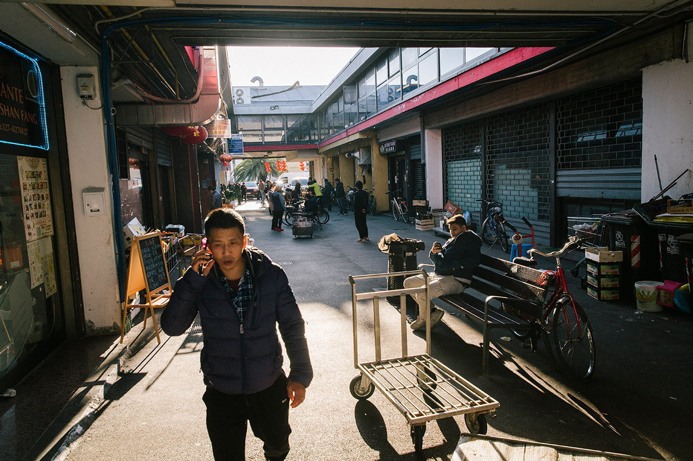
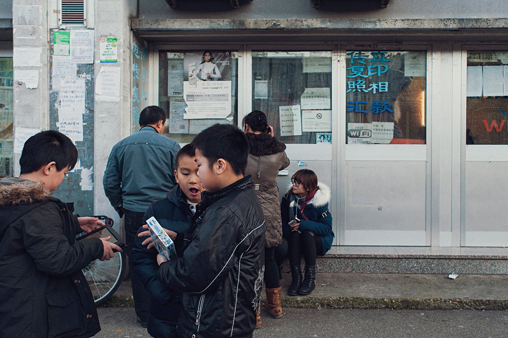

###### The three knife trilogy

# Emigrants from a small corner of China are making an outsize mark abroad 

##### Chinese migrants from Wenzhou are strikingly different from their compatriots 

 

> Dec 20th 2022 

Wang rui (pictured) was too young to remember his parents when they left him. He was just two when his mother set off to start a new life in Europe. A year later his father followed her. In the countryside around the coastal Chinese city of Wenzhou, young adults like them were doing the same in droves—abandoning their towns and villages, and often their children, in pursuit of a dream. Why eke out a hand-to-mouth existence in Wenzhou when there was far more money to be made in sweatshops in France or Italy? Why stay behind when so many had already left? 


Mr Wang is sitting in a poky café in Pantin in north-eastern Paris, where the city gives way to the : grim suburbs with high populations of poor migrants. He recalls his childhood with sadness. His father was earning a decent income at a state-owned transport firm. “It was not necessary for him to leave China,” he says. But his mother, who had a job in a village textile factory, was not satisfied. “Sometimes, when my mother is angry, she says she left China because she wanted to leave my father. But I also know that she wanted to get more money.” 

It was 1989 when she bade farewell, a year of pro-democracy upheaval in China and the rapid unravelling of communism’s grip on eastern Europe. Demonstrators began demolishing the Berlin Wall; the Soviet Union’s days were numbered. Chaos in eastern Europe created an opportunity: ill-guarded borders, easier for migrants like her to cross without being challenged. 

Wenzhou was a place with a rebellious streak—not in a political sense, but in the realm of business. Even then, a decade into Deng Xiaoping’s “reform and opening” programme, the economy of urban China was still largely under the dead hand of the state. Wenzhou was different. It had a tradition of entrepreneurship that had weathered the worst of Maoism. Indeed, Mao Zedong had inadvertently fostered it by neglect. Wenzhou was on the front line of potential war with Taiwan, so the state and its firms invested little in it, fearing money spent could be lost in any conflict. It had no airport until 1990 and no railway link until eight years later. Geography had helped, too. Wenzhou’s land-facing sides are ringed by hills and peaks. It is isolated. Its unique dialect is described in China as the least intelligible to outsiders—a “living fossil” of ancient Chinese. 

The Wenzhounese are also famed in China for leaving their home town to do business elsewhere, and excelling at it. Even during Mao’s vicious Cultural Revolution they travelled across the country, buying and selling, notes Joseph Fewsmith of Boston University in an edited volume, “Mao’s Invisible Hand”. They delighted in the nickname “the Jews of the east”—to Wenzhounese, the term captured their flair for commerce and a sense of kinship that helped them survive and prosper in far-flung places. Turn up in France, or Italy or Spain and there would be people ready to help. 

The ties that bind

Those bonds have enabled a remarkable phenomenon. Among Europe’s 1.7m China-born immigrants, people with links to just one city—Wenzhou (and the neighbouring county of Qingtian, which historically was part of Wenzhou)—form the majority. 

 


The Wenzhounese in Europe are concentrated in a few cities. You rarely chance upon their delicately flavoured seafood cuisine (, as it is called in Wenzhounese), let alone hear snatches of their dialect, as you walk through streets elsewhere, not even in multicultural London. Among non-Chinese, even Wenzhou’s name is little known (oddly—its population of about 9.6m is bigger than the British capital’s). Yet in the places where most Wenzhounese have settled, their impact on business and society is huge.

Mr Wang’s mother had a cousin in France, so that was the obvious place to go. It was fairly easy then to cheat the system. Many Wenzhounese were helped by people-smugglers. They commonly overstayed visas. When getting these became harder, pretending to be Japanese was used as a ruse. Get in line with some real Japanese tourists and European immigration officers would give your fake passport only a cursory glance. 

As China opened its doors to the outside world in the 1980s and 1990s, making travel abroad easier, emigration from Wenzhou surged. It was mainly people from the city’s rural environs who left. They were poorer and had little land. They also had strong ties with clans—it is common in Wenzhou’s villages for many residents to have the same surname. People settling abroad could tap into kinship networks for support. Their loyalties to lineage reinforced the bonds of trust created by their links with this city and its distinct culture. In Europe, Wenzhounese tend to form communities based not on random affiliation with Wenzhou, but on which of the region’s rural counties (plus Qingtian) they come from. 

Their trust in one another is a key part of Wenzhou’s entrepreneurial success. The area is famous in China for its informal lending schemes. People with a business plan can get the startup money they need without recourse to snooty state banks. Abroad, Wenzhounese migrants tap into their networks for cash.

But before going into business, there is a rite of passage—hard graft. Many Wenzhounese in Europe have similar stories of a long and tough induction to European life, toiling in tiny factories. Some migrants have had to work years to pay off debts incurred by payments to the “cattle”, as Wenzhounese call the people-smugglers. The trust circle may have helped to provide the cash, but it had to be returned. 

Wenzhou is known as the deer city (its central district, Lucheng, bears the name). That is because of a legend that, some 2,000 years ago, its founders saw a white deer with a flower in its mouth passing by. To them it was an auspicious sign. There is a streak of that optimism in how Wenzhounese sometimes describe their typical experience in Europe as a , or trilogy. Part one involves drudgery as a , or black worker (black, in Chinese, meaning illegal). Part two is the stage of formal employment, with documents in order. In the final part, the migrant becomes the boss. 

For many, part one has begun in central Italy on the edge of Prato, a medieval Tuscan town. In 1989 there were just 38 ethnic-Chinese people living there. Now there are about 35,000 and thousands more in the nearby regional capital, Florence. Most of them are from the Wenzhou area. Their arrival in Tuscany and sweeping reconfiguration of one of its pillar industries—clothing—has been one of the most dramatic chapters in the recent history of migration in Europe. 

 


Just outside Prato’s ancient walls, “Little Italy uncomfortably commingles with Little Wenzhou”, as two scholars who have specialised in the study of Prato’s ethnic-Chinese population, Elizabeth Krause and Massimo Bressan, put it in a research paper published in 2017. Farther towards the edge of town there is barely any sign of Little Italy in the industrial expanse that unfolds. On factory after factory, warehouse after warehouse, the signs have Chinese characters. Almost all are run by Wenzhounese and mainly employ Wenzhounese. “It is just like China!” exclaims a non-Wenzhounese emigrant from that country. 

Ding Jinrong is the 56-year-old boss of one of these businesses, Hermosa Fast Fashion. His part-one story is typical: sneaking into Italy by road in 1991 via Hungary and Austria, then making his way to Prato where he worked and slept in factories (“not as good as this one,” he says, indicating his own large warehouse). Back then, he was alone. He had left his wife behind in their village outside Wenzhou. “It was a hard life,” he chuckles. “But what could you do?” 

The thousands of Wenzhounese who flooded into Prato at that time were following an earlier wave of migrants. These were mainly poor Italians from the south of the country, drawn by the city’s textile businesses’ need for cheap labour. The influx had caused a population surge in Prato, but by the 1980s the supply of such labour was running out. China was beginning to outcompete Prato’s mostly small-scale businesses, which specialised in subcontracted work cutting and sewing materials for clothing firms. The Wenzhounese satisfied a desperate demand: they were willing to work hard for low wages. They saved a dying industry. 


Soon they began to move up the value ladder, first taking over the tiny companies for which they worked, then the entire production chain. They developed a new specialism in , or fast fashion. China could make clothes quickly, too, but getting them to Western markets could take weeks. Prato’s Wenzhounese businesses could not only produce them rapidly, in lightning response to ever-shifting trends, but also ensure swift delivery to wholesalers in Europe. Moreover, they would have the coveted “Made in Italy” label. By the mid-2000s Prato boasted thousands of Chinese-owned clothing firms, making it Europe’s biggest fast-fashion hub. Some did work for famous global brands. A centuries-old tradition of textile work in Prato had set out on a new trajectory, steered by Chinese. 

Knife skills

Wenzhounese are renowned in China for specialising in a handful of industries and establishing large shares of their markets both nationally and globally. Factories in Wenzhou produce 60% of the world’s buttons, a quarter of China’s spectacles and one-tenth of its shoes, official websites claim (don’t ask about its share of the world’s sex toys). Wenzhounese call their niche sectors in Europe the , or three knives, because that instrument is used in all of them: making clothes, fashioning leather and catering. The Wenzhounese in Prato wield the first of these knives; those in Florence employ the second, making handbags and suitcases. Milan has Italy’s biggest number of Wenzhounese (twice as many as Prato, although, as a share of the city’s population, they are far less prominent). All of the knives have played a role in the Milanese community’s growth. The city’s Wenzhounese have spread into other businesses, too. By 2019 11.5% of bars in Milan were Chinese-owned, according to a national newspaper based there. 

It is the same in the other European countries with many Wenzhounese. The catering business has drawn many to cities in Germany, the Netherlands and Spain. They rarely serve  dishes, unless they know their customers are likely to be overwhelmingly Wenzhounese. Instead they offer better-known regional Chinese cuisine, such as Cantonese, or food from other countries (pizza included). In recent years Wenzhounese-run Japanese restaurants have proliferated in Paris. They now outnumber those with Japanese owners by ten to one, reckons Cheng Xiabing, a phd student at Sorbonne University who focuses on Chinese involvement in the Parisian catering industry. 

 


In Paris Wenzhounese often specialise in the wholesale of clothing and leather goods. In 2015 a Wenzhounese tycoon, Hsueh Sheng Wang, opened Europe’s biggest textile trading centre in a Parisian suburb. Mr Hsueh migrated to Paris from Wenzhou in the 1970s as a child, with his parents. His first job was as a deliveryman. The final part of his trilogy—as the ceo of Eurasia Group, a large property firm he founded—is legendary among the city’s Wenzhounese. 

The pandemic and the war in Ukraine have taken their toll. On a recent visit to the three-storey complex, your correspondent saw row after row of tiny showrooms crammed with displays—and boxes filled with goods ready to ship to customers. Yet Wenzhounese staff said there were far fewer visitors these days. The war has pushed up transport costs, they complained, especially from faraway production bases like China. Both in Prato and Paris, owners of textile- and leather-related businesses said a few were closing down. 

Some Wenzhounese talk of returning to their native city to live. Amnesties offered by European governments mean most have acquired residency permits in Europe. But few have applied for foreign citizenship. China does not allow dual nationality, so Wenzhounese with Chinese passports mainly prefer to keep them: they are essential for doing business in China without the fetters imposed on foreigners, or for enabling retirement to their ancestral villages (where many still have houses). 

 


Wenzhou’s links to Europe far precede the influx of the past 30 or 40 years. The first long-term settlement of Wenzhounese on the continent dates back more than a century. During the first world war, the allies needed for labour—their own young men were needed to fight instead. Chinese people helped to make up the numbers. About 135,000 of them joined an allied organisation called the Chinese Labour Corps. Its members dug trenches, carried away the dead and injured, and maintained the roads and railways needed to supply the troops. After the war about 3,000 Chinese survivors (thousands had been killed by bombs, disease or in accidents) stayed behind in Paris. Many were from Wenzhou. Others from Wenzhou joined them later. 

When China began opening up in the 1980s, France was therefore an obvious destination for Wenzhounese, as was Italy, where some of those early migrants had headed, too. It may have helped that Wenzhou was no stranger to at least one strand of Western thinking: Christianity. Wenzhou is often described by Chinese as the country’s “Jerusalem” because so many of its people are followers of the faith (at least one-tenth, by conservative official estimates). They are evangelical Protestants whose ancestors were converted by Scottish missionaries in the 19th century. Perhaps not the best fit with the Catholic traditions of countries such as France and Italy, but still a spiritual overlap. There is a link, too, with entrepreneurialism—many of Wenzhou’s Christians believe that making money is a way of serving God. Successful ones are known as “boss Christians”. In European cities wealthy Wenzhounese have helped to open churches, with services in their dialect. Paris has well over a dozen. “God gives us an ability to do business,” says a lay clergyman. 

But Europe can be a hostile place, too. Anger has flared against Wenzhounese, with people accusing them of everything from unfair and exploitative business practices, to crime and causing damage to local ways of life. In 2004 rioting erupted in the south-eastern Spanish city of Elche, a traditional centre of the country’s shoemaking industry. Two Chinese shoe warehouses were set on fire. Hundreds of protesters took to the streets, some with banners saying “Chinese out”. They were enraged by local Wenzhounese traders’ sale of cut-price shoes from Wenzhou, which they said were forcing Spanish firms out of business. 

Wenzhounese often complain about hostility shown by the police, accusing them of disproportionate targeting of Chinese businesses during crackdowns on illegal behaviour. In Milan in 2007, following a sharp escalation of fines imposed by Italian police on Wenzhounese traders for using private vehicles for commercial purposes, hundreds of Chinese staged a protest, waving Chinese flags. They clashed with police, injuring several, and overturned cars. 


In 2009 the citizens of Prato—a city long known as a left-wing stronghold—elected Roberto Cenni as mayor. Mr Cenni, a centre-right textile entrepreneur, had made anti-immigration a central feature of his campaign for the job. “The people who are truly being discriminated against are the people of Prato,” he said, referring to non-Chinese. Mr Cenni was replaced in 2014 by a left-wing mayor, Matteo Biffoni, who is more sympathetic to the Chinese presence. But September’s election of a national government with a neo-fascist past has shown a worrying trend in European politics towards the far right, especially for immigrants.

 


Young Wenzhounese—those brought up in Europe, who are fluent in European languages and usually are citizens of the countries they live in—are beginning to find a voice. In Paris Wang Rui, the boy who was left behind in Wenzhou by his parents, rejoined them at the age of seven when his father returned to pick him up. In Rome, his first port of call, he recalls the scorching heat, and the pleasure of being able to drink water safely straight from the tap. 

Now Mr Wang is 35, with a master’s degree in management. The three knives are not for him. He is a business consultant who has also thrown himself into politics (at 18 he automatically became a French citizen, having grown up in France). Mr Wang and other young French Wenzhounese born or brought up in the country have helped the genesis of a rights-protection movement that, in recent years, has spawned several protests in Paris against anti-Asian racism.

Singing the song of angry men

One of them, in 2016, attracted tens of thousands of people—the biggest ever led by ethnic-Chinese in Europe. The flags they waved were French. They sang “La Marseillaise”. Many of the participants were Wenzhounese, angered by the death of a Wenzhounese tailor after being assaulted by three teenagers. The demonstrators complained that such attacks on ethnic-Chinese were often ignored by the Parisian authorities. The protest sparked much debate in France about such crimes. The tailor’s assailants were convicted of the murder. The court ruled that it was racist.

Wenzhounese activists see the protest movement as a watershed—a political awakening among a group that hitherto had preferred to stay out of the limelight. One of them, Olivier Wang, a Wenzhou-born commercial lawyer, says the demonstrations have achieved some success. “It would be impossible to end all racism by French towards Chinese,” he admits. But he says Wenzhounese have shown that they are no longer prepared to be ignored. “Now we stand up and say no.” 

Many young Wenzhounese still find it hard to say that word to elders in their community. The tradition of hard graft is one that is hard to shake off. You see it in the  shops that are part of the fabric of Parisian life. Visit one these days and it is likely that the people running it will be young Wenzhounese. The shops are controlled by a government monopoly—you need to be French to run one. It is tough work with long hours. But elder Wenzhounese, having completed their trilogies, are helping their French-born children shell out for them, seeing such shops as safe investments. In that most French of businesses, the Wenzhounese are spreading their wings. 

Mr Wang, the consultant, longs to be seen as French. In 2020 he was elected as a councillor in Pantin, the commune of north-eastern Paris where he lives. He campaigns for more than the rights of ethnic-Chinese. He has joined Place Publique, a new centre-left party, and says he wants to represent Parisians of all kinds. As he is quoted as saying on the commune’s website, “I don’t want to be reduced to my origins.” ■

PHOTOGRAPHS: Nicolas de Rougé, Gianni Cipriano, Dario Miale


