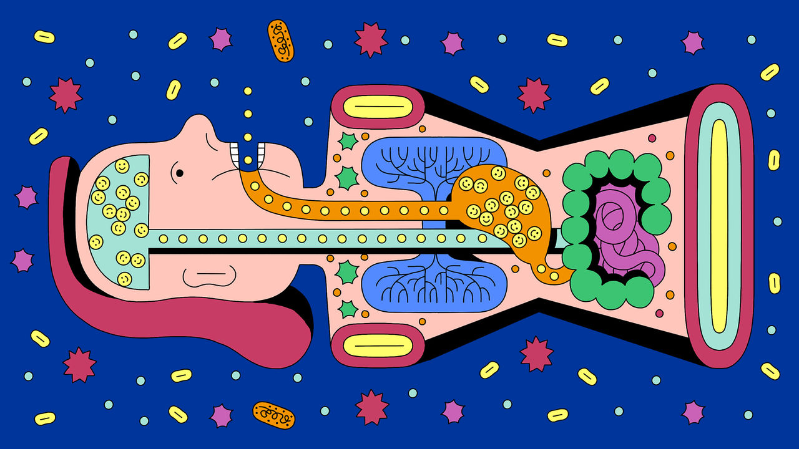
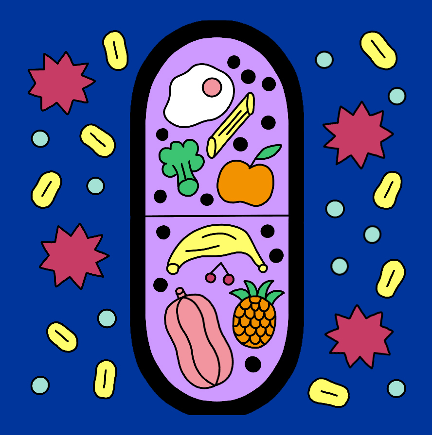
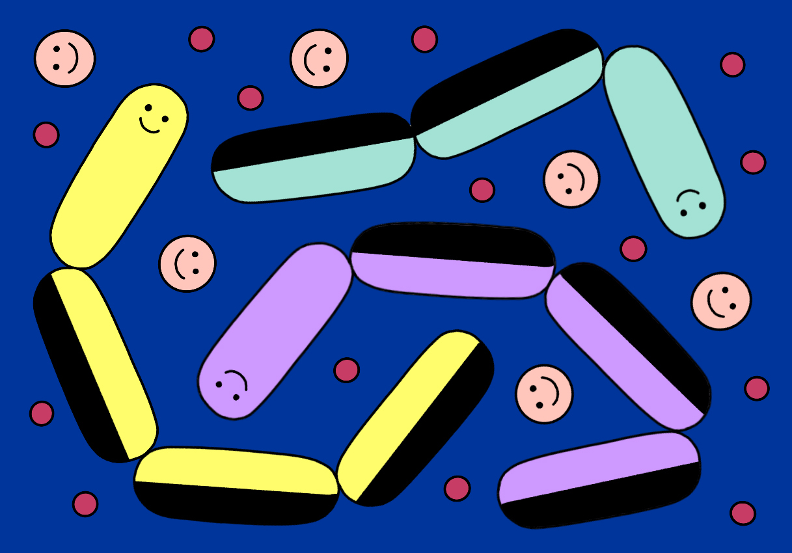

###### Use your loaf

# How food affects the mind, as well as the body 

##### It turns out you are what you eat after all 

 

> Dec 20th 2022 

A glistening roast turkey. Rounds of golden, roast potatoes and parsnips. Pigs in blankets (because what meat-based meal is not improved by a side of sausages wrapped in bacon?). Brussels sprouts. Bread sauce. Cranberry sauce. Gravy. And, to finish, brandy-sodden pudding topped with butter.

Countries vary in their Christmas-meal traditions. Poles prefer fish, often carp. A Swedish  groans with variety, though herring will never be far off. But the repast served at most British tables on December 25th is iconic, and has been (with goose sometimes standing in for turkey) since the time of the Victorians.

A good meal has a positive impact on one’s mood. Part of that pleasure is immediate. Those who avoid overindulgence and family squabbles will enjoy a postprandial rise in their blood sugar. That will prompt a flood of endorphins—chemicals that act as happy hormones—to rush through their brains. 

But the pleasure goes deeper. Animal proteins, such as roast fowl, hams or fish, contain all the amino acids that the body needs including many it cannot make for itself. Tyrosine and tryptophan are needed for the production, respectively, of dopamine, a neurotransmitter that controls feelings of pleasure and reward, and serotonin, another such, which helps regulate mood. Brussels sprouts contain folate, a vitamin without which the brain cannot function properly. And cranberries are high in vitamin C, which is involved, among other things, in converting dopamine to noradrenaline, another neurotransmitter, and a lack of which seems to be associated with depression.

With mental-health disorders rising, a growing number of scientists are investigating how food or nutritional supplements affect the mind. Brains, being the most complex and energy-demanding of the body’s organs, almost certainly have their own specialised, nutritional needs. Welcome, then, to the emerging field of nutritional psychiatry.

An adult human brain, which accounts for about 2% of a body’s mass, uses 20% of its metabolic energy. An host of vitamins and minerals are necessary to keep it going. Even in one small section of the brain’s metabolic pathways, many essential nutrients are needed. The conversion of tryptophan to serotonin alone requires vitamin B6, iron, phosphorus and calcium.

Disentangling the brain’s nutritional needs from those of the rest of the body is tricky. Recommended daily allowances (rdas) are little help. They were formulated during the second world war on the basis of the nutrients needed for the physical health of troops. No such rdas exist for the brain. Not yet, at least.

Compared with other fields, nutritional science is understudied. That is partly because it is hard to do well. Randomised controlled trials (rcts), used to test drugs, are tricky. Few people want to stick to an experimental diet for years. Instead, most nutritional science is based on observational studies that try to establish associations between particular foods or nutrients and diseases. They cannot be used to definitively prove a causal connection between a disease and a particular contributing factor in a diet. But as with smoking and lung cancer, put together enough of these kinds of trials and causal narratives begin to emerge.

 


It is now clear that some diets are particularly good for the brain. One recent study concludes that sticking to the “Mediterranean diet”, high in vegetables, fruit, pulses and wholegrains, low in red and processed meats and saturated fats, decreases the chances of experiencing strokes, cognitive impairment and depression. Other recent work looking at a “green” Mediterranean diet high in polyphenols (the antioxidants found in things like green tea) found it reduced age-related brain atrophy. Another version, the mind diet, emphasises, among other things, eating berries over other kinds of fruit and seems to lessen the risk of dementia.


Scientists think such diets may work by reducing inflammation in the brain. This, in turn, may affect areas such as the hippocampus, which is associated with learning, memory and mood regulation—and where new neurons grow in adults. Studies in animals show that when they are fed a diet rich in omega-3 fatty acids (from walnuts, for example), flavonoids (consumed mainly via tea and wine), antioxidants (found in berries) and resveratrol (found in red grapes), neuron growth is stimulated and inflammatory processes are reduced. This fits with research suggesting that those who regularly eat ultra-processed, fried and sugary foods, which increase inflammation in the brain, heighten their risk of developing depression.

The hanger games

That Christmas feast is often lambasted as an orgy of gluttony. In fact, with its sides of multiple vegetables, its nutritional density may make it among the healthier meals some people eat throughout the year. Only 10% of adults in America consume their recommended daily serving of vegetables, and just 12% get enough fruit. It is a similar story in much of the world. As a result, many turn to vitamin and mineral supplements to make up for their dietary deficiencies.

 


In 2018, 54% of North Americans and 43% of Asians were taking a nutritional supplement. The most common types are multivitamins, vitamin D and omega-3 fatty acids. America spends the most on dietary supplements, followed by western Europe and Japan. One estimate put the global market at $152bn in 2021, with 9% annual growth expected until 2030. But in many places the regulation of the supplement industry is either weak or non-existent and little rigorous research has been carried out on either their benefits or risks. 

The story of nutritional supplements starts in 1912 when Casimir Funk, a Polish-American biochemist, proposed that unidentified organic substances were required in tiny amounts to maintain human health. It was a revolutionary idea. And he was correct. Along with macronutrients such as protein and carbohydrates, there were undiscovered components of foods—micronutrients. The first vitamin to be isolated and then synthesised in 1936 was thiamine or B1. Deficiency causes beriberi, a disease that can affect both the cardiovascular and the central nervous systems. The discovery prompted a race to isolate, characterise and manufacture vitamins and ultimately launched the supplement industry.

Half a century after Funk’s discovery, the notion that nutrients might be able to treat mental illnesses took hold. Abram Hoffer, a Canadian psychiatrist, tried treating schizophrenics with high doses of vitamins B3. Then in 1968 Linus Pauling, a Nobel-prize-winning chemist, coined the term “orthomolecular psychiatry” to describe the theory that varying the concentration of substances normally present in the body could treat mental disease. But there was little evidence to support their claims and in 1973 the American Psychiatric Association released a report dismissing orthomolecular psychiatry, highlighting the lack of controlled experiments and concluding that large doses of B3 were “useless and not without hazard”.

The absence of any large-scale, serious studies in the field of nutritional psychiatry left an opening for those keen to promote the potential of supplements far beyond any existing science. Autumn Stringam is one such case. After her first baby was born in 1992 Ms Stringam, a Canadian, was admitted to a psychiatric ward with severe post-partum psychosis. Her family had a history of mental illness, including bipolar disorder, psychosis, depression and suicide. Her prognosis was grim. But then her father, together with a friend working in the animal-feed business, developed a supplement containing a range of vitamins and minerals that they claimed were based on supplements that reduced anxiety and stress in pigs. Ms Stringam credited the supplements with her recovery. Her story spread and the family started selling the pills widely.

There were, however, no trials proving efficacy or safety. The suggestion that the supplements were a cure-all led one schizophrenic to abandon his prescribed medication. He subsequently murdered his father and seriously injured his mother. In 2003 the Canadian drug regulator, concerned about the use of untested supplements for serious mental-health disorders, seized the pills. The episode cemented the idea in many minds that using micronutrients to treat mental-health conditions was pure quackery.

And yet today much science does support the idea that there is a strong link between what people eat and their mental health. Studies have shown that b12 shortages cause depression and poor memory and are associated with mania and psychosis. Low levels of vitamin D are associated with increased risks of dementia and stroke, and are implicated in neurodevelopmental disorders. A recent rct found that high doses of B6—100mg per day rather than the rda of 1.3mg—reduces anxiety. In a study by Robert Przybelski of the University of Wisconsin of geriatric patients attending a memory clinic, 40% were deficient in one vitamin (of five that were looked for), and 20% in two.

Epicurious

So why not simply pop a handful of vitamins rather than bother with a complex, and perhaps expensive, diet? In part because you rarely know exactly what you’re getting. Ted Dinan, a professor of psychiatry at University College, Cork describes the supplement industry as the “Wild West”. Unlike tightly regulated drugs, supplements may contain more, or less, of what they claim. Too much vitamin A can be harmful in pregnancy. There are a variety of health risks from taking beta carotene and vitamin E. High doses of one nutrient can interfere with the absorption of others. 

Any testing of the use of micronutrients in mental-health conditions in Canada stalled after the episode with Ms Stringam. And yet some remained intrigued. Julia Rucklidge, a clinical psychologist at the University of Canterbury in New Zealand, was approached in 2003 by a Canadian colleague to see if she might be interested in running such trials. She was sceptical: “I had been taught that nutrition is completely irrelevant to brain health.” At the time, she recalls, she was immersed in positive data showing the efficacy of Prozac, an antidepressant, and stimulants such as methylphenidate for attention-deficit hyperactivity disorder (adhd). She was excited, she explains, to have these new drugs as tools to treat mental-health problems.

Then she was forced to question those views. She had been treating a child with obsessive compulsive disorder for a year with no success. The family did not want medication. One day when they were leaving she remembered she had a box of supplements under her desk for a trial she was planning. She offered them to the parents with the caveat that she had no idea whether they would work. Two weeks later they returned, saying the child’s obsessions were gone. 

 


Dr Rucklidge was sceptical that any improvement was due to the supplements but it nudged her towards conducting more trials. A few decades on and she has shown that supplements are helpful in children with adhd—particularly those who struggle to regulate their emotions. The trial was recently replicated in America. Other evidence of the efficacy of supplements is emerging. The results of a large rct published in September showed that taking a daily multivitamin may improve cognition in those over 65. Researchers followed more than 2,000 people and estimated that three years of supplementation led to a 60% slowing of cognitive decline. 

Nutritional psychiatry is still in its infancy. As it becomes clearer which micronutrients affect the brain, the next stage is to determine how they do so. Another new field of research could help with that.

One of the most intriguing scientific developments of recent years is the discovery of the importance of micro-organisms in the gut as intermediaries between what goes into the mouth and what happens in the brain. Researchers now know that microbes form a complex ecosystem in the gut—known as the microbiome. These microbes need micronutrients. A diet lacking in them, such as that consumed by many in the West, may lead to an imbalance in the gut microbiome.


Could this affect how people think and feel? Evidence is mounting for a link between the gut and the brain in what is termed the psychobiome—part of the microbiome—that does just that. The substances that the various bacteria, viruses and fungi produce may go directly into the bloodstream and infiltrate blood vessels, or they may stimulate the vagus nerve that connects the gut and the brain. The bacteria in the gut produce, among other things, tryptophan, the amino acid thought to have come entirely from the diet. 

The sorts of microorganisms found in yogurt specifically, and fermented foods generally, have also been shown by trials to reduce anxiety. Most astonishing to Dr Dinan is the finding that a person’s capacity to deal with stress can be altered by a single strain of bacterium. Studies show that two species of  and one of  each reduce stress. In a trial on germfree mice, an abnormal stress response was reversed when they were given oral doses of . These findings have given rise to the notion of “psychobiotics”—bacteria that, when ingested, may have similar effects to antidepressants or anti-anxiety medication.

 


The difficulty with developing this new field of research lies in the economics. Unlike drugs, vitamins, minerals and microbes are not patentable. Pharmaceutical firms have nothing to gain commercially from running trials on pills that anyone can flog. It is difficult to trust industry-sponsored research since it has a bias towards favourable findings. Governments, universities and health systems are better placed to run such trials. None of this will replace the need for a good diet. But it would provide food for thought. ■

ILLUSTRATIONS: Cristina Spanò


