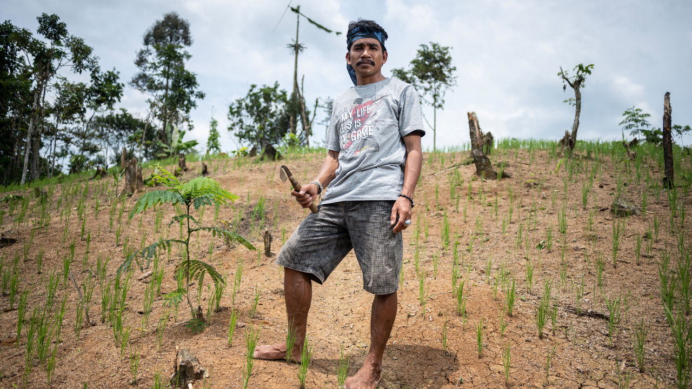
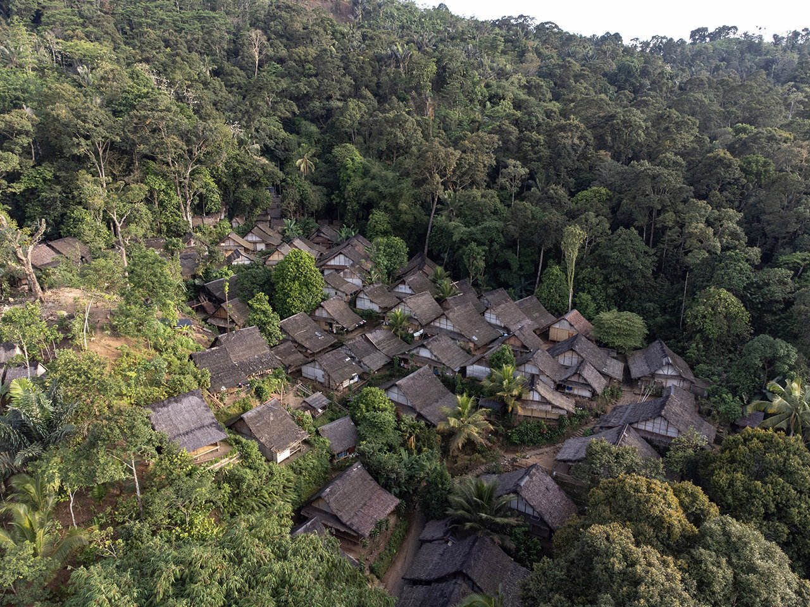
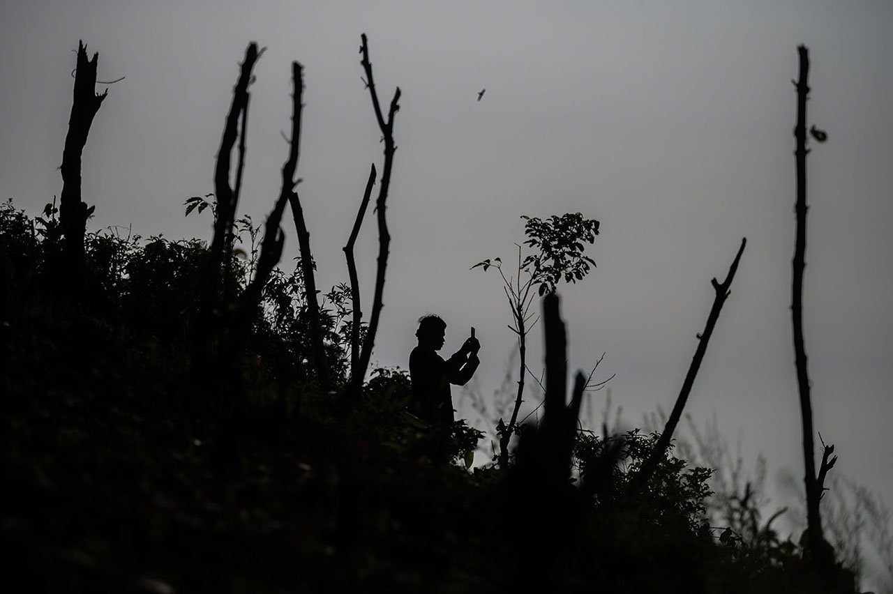
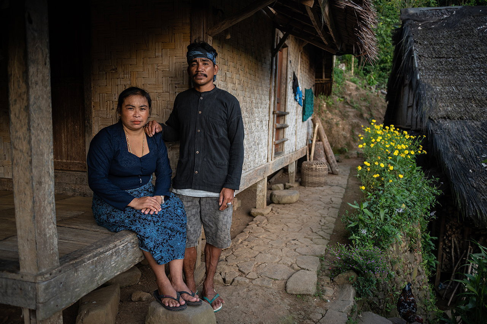
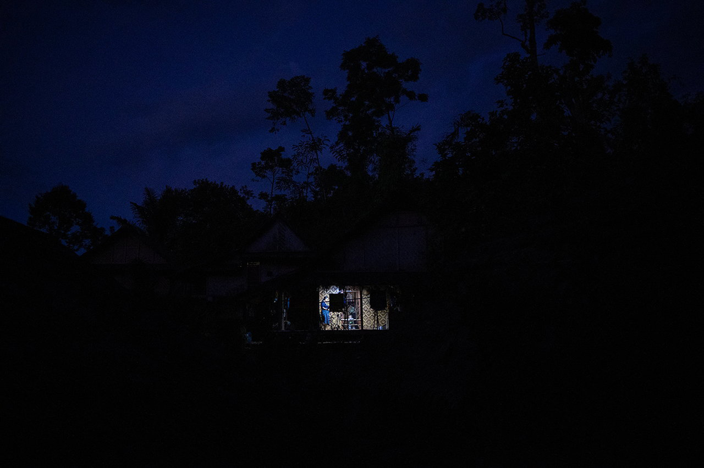
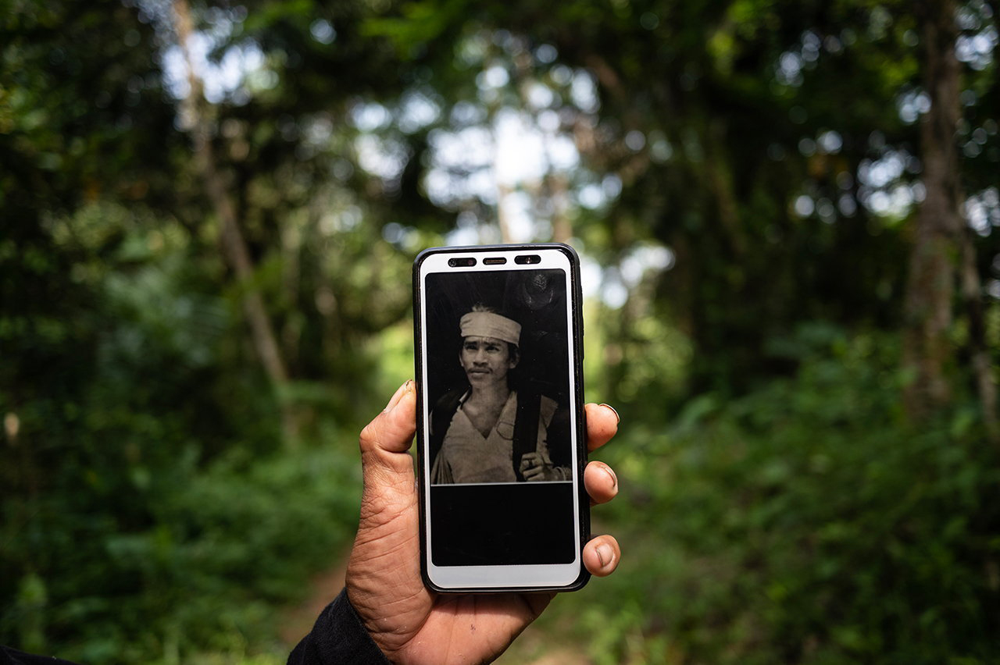
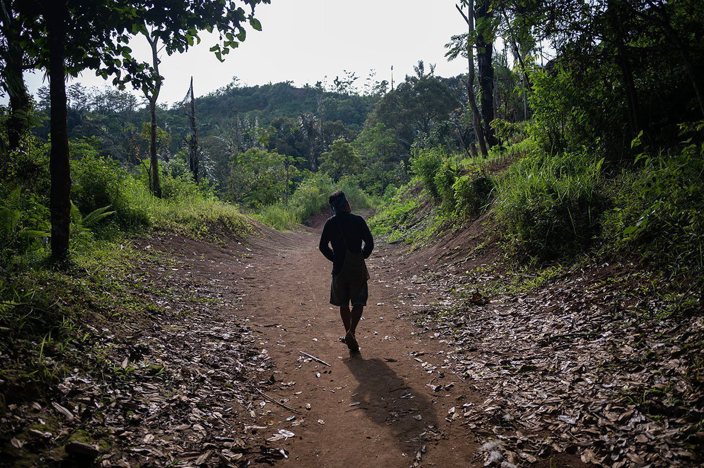

###### Time lords

# In a corner of Java live the Amish of Indonesia 

##### The Baduy of Indonesia shun modernity. But growing numbers are abandoning their way of life 

 

> Dec 20th 2022 

It was just another day in Kanekes when Herman Jarkan (pictured) was struck by an epiphany. He was rushing home after the weekly shop one afternoon in May 2014. On his shoulders was balanced a baton of wood, on either end of which hung two big knapsacks laden with rice, cooking oil and salted fish. His bare feet gripped the cobblestones of the path which meandered up hills and through forests.

The walk afforded him time to think. His thoughts often drifted back to the question that had nagged away at him for years: should he leave his village and family to seek a better life on the frontier?

The arguments for and against were as well trodden as the path under his feet. His village contained his world. That was by design. His people had always shunned modernity. But he had travelled to the big cities in the Outside and marvelled: people there lived in buildings that scraped the sky and drove machines many times faster than the fastest man. That world tantalised him. He wanted to be closer to it. But he had to be sure. Once he left, he could never move back.

Over the years Mr Herman had learned to dismiss those thoughts. But today was different. “If I don’t leave now, I never will,” he realised. So he decided to go. It felt as if a weight had lifted from his shoulders.

Kanekes is a mere three-hour drive from Jakarta, Indonesia’s heaving capital, but it feels a world apart. Gone are the high-rises, the pell-mell traffic and the throngs of people. In their place is the forest: the ancient trees standing sentry, the flashy green moss carpeting the rot, and amid the slick humus, paths leading to the terraced bamboo houses of the Baduy.

The Baduy have lived in this corner of western Java for centuries. They are an example of what Indonesians call , ethnic groups who live according to their traditions. Life revolves around their religion. They believe that their forest is the wellspring of the universe and that they are its divinely appointed guardians. To protect the land, they must “follow whatever our ancestors did in order to live in harmony with nature,” says Sangsang, a Baduy official who, like many Indonesians, goes by only one name.


The Baduy, who are subsistence farmers, live by a rigid set of rules. They are not allowed to irrigate their fields, use chemical fertilisers and pesticides, or plant crops that harm the land’s fertility. To defend the land, they must be ritually pure. Modernity is a byword for moral corruption. Electricity is banned; so are radio, television and mobile phones, as well as the use of modern vehicles. They cannot wear shoes or long trousers. Toilets are forbidden.

 


Like the Amish of America, the Baduy are a people trapped in amber. A 16th-century Dutch etching of two Baduy men could be a modern-day portrait. And yet, on the outskirts of Kanekes, an acid-rain drizzle of modernity is slowly dissolving the amber. 

The Baduy are divided into two castes: Inner Baduy, who number about 900, and the 15,000 Outer Baduy, who live in a horseshoe of land encircling the sacred southern core of Kanekes. The Outers are freer. They may travel in modern vehicles and can get away with wearing shoes. But they are still not allowed to drive, and can charge their phones only in the outside world. As a result, they seem to straddle the past and present.

For centuries, the people of the interior have relied on Outer Baduy to serve as a bulwark against modernity. The latter handle emissaries from the outside world: the local government and tourists. That leaves the hermits of the inner sanctum at liberty to pursue their asceticism. As Mr Sangsang says, “Inner Baduy are higher in status” precisely because they have less to do with the wider world than their neighbours.

 


This hierarchy is woven into the fabric of everyday life, in the colour of their clothes (black and blue for Outers, black and white for Inners); in the walls of their bamboo houses (patterns are permitted only for Outers); and in the deference Outers show Inners.

This difference is also mapped onto the land. The Inners and Outers are separated geographically. Because they are pure of heart, Inners may live among their sacred sites; Outers must live farther away. The Indonesian government manages Outer Kanekes while the interior is governed by Baduy spiritual leaders. “For Inner Baduy villages, this is where the government stops,” says Jaro Saeja, the headman of the Outer Baduy, pointing at his house. The two groups may visit each other but for no longer than two nights. 

There is, however, an exception to this commandment. Inners convicted of committing the worst sins, such as adultery or driving a car, are banished to Outer Kanekes for several months. The punishment captures the vexed attitude Inners have towards Outers: the former are grateful for the way the outer villages repel the wider world. And yet it is a service that must, through contact with that world, blemish their souls.

Despite the frontier’s association with sin, a growing number of Inners are migrating to Outer Kanekes. Many who move had previously been banished there. At the end of their exile, the authorities of the interior ask whether they want to go home or stay in the outer ring. “Most say ‘I will stay,’” says Mr Sangsang. He estimates that ten Baduy—about 1% of the population of the inner core—move to the frontier every year. They move, he says, because of the lure of the modern. The authorities do not stand in their way. But it is not an easy decision.

No going back

Mr Herman sits cross-legged in a hut near one of his fields, about a five-minute drive from his home in Outer Baduy. He pulls out one of two phones (“one for business, one for personal use”) and shows off a picture of himself and two Baduy friends in Jakarta. It was taken by a professional photographer—one of Mr Herman’s good friends, he says.

Mr Herman first left Kanekes when he was 13. He was helping his father, who made handicrafts for tourists, deliver a large order to a customer in Jakarta. To get there they walked, barefoot, for two days. When they arrived, Mr Herman saw skyscrapers and pylons. He saw the tiny figures of labourers high up in the frame of a building they were erecting, and a crane delivering metal girders to them. How did they get so high up, he wondered. How did they communicate with the crane operator? “I was astonished,” he says.

He began to spend more time in Outer Kanekes. Picking up odd jobs there, he met tourists who taught him some Indonesian. “I wanted to make friends from the outside world,” he recalls.

 


Outer Kanekes was nowhere near as alien as Jakarta but it was different in its own way. The Outers had it much easier than the Inners, Mr Herman thought. To construct their houses, they could use saws. Inners had to use axes and machetes—bulky, tiring tools. In the time that it took Inners to walk from the interior to the exterior, Outers could travel by bus or train to Jakarta. He began to dream of leaving.

 


Life got in the way. Mr Herman got married, had children, tended the fields. The prospect of leaving his parents pained him. He did not know how he would support himself in Outer Kanekes. “In the interior, you manage together,” says Jamidi, Mr Herman’s nephew, who was banished to the exterior in July 2022. Land is owned and tended communally. By contrast, in the exterior, says Mr Jamidi, “Everything is money.” 

But Mr Herman continued to explore, visiting his friends in Jakarta a few times a year. They showed him how to order a taxi on a mobile phone and took him to fancy restaurants, where he had to explain his bare feet to bemused security guards. Those trips stirred a longing for adventure and agency. “I wanted to try things I’m not allowed to do,” he says. “I wanted to try to be more free.”

 


That afternoon in 2014, when Mr Herman returned home from the market, he told his wife of his decision. He yearned for the freedoms of Outer Kanekes—but it was the growing hardship of life in the interior that clinched his decision. As the population of Inners has grown, the land allotted to every family has shrunk with each generation. Mr Herman’s parents were apportioned one hectare of land; Mr Herman received just half that. 

Things would be different in the exterior, he reckoned. He would be able to buy land and sell surplus produce to a much bigger market. More tourists come to Outer Kanekes than to the interior (where foreigners are banned), plus he would be able to use a mobile phone to advertise and sell his wares to consumers online. “I thought, ‘Of all five of us [his parents and siblings], one of us can’t be poor, one of us has to progress.’ That was how I got the courage to go out.”

 


One month later, Mr Herman and his family left Inner Kanekes. At last the dream that he had nurtured for 25 years had come true. Yet, far from celebrating, Mr Herman was consumed with anxiety. He did not have a job and he could hardly afford to feed his family. His worries kept him up at night. So, too, did homesickness for life and his family in the interior.

Liminal space

Eight years later, Mr Herman’s life is transformed. He owns four plots of land, on which he grows bananas, durian, stink beans and timber. He sells his produce online. He is prosperous, and was able to buy a house for his newly married son. It took his parents a year to make their peace with his decision to leave, but now they are pleased for him, he says.

In many respects, Mr Herman is the picture of a modern Indonesian. He distracts his one-year-old son with cartoons on his smartphone. When he is not working the fields, he lives on his phone, just like any other social-media obsessed millennial. He thinks in terms of profit and loss, not virtue and vice—which is just as well given that he wears flip-flops and has a solar panel affixed to his thatched roof, breaking the prohibitions against shoes and electricity.

His new life is not without hardship. The individualism of the Outer Baduy cleared the path for Mr Herman to remake himself into an entrepreneur—but it comes with penury, too—a sense of alienation from his culture. He has discouraged his siblings from following him to the exterior, in part so they can look after their parents, but also to spare them “the difficult hardships I had to endure” in Outer Kanekes. 

Mr Herman does not regret his move: “I am really happy with my life.” He says that he does not chafe against the rules of the Outer Baduy as he did back in the interior. “If we give in to all our desires, it’s never ending. As long as I have enough to feed and attend to my family’s needs, I am content.” But every year a small but growing number of Outers heed those desires and abandon Kanekes altogether. Modernity is rushing in. There is no going back. ■

PHOTOGRAPHS: ROSA PANGGABEAN


