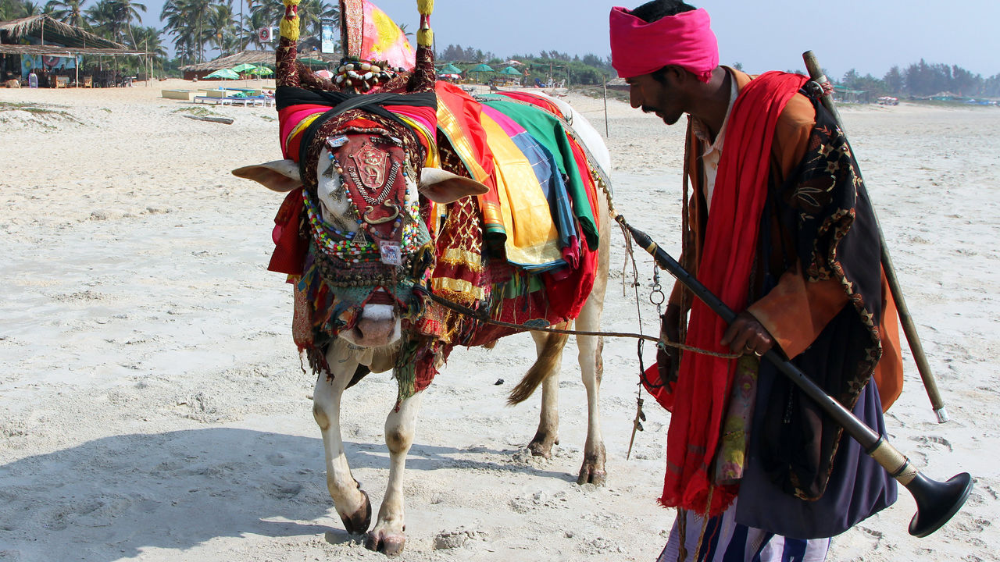
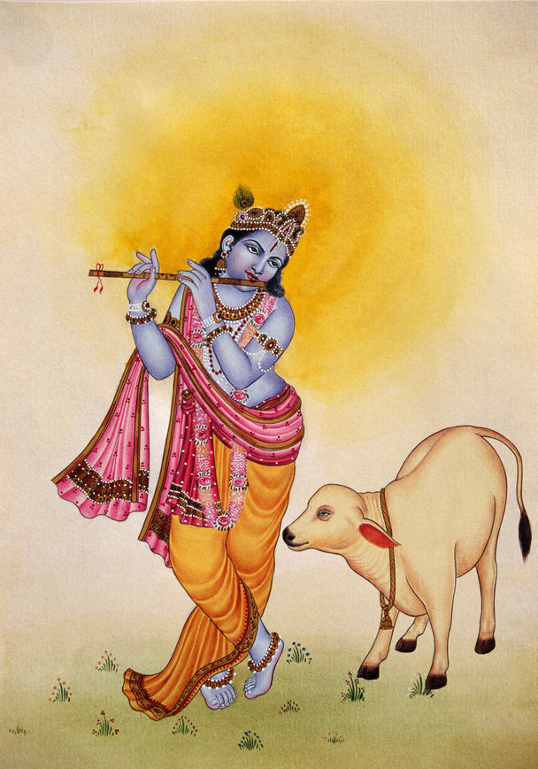
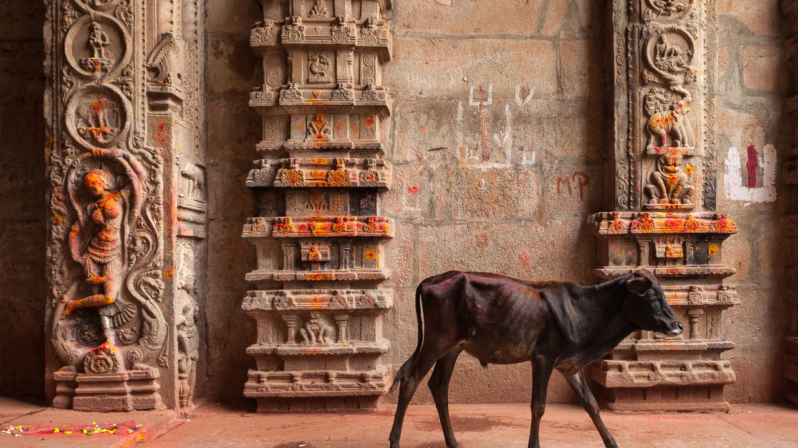

###### The myth of the holy cow

# India’s movement to protect cows is rooted in politics, not religion 

##### How the Hindu right co-opted the cow 

 

> Dec 20th 2022 

The lynching began with an announcement over the loudspeaker of the local temple: a calf had been slaughtered. It was 28th September 2015, around the Eid holiday, and Hindu-Muslim tensions were running high in the village of Bisara in the Indian state of Uttar Pradesh (UP). The broadcast roused the village’s Hindu residents, who consider the cow sacred. They were convinced one of a handful of Muslim families in Bisara, the Akhlaqs, had slaughtered the cow for Eid.

Late in the evening, dozens of rioters broke into the Akhlaqs’ home and found meat in the refrigerator. They could not be sure it was beef, but that didn’t matter. They smashed a sewing machine over Danish Akhlaq’s head. Then they grabbed the patriarch, Mohammed, and dragged him outside, his head crashing down 14 stone steps to the street. By the time the police arrived half an hour later, he was dead.

Justice is yet to be served. Most of the 18 accused are out on bail. Four were given front-row seats at a rally held by Yogi Adityanath, the fiery Hindu priest who runs up. One died in custody and received a martyr’s send-off, Hindu nationalist politicians descending on Bisara to pay their respects. Prime Minister Narendra Modi has not taken much notice. His first remark on the murder, eight days after it took place, was a call for Hindus and Muslims to unite.

India’s prime minister has a fixation with cows. Under his Bharatiya Janata Party (BJP), they have become a symbol for the struggle to remake India as a Hindu state. To eat beef or not to eat beef has become the question dividing the country’s billion Hindus, who protect cows because they revere them, and its 200m Muslims, whose religion permits them to eat beef and sacrifice cows. More than class or caste, this distinction stirs passions and wins votes.

Most of India’s Hindus share the belief that slaughtering cows is sacrilegious. Thus protected, cows have multiplied to the point that India has more cattle—over 300m, according to the United States Department of Agriculture—than any other country. Cows sashay down motorways, causing accidents. They gnaw at whatever pastures they come across, to the consternation of small farmers. And they excrete everywhere. 

No matter. Hindus are unwavering in their devotion to or mother cow. Historians have puzzled over this. Why and how did the humble cow, not the majestic elephant or the fearsome tiger, become holy? The theological basis for its elevation is mixed. Indeed, veneration of the cow has often had less to do with achieving success in the afterworld than with acquiring and holding political power in this one. 

Ask Hindus why they consider the cow sacred and they will probably wax lyrical about the sustenance it provides. The typical Indian family consumes copious amounts of milk—not skimmed or lactose-free but the good stuff, so thick and creamy that it exudes the sweet smell of butter when heated. Visit a Hindu temple and you will see cows everywhere. Statues of them are draped in marigold wreaths and multicoloured shawls. There is often a shelter on site where priests feed and bathe cows. Worshippers give generously towards their care, hoping for good fortune in return.

 


Yet religious texts are ambiguous on the question of cows. Few Hindus today read the Vedas, the books considered the fountainhead of Hindu wisdom. If they did, they would be gobsmacked. Sure, the cow is admired, mentioned more than any other animal except perhaps the horse. In the Rigveda alone the animal is mentioned around 700 times. But it is not clear the cow is off the menu. Those 700 mentions include references to slaughtering cattle for food and sacrifice. One text prohibits eating cows and bulls only to quote a revered sage, Yajnavalkya, who says otherwise. He would eat the meat of either “as long as it is tender”. 

It seems Vedic Indians, who lived around 1500bc, ate beef. So did the gods. Indra, the king of gods, is said to have had a taste for bulls. Agni, the fire god, enjoyed the meat of horses, bulls and cows. In the Mahabharata, one of Hinduism’s great epics, 2,000 cows were slaughtered daily in the kitchen of King Rantideva. 

It contains multitudes

Such contradictions are not surprising. Hinduism is, says Wendy Doniger, a retired Indologist at the University of Chicago, a decentralised faith. There is no living figurehead comparable to the pope. Myriad holy men command personal followings. Hindus have their pick of deities, because god comes in many forms. There is no singular religious text, like the Bible or Koran, but rather an array of epics. There isn’t even one holy day of the week. Individuals’ practices depend on which temples they pray at, which elders they speak to and which texts they pick up. 

That has left room for the powerful, religious or political, to push practices that serve their own ends. Various groups helped build what the late Indian historian, Dwijendra Narayan Jha, labelled “the myth of the holy cow”. Like Mr Modi and his incarnation of the bjp, each group has emphasised venerating cows as a way to define its own community.

Start with Brahmins, the priestly caste. Around 500bc Buddhism was spreading in India. The Brahmins were grasping to maintain influence over the masses. It was no good trying to counter the Buddhist belief in —non-violence towards all living things. The public was sold on it. Better to take the moral high ground. The Brahmins focused on parts of Hindu texts that do uphold cow worship. Where the early Buddhists, who were not vegetarians, opposed only the unnecessary sacrifice of animals in general, the Brahmins went further and stopped killing cows for meat, too. They went vegetarian and began to worship the cow. In an agricultural society, where cattle were valuable, it was an easy way to get the public on-side. Soon lower-caste Hindus began giving up beef in an attempt to shimmy up the social ladder. Only the dalits, the untouchable caste, continued to eat beef.

The next boost to the myth of the holy cow came during the colonial era. When local Hindu rulers called for beef bans, the British refused, claiming they wanted to remain neutral in local conflicts. Besides, beef was—and still is—a staple in the British diet.

The cow protection movement, led by the Arya Samaj, a fundamentalist Hindu group, put the cow at the centre of their struggle to revive India’s Hindu identity following decades under Muslim and British invaders. They demanded money from Hindu households and used it to build cow sanctuaries and organise violent protests. Posters and pamphlets listed offences, from setting cows loose to selling them to strangers.

Freedom fighters also used the animal as a symbol for their fight. “Cow protection is the gift of Hinduism to the world,” Mahatma Gandhi said. “And Hinduism will live so long as there are Hindus to protect the cow.” British consumption of beef became a lightning rod. The 1857 Indian Rebellion began when a rumour spread among the sepoys of the East India Company that the cartridges they tore open with their teeth and loaded into rifles were greased with beef tallow. 

 


By the time India won independence, in 1947, the cow was regarded as an inalienable part of Indian identity. When the constitution was drafted, in 1949, the Parliament received over 100,000 letters, postcards and telegrams imploring lawmakers to institute a nationwide beef ban. The first prime minister, Jawaharlal Nehru, who claimed to be a secular modernist, caved. Article 48 of the Indian constitution calls on state policymakers to “endeavour” to prevent cow slaughter and preserve the native breed. 

Since then, the fight for the holy cow has been part of the backdrop of Indian politics. Politicians of all stripes have entertained a national beef ban to appease the Hindu right. 

With Mr Modi, the cow protection movement has one of their own in charge. He was eight when he joined the Rashtriya Swayamsevak Sangh (RSS), a right-wing paramilitary organisation that often shares a stage with the Arya Samaj. 

Ahead of his election in 2014, Mr Modi accused opposition politicians of watching over a “pink revolution”, promoting the slaughter of cattle and propping up the beef trade. In power, he has poured crores of rupees into setting up cow shelters. He has not done enough to condemn cow vigilante groups, like the one that killed Mr Akhlaq in Bisara. Under his leadership, bjp-led states have cracked down on cattle slaughter. 

But eight years into BJP rule, it has become clear that talk of cow protection is about politics rather than faith. Life is no better for cows. The party’s vaunted investment in cow sanctuaries has turned out to be a sham; there is often little effort to provide real shelter. 

Despite the beef bans, butchers continue to kill cattle in underground slaughterhouses, which are far less humane than regulated shops. Chetan Sharma, a Hindu animal-rights activist, has raided about 500 illegal abattoirs over the past decade, and paints a grim picture. Butchers blind the animals by rubbing chilli powder into their eyes, whip them and drive them to remote areas. There are no stun guns or drugs to minimise the pain, just a struggle to hold the animal down and a whopping knife to the throat. Piles of limbs and severed heads are left to rot in pools of fetid blood.

The dark side of the moo

Meanwhile, India’s cattle population is ballooning. Small dairy farmers have no use for cows once they stop producing milk. They don’t even need buffaloes now that tractors and other mechanised farm tools have become affordable. But with cattle markets shuttered, they can’t sell the animals. Indigent families have no option but to abandon them.


These stray cows have a miserable existence. In cities, they are hit by cars and choke on rubbish. They starve to the point that their ribs poke through their sagging skin. Those that roam rural areas cause trouble for farmers. In recent years, there have been countless reports of fed-up farmers shooting cows that ambled onto their land and destroyed crops. 

In one farcical case, farmers in UP began locking wandering cattle inside public schools, bringing classes to a halt and filling the buildings with dung and urine. It was a desperate attempt to get BJP politicians to deal with what local media have termed “the stray cow menace”. It was also a fitting metaphor for how the BJP itself is using cattle. After millennia of slaughter and sacrifice, worship and protection, India’s cows have become pawns of the Hindu right. ■

PHOTOGRAPHS: Shutterstock, Bridgeman, Getty Images


