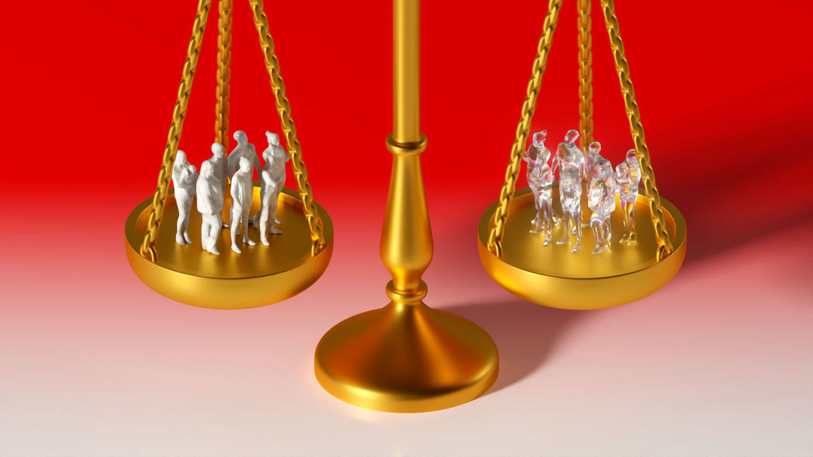
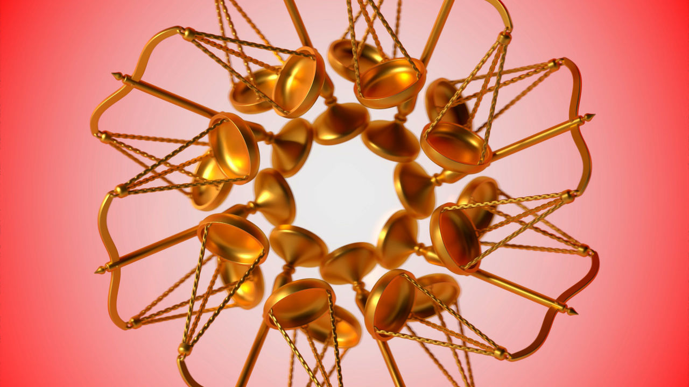

###### All uncreated men are equal

# Should we care about people who need never exist? 

##### How do you value a life not yet lived? 

 

> Dec 20th 2022 

In 1852 the  , carrying troops to fight the Xhosa wars, struck a rock near Danger Point in what is now South Africa. The soldiers assembled quietly at the ship’s stern, while the women and children on board clambered to safety on a small boat tethered alongside. Over 440 men lost their lives, drowned, crushed, or eaten by sharks.

Saving women and children first became known as the Birkenhead drill. It was invoked on the  and celebrated as an unwritten law of the sea. To many at the time, its rationale seemed self-evident. Women and children were “naturally more helpless”, as a journalist put it. On the , one fashionable woman lamented that she was a “prisoner in my own skirt”, unable even to jump into a lifeboat without assistance.

Some have, however, suggested a deeper justification for the drill, rooted in safeguarding the future of a society. Some of the  survivors went on to have children. Madeleine Astor remarried and had two sons with her new husband. (One of them would describe himself as a “most lucky man”, acknowledging that his mother’s good fortune was also his own.) Leah Aks later gave birth to a daughter and second son. Her great-granddaughter, a flautist, has taught a class about the  at the University of Tennessee. In rescuing over 700 souls from the icy deep, the lifeboats of the  also, in a sense, “saved” the additional lives these survivors went on to create, salvaging them from the deeper abyss of non-existence.


A growing band of philosophers, and a smaller number of economists, have wondered how to value these sorts of lives—lives which did not exist at the time of the rescue, but which could not have existed without it. Their inquiries fall within a field known as “population ethics”, which was invented in its modern form by Derek Parfit, a British philosopher, in the 1970s. Economists routinely ask how a policy or regulation affects people’s well-being. But often a policy does not merely benefit or harm a population, it helps to create it, changing the number and identity of the people in question. In these cases, an analyst cannot simply compare the lives of a given population with and without the policy. Their task is trickier than that, because the group of people that exists with the policy will be different from the one that exists without it. 

The questions posed by population ethics range from the intimate to the cosmic. Should a couple have a child—and should the government pay for any fertility treatment? Should humankind seek to colonise other planets to increase its potential size and lifespan beyond Earth’s limits? Somewhere in between are the policy questions posed by climate change, which would be less vexing if humanity was less extensive. In a paper published in 2017, Noah Scovronick of Princeton University and his co-authors calculated the cost of preventing temperatures rising by more than two degrees above pre-industrial levels. With a population of 9.7bn in 2050, the annual cost of emissions curbs would increase to $481 per person. With a smaller population of 8.7bn, the cost would drop to $471. The second option is cheaper. The first has more people in it. How should the two be ranked and evaluated? 

Before making that call, any analyst would need more practical details. They would want to know how the smaller population could be achieved, for example: could it be done while respecting everyone’s reproductive rights? But they would also need to answer a philosophical conundrum: what weight to place on the 1bn or so people who would exist in one scenario but not the other?

After the  disaster, an official inquiry concluded that ships should carry more lifeboats, despite the expense. Similar calculations have become a routine part of economics, estimating how much societies should spend on reducing other risks, such as road accidents. These estimates do not shy away from putting a dollar value on saving a life. They might, for example, infer the value from the amount of extra pay people demand to work in dangerous jobs. But it is vanishingly rare for these calculations to acknowledge that saving someone’s life might also make it possible for their descendants to live too. 

The exceptions prove the rule. In 1981 W. Brian Arthur, then at the International Institute for Applied Systems Analysis in Austria, compared the cost to society of different kinds of death. On plausible assumptions, saving someone from a motor accident was worth 2.5-4 times as much as sparing someone from cancer. Road victims tend to be younger so they had more years of life ahead of them. They also had more kids ahead of them. For every 100 people killed by cancer, the world also loses the two children these cancer victims might have had. For every 100 people killed on the road, society loses 32 potential children. 

Saving the young from untimely death is not the only way for governments to influence the number of people who come into existence. Policies on family planning, parental leave and subsidised child care can affect fertility rates fairly directly. Many other policies do so indirectly and often inadvertently.

High house prices, for example, make it harder for young people to start a family. The expense can also stop small families becoming larger. One study found that a hypothetical increase in unemployment by ten percentage points in Europe would reduce the number of children per 100 women by nine. Increasing women’s education can delay childbearing. It can also make women more employable, so that staying at home to raise kids entails a bigger economic sacrifice. In China, the long fight against covid-19 has coincided with a sharp decline in the number of marriages and births. Scholars blame the economic uncertainty and the strains of managing a household under lockdown. Almost every big economic policy is also de facto a population policy, because it will reshape the prospects of people who could still have children.

For what it’s worth

All of this raises practical as well as philosophical questions. When deciding how much to spend to save people from shipwrecks or road accidents, should their potential offspring count? If some people are never born because of a government decision—a tightening of planning regulations that raises the price of homes, a hike in interest rates that spreads unease and unemployment, or a pandemic-related lockdown that keeps Cupid’s arrow in its quiver—should their non-existence count against the policy?

The usual answer is no. The life of your potential offspring “has never been counted as part of the value of saving your life,” notes John Broome, a moral philosopher at Oxford. These lives can go uncounted even when they are the point of a policy. In justifying the public provision of infertility treatment, Britain’s clinical guidelines dwell on the treatment’s benefits for the mother. But they decline to consider the value of the child that might result. The same reticence applies even to much bigger changes in population. Climate change, for example, will change how and where people live, all of which will presumably influence the size of the future population. But “in all the very extensive writings on the harm of global warming, I have never seen the effect on population mentioned among the harms or benefits,” wrote Mr Broome in 2001. (He later served on a working group for the International Panel on Climate Change.)

The reason for this silence, he went on to say, is obvious. “The people who do these valuations take it for granted that changes in population are not, in themselves, good or bad. They assume they are ethically neutral.” Policymakers do, of course, worry about the impact of extra people (or fewer) on everyone else. They worry about the environmental strains of overpopulation and the fiscal strains of demographic decline. But many are neutral about the change in population in itself. Even if they could be assured that an extra 1bn people would not overcrowd the planet and clog the atmosphere, many would view the existence of this additional multitude as neither good nor bad.

This stance is common, convenient and often compelling. The intuition behind it was best captured by Jan Narveson, a Canadian philosopher, in 1973. “We are in favour of making people happy,” he wrote, “but neutral about making happy people.”

 


This intuition of neutrality is perhaps most appealing when applied to a family’s decision whether or not to have children. That decision will have all sorts of profound effects on others, most notably the parents. But setting those aside, does a couple’s choice make the world better or worse? Neither, argues Mr Narveson. As a result, “there is nothing immoral, or even slightly unbenevolent, about having no children when one could have had them.” This is true, he argues, even if the children would probably have flourished. 

You might object that the never-born child has lost out in some way. Their non-existence is worse for them than the life they could have led. But that is a metaphysical mistake, Mr Broome points out: if they never exist, there is no “them” for it to be worse for.

This argument is not confined to modern philosophy. Lucretius, a Roman poet, made the same point in verse 2,000 years ago:

“What loss were ours, if we had known not birth?

…whoso ne’er hath tasted life’s desire

Unborn, impersonal, can feel no dearth.

Poetically appealing, the intuition is also politically convenient. It allows policymakers and analysts to give little weight or even thought to the additional people who might come into the world as a result of their policies, whether they be improving road safety, reducing home prices or curtailing lockdowns. The 32 kids who might result from saving 100 young motorists’ lives do not factor into the road-safety budget. The child who might result from infertility treatment does not feature in the calculation of that treatment’s costs and benefits. People who would not exist without a decision cannot sway that decision. 


Because of the intuition’s appeal, Mr Broome went to considerable philosophical lengths to preserve it in the preparation of his book “Weighing Lives”. But at last he “grudgingly concluded” that it had “to be abandoned”. Many other philosophers have reached the same position. They include Parfit before him and more recently, William MacAskill, who became an intellectual celebrity in 2022 with his book “What We Owe the Future”. Mr MacAskill was one of Mr Broome’s doctoral students, and his book describes a similar intellectual journey away from the neutrality intuition.

Such journeys typically pass through several stations. One obvious objection to neutrality is the threat of extinction. If one couple refuses to have a child, it is neither good nor bad. But if every couple refuses, it is a catastrophe. A recent cartoon depicts Noah’s ark. Amid the pairs of monkeys, elephants and giraffes, one unicorn says to the other, “I just don’t think I want kids.” Making happy unicorns is a matter of moral indifference only as long as someone is doing it. 

Never was I ever

Critics of the neutrality principle point out its awkward asymmetry. It applies to happy people but not to those who would be horribly unhappy. Parfit imagined a “wretched” child, “so multiply diseased that his life will be worse than nothing”. It would be wrong to bring such children into the world, Mr Narveson conceded.

But this creates a moral dilemma. Everyone who gives birth takes an ethical gamble. They hope to bring a happy child into the world. But there is always a chance the child will suffer horribly, perhaps because of a rare birth defect or later accident or illness. Thus in order to do something morally neutral, they run the risk of doing something morally regrettable. 

Even when applied to “non-wretched” lives, the intuition of neutrality runs into logical difficulties. By placing no weight on potential populations, whatever their size and degree of contentment, neutrality makes it hard to weigh them against each other. The ethical scales give the same “neutral” reading for all of them, regardless of whether they are large or small, happy indeed or merely happy enough.

In his book, Mr MacAskill imagines a would-be mother deciding whether to have a child. She is suffering from a temporary vitamin deficiency, which means that if she conceives now, her child will suffer headaches later in life. If she waits, her child will not. 

The scales are neutral about making a happy child with occasional migraines. And they are neutral, too, about making a happy child without. They give the same ethical reading, even though one of those choices seems intuitively better than the other. In failing to distinguish either of these scenarios from the childless status quo, the scales also fail to distinguish them from each other.

Difficulties of this kind have prompted philosophers like Parfit and Broome to look for a moral reason, and a workable method, for weighing potential people. Parfit was wary of saying that existence is better for a person than non-existence (since in the latter scenario, there is no person). But even if causing someone to exist is not “better” for a person than the alternative, it might still be “good” for them, Parfit argued in his book “Reasons and Persons”. He quoted another philosopher, Thomas Nagel. “All of us…are fortunate to have been born. But…it cannot be said that not to have been is a misfortune.”

If causing someone to exist is good for them, that good can be placed on the ethical scales. By bearing a child, the mother in Mr MacAskill’s example benefits that child. If she waits, she heaps a larger benefit on the child without headaches than she would have conferred on the different, earlier child with headaches. 

What philosophers call an “impersonal view” is also possible. In ranking futures, a decision-maker may decide that one world is better than another, even if it is not better for anyone who exists in both. The children who could exist in Mr MacAskill’s example would have lives worth living. Such lives are good things. A world with them is better than one without. 

From an impersonal vantage point, people who merely could exist should be weighed alongside those who do or will. This view of potential people has potentially stark implications for everyone else. If adding a (sufficiently) happy person to the world makes that world better, then it might be worth adding them, even if it requires some sacrifice on the part of others. A bigger, worse-off population could be morally preferable to a smaller, better-off one. A world with 9.7bn people paying $481 per year to fight carbon emissions might be better than a world with fewer people paying less.

On a planet that already feels overstretched that is not an obviously appealing position. But the same philosophical logic can be recast as a radically green argument. Imagine the world reaches a point of great environmental precariousness, such that every cut in pollution today allows humanity to survive just a little longer. By living less well ourselves, we can, in effect, add another generation to the lifespan of our species. If our children also tighten their belts, they can add a further generation. And the same is true of their offspring, too. In this way, humanity might curtail the quality of life to increase the quantity of life, as it extends over time. 

The problem is where do you stop? When couched in these terms, even savage cuts in the quality of life could be justified by a sufficient increase in the quantity. We might be forced to conclude that a threadbare world is better than a comfortable one if enough extra people get to experience it. 

 


This is one version of what Parfit dubbed the “repugnant conclusion”. He imagined a world where people had lives that were barely worth living (a life of “muzak and potatoes” as he put it). If the population was sufficiently large (and in a philosophical thought experiment, the only limit on a population’s size is the philosopher’s imagination) such a world could be morally preferable to one where a smaller population enjoyed lives of joy and abundance. 

It is a deeply unappealing conclusion. It troubled Parfit for the rest of his life and remains one of the “cardinal challenges of modern ethics”, according to Gustaf Arrhenius of the Institute for Futures Studies. It is one reason why some philosophers still tenaciously defend the neutrality intuition. 

Mr Broome thinks it can be avoided by properly calibrating the scales, changing what counts as a borderline life. Parfit imagined it as a life that is only just worth living for the person living it. For Mr Broome the borderline is a life that is only just worth adding to the world, from an impersonal viewpoint. If lives of muzak and potatoes do not make the world better, if they are repugnant, then by definition they fall below this line. And so only happier potential lives would have positive value on a properly calibrated scale.

The sum of all fears

But even if this calibration deflects the repugnant conclusion, it has other off-putting implications. As Mr Arrhenius has pointed out, it might favour a world of hellish lives over another world where many more people lead slightly negative lives just below Mr Broome’s borderline. Indeed, the repugnant conclusion and its variants are fiendishly difficult to avoid. They pop up in many fields of ethics and in many guises. Viewed from a certain angle, Parfit’s conundrum is not that different from the more familiar dilemma of whether to help a lot of people a little, or a few people a lot, as Dean Spears of the University of Texas, Austin, and his co-authors have pointed out. 

Something like the repugnant conclusion can arise whenever a moral calculation requires adding up things with no obvious upper limit, be they people, pleasures or pains. Tyler Cowen of George Mason university has likened the repugnant conclusion to Pascal’s wager: if heaven is infinitely blissful, people should sacrifice almost everything to improve their odds of admission by even a fraction. That too is a repugnant thought. And it arises because there is no upper limit on the joys of heaven, just as there is no upper limit on the population in Parfit’s imagination.


The ubiquity of the repugnant conclusion and its ilk could be paralysing. But Mr Spears and Mark Budolfson of Rutgers University instead find it liberating. “If the repugnant conclusion is unavoidable, then we should not try to avoid it.” If a theory makes sense of practical cases, it should not be tossed out merely because it has counterintuitive implications when applied to imaginary scenarios that involve limitless summations of hypothetical people. 

In 2021 Mr Spears and Mr Budolfson published a short paper with 27 other scholars (including most of those named in this story). It tried not to solve the repugnant conclusion but to disarm it. It stated their shared view that the repugnant conclusion was not as fatal as it seemed. “The fact that an approach to population ethics…entails the Repugnant Conclusion is not sufficient to conclude that the approach is inadequate,” they wrote. The fear of large populations of low-quality lives has overshadowed the field of population ethics. Perhaps an unusually large population of high-quality authors can dispel it. ■

ILLUSTRATIONS: Timo Lenzen


