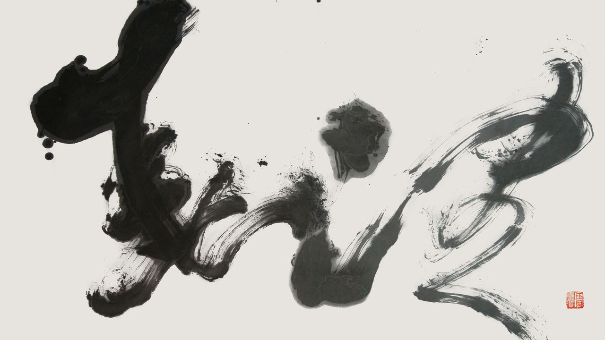
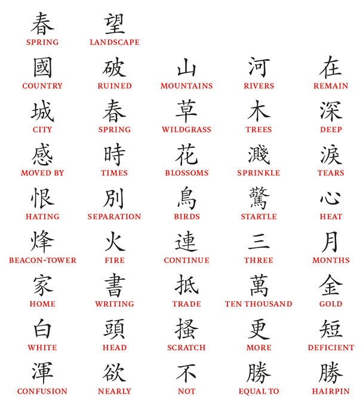

###### Through a crystal curtain

# The Chinese celebrate Tang poetry as a pinnacle of their culture 

##### Can poetry come alive to those who must read it in translation? 

 

> Dec 19th 2022 

EZRA POUND, an American modernist, described poetry as “news that stays news”. The versions of classical Chinese poetry he published in “Cathay” in 1915 were a declaration that, in a world of Model ts and machine guns, 1,200-year-old verse still mattered.

That is certainly what the Chinese think today. In the West poetry is a minority pursuit; in China it is woven into people’s lives. Children learn classical verse throughout their schooling, new poems celebrate births and marriages, and idiomatic speech is embroidered with ancient couplets.

Last year Wang Xing, founder of Meituan, a food-delivery giant, quoted “The book-burning pit”, a Tang-dynasty poem by Zhang Jie (836-905ad) in which an emperor kills dissenting scholars and destroys their work. Meituan’s stockmarket value duly fell by $26bn. Classical poetry is so familiar in China that, although Mr Wang pretended otherwise, everyone knew he was criticising the repressive rule of President Xi Jinping.

Can this ancient poetry come alive to readers who, like your correspondent, speak no Chinese? The barriers are immense: not just temporal, but linguistic and philosophical. However, the rewards are immense, too: a glimpse into a great civilisation, the spritz of fresh imagery, and sudden, consoling moments when an eighth-century poet rises up off the page, a human being like any other. Nowhere are these rewards stacked higher than in the poetry of the Tang dynasty. 

The Tang lasted from 618 to 907ad. During its first half, as China flourished, the Silk Road brought luxuries, wealth and exoticism. The capital Chang’an, modern-day Xi’an, had about 1m inhabitants. Perhaps 5% of them were literate. Before a rebellion knocked everything off centre in 755, it may have been the most prosperous and cosmopolitan city in the world.


 As in Shakespeare’s England and J.S. Bach’s Germany, something was in the air. Early in the Tang, poetry-writing was brought into the examination that selected scholars for the bureaucracy. Among the finest Tang poets were great drinkers who had studied for the exam but failed it, or who could not hold down a government job (some things never change).

Verse was communal. Tian Yuan Tan, professor of Chinese at Oxford, explains that, during this time, it spread from the court into everyday life. When somebody left town, you wrote a poem. To dignify a banquet, you declaimed a poem. If your friend was out when you dropped by, you left a poem behind.

Plenty of people could write Tang verse. Stephen Owen, a Harvard professor who may have translated more of it than anyone, says that, even if writing good poetry was formidably hard, everyday poems were easy to toss off—Chinese has plenty of rhymes and stock allusions. Fortunately, the best verses were rapidly anthologised, one reason so many still exist.

And poetry was becoming more contemplative. Some wrote of the miseries of exile. The rebellion caused upheaval and suffering, some of which coloured poetry. David Hinton, a poet and translator, argues that Tang China was perfused by Chan Buddhism, better known by its Japanese name, Zen. All this gave verse a depth that court poetry had lacked.

It is one thing for Chinese-speakers to look back on the Tang poets in awe. It is quite another for their poetry to work in modern English. Robert Frost, a 20th-century American writer, is supposed to have said that “poetry is what is lost in translation”. If so, grappling with Chinese poetry is doubly futile. English has no tones, or characters—which may add layers of meaning. Eliot Weinberger, who wrote a book that compares 36 translations of a single, celebrated four-line Tang poem, points out that Chinese verbs have no tense, the sentence may have no subject and a single character could have several meanings (modern Chinese is less ambiguous, because it tends to group text into two-character units). That leaves the translator with a lot to fill in. Mr Hinton says that European poetry is “the same grammatical world just reorganised.” By contrast, “for Chinese, you pretty much have to reinvent it because the language is so radically different.”

Inevitably, there are plenty of bad versions of Chinese poetry. It is unfortunate that the first Tang poem in English, “Climbing Qi Mountain in The Double Ninth Day” by Du Mu (803-852), from a missionary called Robert Morrison in 1815, mixes up the words for wild geese and swallows. The rhymes of Launcelot Cranmer-Byng, a renowned British translator who died in 1945, are hard for the modern ear to bear.


Yet Frost’s epigram is either obvious or fatuous. Obvious because nobody could imagine that the sounds and layers of meaning which make poetry sing in one language could ever map directly onto another. Fatuous because of the in-your-face fact that, from Chapman’s Homer to Seamus Heaney’s “Beowulf”, poetry books are bursting with inspiring translations.

Indeed, the language has changed so since the Tang that poems read out loud in the original Middle Chinese would be incomprehensible to speakers of modern standard Putonghua. In a sense, everybody who experiences poetry across a millennium experiences it in translation. As a rebuke to Frost, Mr Weinberger begins his study: “Poetry is that which is worth translating.” Here are five Tang poems. Judge for yourself.

China has hundreds of poems about the frontier. Most of them were heroic, but here Li He (791-817), a Late Tang maverick, instead paints a desolate picture of a barbarian threat out in the nothingness. 

 

A Tartar horn tugs at the north wind,

Thistle Gate shines whiter than the stream.

The sky swallows the road to Kokonor.

On the Great Wall, a thousand miles of moonlight.

The dew comes down, the banners drizzle,

Cold bronze rings the watches of the night.

The nomads’ armour meshes serpents’ scales.

Horses neigh, Evergreen Mound’s champed white.

In the still of autumn see the Pleiades.

Far out on the sands, danger in the furze.

North of their tents is surely the sky’s end

Where the sound of the river streams beyond the border.


A lot of Chinese poetry layers images on top of each other. In the first stanza, Li He begins with a panorama—Kokonor comes from the Mongolian word for Qinghai, a region 1,700km west of Beijing.

Then he zooms in on the soldiers, down to the plates in their armour. The Evergreen Mount is the tomb of Wang Zhaojun, who was sent as a wife to appease a Barbarian leader. The mound was supposed to be green—but here, in the moonlight, it is drained of colour, like the steppe.

And the last stanza pulls back out again. Mr Tan points out that Li He mixes scenery and emotion. The flickering star-cluster that Westerners call the Pleiades was an omen of barbarian invasion. Although the soldiers cannot see the horde, they sense it and they are apprehensive. The Yellow River flows from the wilderness into China, unstoppable. 

The next poem is about a woman at court who is let down by her lover. As in much Chinese poetry, it draws its power from what is left unsaid.

 

The jewelled steps are already quite white with dew,

It is so late that the dew soaks my gauze stockings,

And I let down the crystal curtain

And watch the moon through the clear autumn.


This lament is unusual for Li Bai (701-762). He was an extrovert best-known for writing about friendship and drinking. The woman has been waiting for her lover for some time because her stockings are soaked. It is a clear night: he has no excuse. By the third line she has accepted that he is not coming and returns to her room, lowering a beaded curtain. The moon could represent two people’s separation, grievance or a mirror of the woman’s mind, empty and at peace. As Pound remarks in a gloss, “the poem is especially prized because she utters no reproach”.

Pound did not speak Chinese. He was working from notes provided by the widow of Ernest Fenollosa, an American professor in Japan and he makes mistakes. The steps are white jade—marble—not jewelled; the stockings silk. By tradition, poems like this are in the third person, with the poet as an omniscient observer. Mr Owen says that in the original the moonlight in the last line is scattered by the crystal curtain, just as it was by the dew: the lovers’ moon is in fragments.

Pound’s versions of Chinese poems were so fresh that “Cathay” had a profound and lasting influence on modern American poetry. Pound wanted to escape the sentimentality and prolixity of the Victorians. In the crystalline economy of Japanese Haiku and classical Chinese poetry he found the means.

Farewell poems make up a lot of Tang verse. Most were formulaic, but this stands out not only for its emotional subtlety, but also because its author, Xue Tao (ca.768-831), was a courtesan famed for her writing. 

 

Rain darkens Mothbrow Mountain;

the river waters flow.

Parting: 

her face behind her sleeves, she

stands atop the watchtower.

Two matched pennons,

a thousand mounts

in pairs on the Eastern Road—

alone she gazes

like a faithful

wife toward the column’s head.


The figure two runs through this poem. The woman’s sleeves, the standards, the columns of cavalry all contrast with the couple who are separated as he leads his troops to war and she is left behind. 

According to Jeanne Larsen, the translator, the complete Tang anthology features about 2,250 poets; 130 of them are women, represented by 600 poems. Courtesans were entertainers. They were meant to be gifted poets and musicians. In an age when wives were usually uneducated, their conversation lubricated the dealings between powerful men. “Sex was part of it, of course,” Ms Larsen writes, “but only part of it.”

Xue Tao was especially successful. Eventually she retired and was able to live independently—a fate denied most courtesans, who were forced into marriage, concubinage or prostitution. Before that, she spent years in the service of a military governor in modern-day Chengdu in Sichuan. It is said that he asked her to be awarded the title Collator, the office of collecting and combining texts, as recognition of her writing.

Pound was drawn by Chinese poets’ focus on images. Nobody saw more clearly than Wang Wei (699-761), who here writes on another Tang theme: going home.

 

A clear stream lined by long tracts of brush,

There horse and coach go rumbling away.

The flowing waters seem to have purpose,

And birds of evening join to turn home.

Grass-grown walls look down on an ancient ford,

As setting sunlight fills the autumn mountains,

And far, far beneath the heights of Mount Song,

I return and close my gate.


The first couplet sets up a contrast between nature and noise, as the cart trundles beside the water. Then the poet sees the river returning to the ocean and the birds to their nests: Wang Wei wants to leave behind the stresses of government work and retire in peace. The next three lines describe a series of barriers—ancient walls, the forded river and a range of tall mountains. But the last barrier, the gate, subverts them. Behind it lies seclusion and awareness. 

Wang Wei was also a painter. He is “a guy that can see”, says Mr Owen, the translator. “Always visualising what’s there and what’s not there.” The surface of his poems are often just a series of statements about nature, as in “The Deer Park”, the poem Mr Weinberger compares in translation. The details seem natural, but the closer you look the more you find.

Wang Wei was a Buddhist, too. From the age of 30 he studied under a Chan master. This poem is usually thought of as a reflection on the universal desire to withdraw from the hurly-burly of life. Mr Hinton also detects a deeper, Buddhist yearning for meditative peace and enlightenment.

The An Lushan Rebellion of 755 lasted seven years and brought destruction that the Tang Dynasty never fully overcame. Roughly 1,200 of the poems of Du Fu (712-770) are from that time, 80% of what survives. This is about how it feels when the world falls apart.

 

The country in ruins, rivers and mountains

continue. The city grows lush with spring.

Blossoms scatter tears for us, and all these

separations in a bird’s cry startle the heart.

Beacon-fires three months ablaze: by now

a mere letter’s worth ten thousand in gold,

and worry’s thinned my hair to such white

confusion I can’t even keep this hairpin in.


The first line is one of the most famous in all Chinese poetry. Du Fu is stuck in the capital, separated from his wife and children, the country is at war but, as spring comes, the natural world keeps turning. As he reflects on the devastation and the misery, he smiles wryly at the hopelessness of his situation.

 


Du Fu is writing regulated verse, which sets up a perfect series of parallels visible in the literal translation. Mr Tan points out that in the first couplet Du Fu stands back to contrast the city’s suffering with nature’s indifference. In the second he draws in: water droplets and birds’ cries are now echoing his sorrow. The third speaks of the civil war, comparing it with his own isolation from his family. And the last focuses on the poet himself. He is not falling into self-pity, but gently laughing at his own ridiculous transfer of worry from the ruin of the nation to the security of the hairpin he uses to fix his official hat—mockery all the more penetrating because, as Mr Owen notes, Du Fu never won high office. All that in 40 characters.

In translation you lose the parallelism of Du Fu—indeed Mr Owen and Mr Hinton say that in English end-stopped lines using repeated patterns soon pall. You also miss literary allusions and the resonance of phrases that have entered the Chinese language.

However, Mr Tan observes that translation has one advantage. To the Chinese, voluminous commentaries weigh down these poems, rather as Hamlet’s “To be, or not to be” is freighted with overuse. But readers in English coming to this poetry for the first time will find it waiting like Pound’s white-silk fan, “as clear as frost on the grass-blade”. ■

ILLUSTRATION: Kapo Liu

sources

1. “Poems of the Late T’ang”, translated by A. C. Graham (New York Review Books Classics) 

2. “Cathay”, by Ezra Pound. (Hardpress Publishing) 

3. “Brocade River Poems: Selected works of the Tang dynasty courtesan Xue Tao”, translated by Jeanne Larsen. (Princeton University Press) 

4. “The Great Age of Chinese Poetry: The High Tang”, by Stephen Owen. (Quirin Press) 

5. “Awakened Cosmos: The mind of classical Chinese poetry”, by David Hinton. (Shambala) 

6. “19 Ways of Looking at Wang Wei”, by Eliot Weinberger.

7. “A little primer of Du Fu”, by David Hawkes.

8. “The Selected Poems of Wang Wei”, translated by David Hinton.

9. “A History of Western Appreciation of English-translated Tang Poetry”, by Lan Jiang.

10. “Autumn Willows: Poetry by Women of China’s Golden Age”, translated by Thomas Cleary and Bannie Chow.

11. “Poetry and Translation: the art of the impossible”, by Peter Robinson.

12. by Laszlo Mongomery, “The History of Tang Poetry”, episodes 218-225.

13. by Rob Moore and Lee Moore, passim.

14. by Melvin Bragg “Tang era poetry”, BBC Radio 4, broadcast May 12th 2022.

15. “Du Fu and Li Bai–the poets”, by Carrie Gracie BBC Radio 4, broadcast October 11 2012.

16. “Du Fu: China’s Greatest Poet”, by Michael Wood and Sir Ian McKellen, BBC4, broadcast April 7th 2020.


