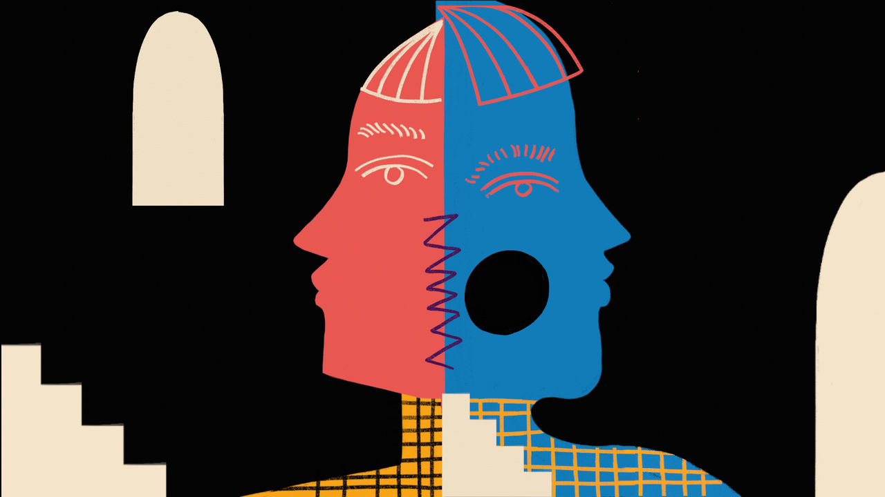

###### The weight of the world

# The economics of thinness 

##### It is economically rational for ambitious women to try as hard as possible to be thin 

 

> Dec 20th 2022 

Mireille guIliano is a slim and successful woman. She was born in France and studied in Paris before working as an interpreter for the United Nations. She then worked in the champagne business and in 1984 joined Veuve Clicquot whose performance was, at the time, rather flat. She fizzed up the ranks and launched their American subsidiary. In 1991 she became its chief executive and ran it with great success. In her apartment overlooking downtown Manhattan, she offers a glass of water before quipping “You know how much I love water.” She is correct; drinking plenty of water is a key rule in “French Women Don’t Get Fat, her bestselling book on how to lose weight and stay slim “the French way”.

In the book she describes her discomfort when as a teenager she gained weight while spending a summer in America. Her uneasiness comes to a head when she returns home to France and her father, instead of rushing to hug her, tells her she looks “like a sack of potatoes”. She goes on a new diet plan, remembers her old French habits (lots of water, controlled portions, moving regularly) and tips the scales back in her favour.

As a successful woman who is willing to talk publicly about her appearance and her weight, Ms Guiliano is rare. “Of course no one wants to talk about it,” she says. “It is much easier to pretend it comes naturally.” Successive waves of feminism have told smart women they should have emancipated themselves from vanity—as they have from domestic servitude and an existence defined by procreation.

But as a woman greatly affected by a comment about her weight she is not rare. Aubrey Gordon, the co-host of the Maintenance Phase, a podcast which unpicks the problems with modern weight loss and wellness, was told by a doctor that she was overweight aged just ten. Roxane Gay, an American writer, describes the shock on her parents’ faces when she returned home from her first term at boarding school, aged 13, weighing 30 pounds (around 14 kgs) more than she did when she went away.

These experiences are deeply personal but also universal, at least in the rich world. They reflect the pressure on women to look like an “ideal”. That ideal has changed over time. Renaissance nudes boast ample curves. But in more recent decades it has been defined by thinness. In the 1980s in New York it was the “social x-ray”, a term coined by Tom Wolfe in his novel “Bonfire of the Vanities” to describe women so slight they existed only in two dimensions. This morphed into the “heroin chic” ideal of London in the 1990s.

Today the perfect body is the “weasel bod”, says one Los Angelena, who is surrounded by women seeking physical perfection. These women strive to look streamlined and sleek, like a weasel, as though they could slip through water without disturbing it. Pursuit of such a body might permit a little more food than the regimes of the past but it is just as difficult to attain.

All women eventually recognise the importance placed upon their bodies. It is as though girls are walking through a forest unaware and are then shown the trees. They can wonder how the trees got there, how long they have been growing and how deep their roots really go. But there is little they can do about them and it is almost impossible to imagine the world any other way. And the fiction that clever and ambitious women, who can measure their worth in the labour market on the basis of their intelligence or education, need pay no attention to their figure, is difficult to maintain upon examination of the evidence on how their weight interacts with their wages or income. The relationship differs in poor countries where rich people are generally heavier than poor ones.

Wealthy people are thinner than poor ones in countries such as America, Britain, Germany and rich Asian countries, such as South Korea. There is typically a gently downward sloping relationship between most measures of weight, like body mass index (bmi), a measure of obesity, or the share of a population that is obese, and income, as measured by wages, the share of people below a poverty line or their income quartile.

 


That poor people are more likely to be overweight has often been explained by arguments that obesity, in the rich world, is a feature of poverty. Poor people may struggle to afford healthy foods. They may reach for processed or fast foods because they lack the time to prepare meals at home or have less time to exercise because low-wage jobs often involve working long shifts and can be less flexible than those performed by the “laptop class”. Or because low income is often a function of limited education, perhaps, so goes the thinking, that lack of education extends to a lack of knowledge about how to maintain a healthy weight.

The problem with all of these explanations is that the correlation between income and weight at the population level in advanced countries is driven almost entirely by women. In America and Italy the relationship between income and weight or obesity is flat for men and downward-sloping for women. In South Korea the correlation is positive for men but this is more than offset by the sharply negative correlation in women. In France the relationship slopes gently downwards for men, but the slope is much steeper for women. These kinds of patterns seem to hold across most rich countries and appear robust to various ways weight or obesity might be measured.

The duchess’s decree

In other words, rich women are much thinner than poor women but rich men are about as fat as poor men. Wallis Simpson, whose marriage to King Edward VIII prompted his abdication, is supposed to have said that a woman “can never be too rich or too thin”. Apparently she must be both or neither.

That should give pause to anyone who thinks that poverty can explain why people are overweight or obese, or that being rich helps people to maintain a lower weight. You must then explain why those dynamics seem only to affect women. Perhaps the relationship would look the same for both sexes, but the occupations they do that require or might result in slimness differ. Men disproportionately do lower-paid physically active jobs, like construction (although nurses spend as much time walking or standing as builders, and are disproportionately women). Some rich women, such as actresses, might be explicitly required to be thin to play certain roles.

Still, it is hard to believe that either dynamic explains the entire difference. Data from the American Bureau of Labour Statistics (bls) suggest that just 3.5% of civilian workers do intensely physical jobs (and some of those categories, like exercise instruction and dancing, employ plenty of women). Only 0.1% of workers do jobs such as acting. That there is a gender gap in the relationship between income and weight, which cannot easily be explained by other differences between men and women, indicates another explanation: perhaps being thin helps women become rich.

Myriad studies which find that overweight or obese women are paid less than their thinner peers while there is little difference in wages between obese men and men in the medically defined “normal” range. There are exceptions: one Swedish study found that obese men were paid less, but obese women were not. But research in America, Britain, Canada and Denmark suggests that overweight women do have lower salaries. The penalty for an obese woman is significant, costing her about 10% of her income.


This might understate reality because it is hard to measure the wage gap for someone who was not offered employment because of their size. The upper estimates of the wage premium for a women being thin are so significant that she might find it almost as valuable to lose weight as she would to gain additional education. The wage premium for getting a master’s degree is around 18%, only 1.8 times the premium a fat women could, in theory, earn by losing around 65lbs—roughly the amount that a moderately obese women of average height would have to lose to be in the medically defined “normal” range. The penalty appears to be particularly significant for white women—evidence for black or Hispanic women is weaker (though could be explained in part the fact that studies often use bmi which can misclassify these women).

Discrimination against fat women has not diminished as their numbers have risen. “We might expect a declining penalty due to the increase in the percentage of overweight individuals,” wrote David Lempert, an economist, in a working paper for the bls, because it has become more normal to be overweight. Instead the stigma against overweight people has grown with their number; it almost doubled between 1980 and 2000. He suggests this may be because “the increasing rarity of thinness has led to its rising premium.”

The conclusion of the paper layers one infuriating sentence on top of another. As larger women age, he writes, they incur the effects of years of cumulative wage discrimination. Controlling for other factors, their starting wages are lower. Throughout their working careers, these women receive fewer raises and promotions. His paper shows “that an obese 43-year-old woman received a larger wage penalty in 2004 than she received at 20 in 1981,” and also that “an obese 20-year-old woman receives a larger wage penalty today than she would have in 1981 at age 20.”

This might reflect, in part, the higher costs that obese employees might impose on their employers, especially in America. Health-insurance premiums in America are often paid by employers, and very overweight or obese people tend to incur higher costs, partly because they suffer more health problems as they age. Still, it is unclear why these costs would be passed on only to women. And studies in Canada and Europe (where government-funded health care is the norm) find similar sized wage penalties for women.

Meanwhile, the idea that the penalty for being obese might be rising, not falling, is backed up by the data from the “implicit bias” test run by Harvard University. It asks test-takers to associate people of different races, sex, sexual orientation or weight with words like good or bad. And in general the findings are trending in a positive direction—discrimination on the basis of race and sex has fallen over the last decade. Negative associations of gay people have fallen by a third. Weight is the exception—attitudes towards heavy individuals have become substantially more negative. 

In this context the arguments often made for why women and girls feel such pressure to be thin and suffer from low self-esteem when they are not appear woefully incomplete. Perhaps women do feel bad about themselves because they compare themselves to the gazelles that populate the covers of magazines and are duped into thinking those photos are unedited and attainable. Maybe their parents or a doctor commented on their weight when they were young. But in addition to those pressures is the powerful incentive of the market: women accurately perceive that failing to lose weight or be thin will literally cost them.

It is economically rational for everyone to devote time to education because it has clear returns in the labour market and for future wages. In the same way it appears to be economically rational for women to pursue being thin. Obsessing over what and how much to eat and paying for fancy exercise classes are investments that will bear returns. For men they are not.

To some extent women know this. A generation ago they seemed to take it for granted. “The most basic thing to get on with after your job—or during it—is how you look and feel. It is unthinkable that a woman bent on ‘having it all’ would want to be fat, or even plump,” wrote Helen Gurley-Brown, the editor of  magazine in the 1980s and 1990s in her book “Having It All”, before rattling off advice about how to survive on 800 calories a day, encouraging women to weigh themselves daily and to accept that “dieting is  and stop getting depressed about it!”

 


Such attitudes were more acceptable four decades ago. But the economic reality does not seem to have shifted much. All that has changed is the narrative, which has embraced body positivity and shunned dieting. Instead of the South-Beach diet or Atkins women eliminate foods—becoming gluten-free, vegan, low-sugar—under the guise of health or wellness, to improve their gut health or raise their energy levels. People spend large sums to attend Soul Cycle classes, a kind of boutique indoor cycling, to be strong and fit, not to burn calories. “Even glossy women’s magazines now model scepticism toward top-down narratives about how we should look…but the psychological parasite of the ideal woman has evolved to survive in an ecosystem that pretends to resist her,” writes Jia Tolentino in her book “Trick Mirror” Feminism “has not eradicated the tyranny of the ideal woman but, rather, has entrenched it and made it trickier.”


Because being very obese comes with elevated health risks, some might argue it is not a problem that there are incentives for women to lose weight. But this relies on two wobbly pillars of logic. First, that people’s weight really is within their control. And second, that shame is an effective motivator.

Most people have experienced the effect that eating a little less and moving a little more has on their physical form and so it is common to think that weight and obesity is a mutable trait—one that slim people work to achieve and fat people fail to achieve. If this were the case, then it might seem possible for women to opt out of discrimination on the basis of weight, by conforming to the body type society demands of them. 

Yet the perception of total control is misguided. People often report gaining weight when they start taking antidepressants; women tend to if they suffer from conditions such as polycystic ovarian syndrome. Ms Gay describes how her weight gain occurred in the aftermath of a brutal sexual assault. It also raises the question of why a great slice of humanity collectively lost control of their eating habits in the 1980s, when obesity rates began to soar in developed countries. Scientists are unsure of the answer (some point to the rise of processed foods) but they do agree that it is almost impossible to lose weight and stay smaller—and people who achieve this are far rarer than those who spend their lives trying, failing and blaming themselves.

Perhaps shame can work for some people, on the margin. It worked for Ms Guiliano. When asked why her reaction to her father’s comment was to decide to lose weight, rather than to tell him off, she pauses for a moment. “But, of course,” she says, “he was right.”

Too high a price

But think, too, of the huge cost that the stigma, shame or the fear of becoming overweight has on all of the women and girls who spend their lives worrying about what becoming that way might cost them. It is impossible to move around the world as a woman and not notice the time, energy and investment women make in logging the food they eat, reading diet books and attending exercise classes. Anyone who has tried a juice cleanse or a cabbage soup diet will know that the pursuit of thinness can come at the expense of other important things girls and women might want to do, like being able to focus on exams and work or enjoy food.

According to some surveys, girls as young as six recognise the expectation that they should be thin. Then adolescents “overwhelmed by sudden expectations of beauty, transmit anorexia and bulimia to one another like a virus,” writes Ms Tolentino. The tragedy is that there is no escape. Most women seem to try to conform. Some choose not to. Many simply fail. But whatever path is taken, it seems to come at a great cost. ■

ILLUSTRATIONS: Diana Ejaita


