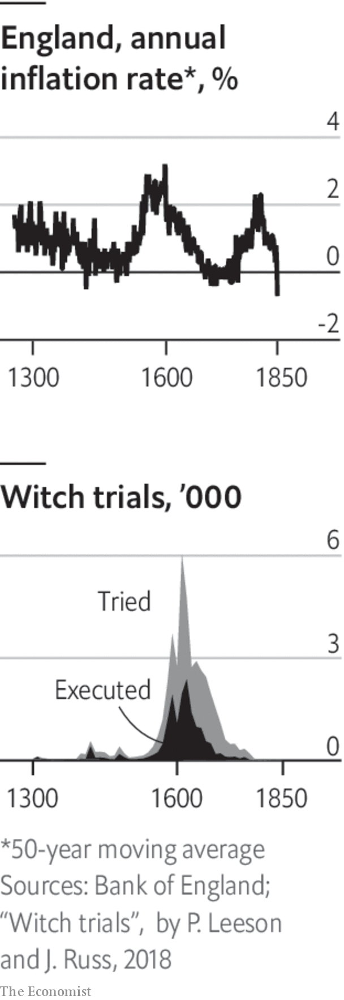

###### When money dies

# The great inflation of the 1500s is echoing eerily today 

##### Inflations past have lessons for today 

> Dec 20th 2022 


In the days of Henry VIII, England seemed to be falling apart. There had never been so many beggars, witnesses reported, many of whom would cut your throat given half a chance. Everyone suspected, rightly it turns out, that the currency was being debased. Morals were as degraded as the coinage. At one infamous funeral in Kent midway through Henry’s reign, an observer reported that “the burial was turned to boozing and belly-cheer”, with an orgy involving “seven score persons of men, every one of them having his woman”. The feeling that something was not quite right was shared across Europe, which by the 1590s was consumed by financial crisis, social unrest and war.

The root of the chaos was a wholly unexpected, and wholly unfamiliar, surge in inflation. For at least the 300 years leading up to the 1500s, western Europe made modern-day Japan look like Zimbabwe. In England in 1500 the price of a standard basket of goods facing consumers (largely food, but including other things such as clothing and light) was no higher than it had been in 1275, suggests work by Gregory Clark, a historian, and researchers at the Bank of England. 

All this changed after 1500. Sustained price inflation, once unthinkable, became unstoppable. Within 50 years average prices across England had doubled. Before long Italian prices were rising by 5% a year, research by Paul Schmelzing of Boston College suggests. In France and Holland, inflation hit 4% by the end of the century. In Russia the inflationary trend picked up from the 1530s. The global rate of inflation peaked in the 1590s at close to 3% a year. If 3% does not sound too painful, bear in mind that growth in nominal incomes in a pre-capitalist world was basically zero: almost any level of inflation made people poorer. 


The inflationary surge also lasted a long time—longer, even, than the galloping-inflation era in the early 19th century caused by the Napoleonic wars, or that of the 1970s. Some countries suffered more than others. Scottish inflation was often a lot worse than English. Dutch inflation might have been the worst of all. 

Just as with today’s inflation, pundits in the 1500s furiously disagreed over the causes. Nowhere was this debate more heated than in France in the 1560s and 1570s. Jean Cherruyer de Malestroit, one pundit, played the role of Larry Summers, a former American treasury secretary, arguing that price pressure was the result of excessive spending. Jean Bodin, the Paul Krugman of his day, argued that unexpected shocks to the global economic system were to blame. Both economists wrote pamphlets attacking the other’s position. Historians continue to disagree. 

Like Messrs Summers and Krugman today, both Malestroit and Bodin had a point. Excess demand certainly played a role. The population had grown fast after the Black Death; many of those people had moved to cities. This raised demand for food even as it cut the number of farmers producing it. And some monarchs goosed the economy by manipulating the currency. 

 


Henry VIII’s “great debasement” of the 1540s involved taking one gold coin, melting it down, adding worthless metal, and then recasting it as two “golden” coins. Using this method Henry plucked coins out of thin air worth about 2% of GDP in some years. Henry spent the extra cash on wars and palaces. The resulting boost to nominal demand provoked merchants to raise their prices. It was not just Henry, or his successor, Edward VI, who debased the currency. Scotland started doing it in 1538 and then doubled down on the strategy in 1560. In the southern Lowlands, or today’s Netherlands, Belgium and Luxembourg, the silver coinage was debased 12 times from 1521 to 1644.

But debasement alone does not explain the great inflation, whatever Malestroit might have argued. It was not a new strategy, for one thing. It is reckoned that France debased its silver coins 123 times between 1285 and 1490. Between those years there was no inflation. And yet in the 1500s, even as many countries slowed down their debasements, they all saw inflation. Spain stopped debasing entirely from 1497 to 1686. Some historians, therefore, follow Bodin and say that demand-side explanations by themselves are insufficient. They also look at what was happening across the Atlantic, the source of a huge supply shock to Europe’s economy. 

In about 1545 people discovered vast silver deposits in Bolivia. Potosí, the centre of this lucrative new industry, became perhaps the fifth-largest city in the Christian world by population (after London, Naples, Paris and Venice). In the first quarter of the 1500s just ten tonnes of silver had arrived on Europe’s shores. By the third quarter of the century Europe imported 173 tonnes. Spain, where much of the metal arrived, initially experienced especially high inflation—but it then spread across the rest of Europe, as far as Russia. 

Today’s surge in inflation, only a year or so old, has already had profound social and political consequences. Consumer confidence is at rock bottom as real wages decline; incumbent politicians are unpopular; and protests about the cost of living are mushrooming. 

All that is peanuts, however, compared with the effects of the 16th-century inflation. Average real wages, which at the start of the 1500s were at the princely level of about seven pence a week, then fell, and fell, and fell. They would not regain their purchasing power until the late 19th century. The consequences of this almighty squeeze on living standards went beyond rampant beggary and orgies at funerals. Across Europe, society and politics became radically unstable. 

In a paper published in 1986 Jack Goldstone, now of George Mason University, asked why from 1550 to 1650 “states broke down on a wide scale”. In France in 1572 the Saint Bartholomew’s Day massacre involved Catholic-on-Protestant assassinations, resulting in thousands of deaths. The 1590s were years of revolt in Austria, Finland, Hungary and Ukraine. Russia experienced its “time of troubles”, a 15-year period of lawlessness from 1598. The Thirty Years War started in 1618, and the period culminated with the execution of England’s Charles I in 1649. In each year of the first quarter of the 1500s, about six in every 100,000 people globally died in conflict. From the 1620s to the 1640s, about 60 in 100,000 were perishing annually. The number of people tried and executed for witchcraft surged. 

Unhappy elites were, in part, responsible for the chaos. The gentry often depended on fixed payments (such as rents) for their income, and so may have experienced the effects of the great inflation more than those who could simply raise prices. In northern France and Belgium inequality fell in the 1560s and 1570s as middle-income people did fine while rich landlords were squeezed. Plutocrats, not used to economic strife, agitated for change.

Ruff and tumble

More importantly governments suffered. Centuries of zero or low inflation affected how they structured state finances. Monarchs often leased plots of land on fixed rents for as long as 99 years. Customs duties were held at nominal prices. This was a problem once inflation took off. From the mid-1570s to the mid-1590s Spain’s tax revenues were constant in cash terms, but they had less purchasing power. And governments’ expenses, which were not fixed, soared. In the century after 1530 the price of putting a soldier in the field rose fivefold.

The inflation thus, over time, contributed towards weaker states and a debt crisis. Governments did what they could to raise revenue. In 1544 and 1545 Henry VIII offloaded state assets, such as plots of land, worth over £150,000 (or more than 2% of gdp), and there were smaller sales under Elizabeth I in the early 1600s. Knighthoods were granted “in unprecedented numbers”, most for large fees, pointed out Mr Goldstone. Borrowing exploded, just at a time when many lenders were starting to raise interest rates. Defaults, rare in the 1300s and 1400s, multiplied, with France (in 1558, 1624 and 1648), Portugal (in 1560) and Spain (in 1557, 1575, 1596, 1607, 1627 and 1647) reneging on claims to foreign investors. 

Eventually, the great inflation came to an end. Population growth slowed, reducing demand for goods and services. Monarchs got a handle on monetary and fiscal policy, promising to default and debase less frequently than they used to. And the flow of precious metals from the Americas slowed. Yet the lessons from the century are clear. No matter the cause, societies which let inflation set in should expect more than just their living standards to be debased. ■

ILLUSTRATION: James Kerr


