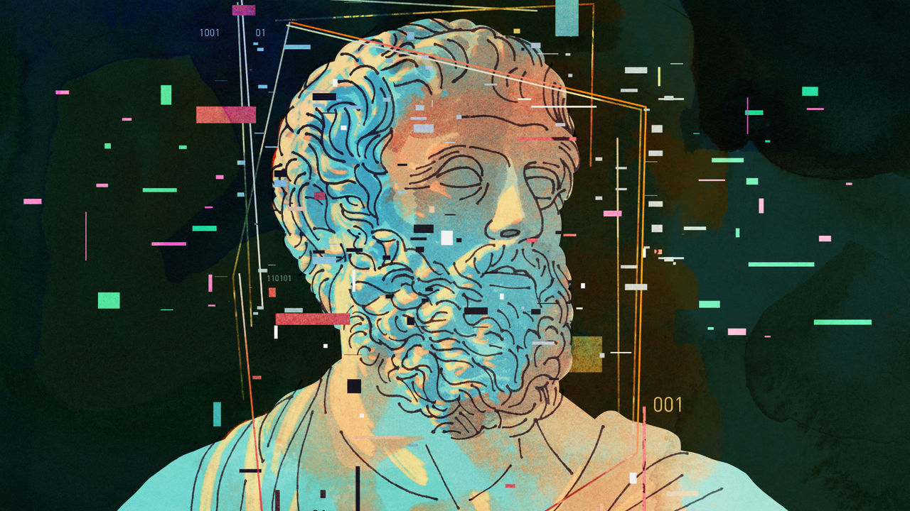

###### Complex saviours

# The new tech worldview 

##### Silicon Valley may be coming down to earth. Not so tech’s big thinkers 

 

> Dec 20th 2022 

Sam Altman is almost supine. He is leaning back in his chair, feet up, in his home library overlooking San Francisco’s Golden Gate Bridge. In washed jeans and a t-shirt, the 37-year-old entrepreneur looks about as laid-back as someone with a galloping mind ever could. Yet the ceo of OpenAi, a startup reportedly valued at nearly $20bn whose mission is to make artificial intelligence a force for good, is not one for light conversation. The only signs of playfulness are two pairs of pink-coloured high-tops sitting on a bookshelf, with logos representing his two favourite technologies, AI and nuclear fusion. Occasionally he drifts into nerd-speak. At one point, keen to convince your correspondent that AI will progress faster than people think, he says, sounding rather robotic himself: “I’m curious if that caused you to update your priors.” 

Joe Lonsdale, 40, is nothing like Mr Altman. He’s sitting in the heart of Silicon Valley, dressed in linen with his hair slicked back. The tech investor and entrepreneur, who has helped create four unicorns plus Palantir, a data-analytics firm worth around $15bn that works with soldiers and spooks, talks fast—and interrupts frequently. By his pool is a giant throne, from the set of “Game of Thrones”. It fits with the grandeur of his worldview that the West, which he cherishes for its classical values of free thought and free speech, should be fighting an epic internal battle not to give in to self-loathing. 

You might think these men have little in common. But they are both part of what Mr Lonsdale calls a “builder class”—a brains trust of youngish idealists, which includes Patrick Collison, co-founder of Stripe, a payments firm valued at $74bn, and other (mostly white and male) techies, who are posing questions that go far beyond the usual interests of Silicon Valley’s titans. They include the future of man and machine, the constraints on economic growth, and the nature of government. 

They share other similarities. Business provided them with their clout, but doesn’t seem to satisfy their ambition. They measure their status not so much in mansions and yachts as in engagement with their blog posts and essays, some mind-numbingly long. There is a lot of fresh, idealistic money behind them. The number of techno-billionaires in America (Mr Collison included) has more than doubled in a decade. Some of them, like the Medicis in medieval Florence, are keen to use their money to bankroll the intellectual ferment. Their musings are treated with cultish reverence by scores of aspiring entrepreneurs. 

This cohort of eggheads starts from common ground: frustration with what they see as sluggish progress in the world around them. Some think the transformation wrought by big tech has not lived up to the excitement—and wealth—that it generated. As Peter Thiel, the co-founder of PayPal, a payments firm, and mentor to many of these iconoclasts once remarked, “We wanted flying cars, instead we got 140 characters.” Mr Altman puts it more optimistically: “The iPhone and cloud computing enabled a Cambrian explosion of new technology. Some things went right and some went wrong. But one thing that went weirdly right is a lot of people got rich and said ‘OK, now what?’”

A belief that with money and brains they can reboot social progress is the essence of this new mindset, making it resolutely upbeat. Yet it is hard not to be sceptical. Governments are hounding Silicon Valley over the power of big tech. Tech stocks have been hammered this year and firms are laying off workers in droves. To cap it all, the arrest of Sam Bankman-Fried, a crypto entrepreneur who once sought to be the epitome of a philosopher king, has shown how flaky the morality of supposedly enlightened elites can be. The question is: are the rest of them further evidence of the tech industry’s hubristic decadence? Or do they reflect the start of a welcome capacity for renewal? 

Silicon Valley has shown an uncanny ability to reinvent itself in the past. In the 1970s business stalwarts such as Hewlett-Packard and Intel could have launched the personal computer, but didn’t, worried about the impact on their legacy products. Two hippies, Steve Jobs and Steve Wozniak, filled the void by creating Apple, unleashing a new age of personal computing. In the early 2000s buttoned-up venture capitalists became the bogeymen; they were dismissed for snubbing messianic young founders who created triumphs like Google. Soon came the turn of visionary founder-CEOs, and with them a shift in business philosophy to something more ruthless. As Meta’s Mark Zuckerberg, co-founder of Facebook, memorably put it, “Move fast and break things.” 


Two well-known entrepreneurs from that era provided the intellectual seed capital for some of today’s techno nerds. The most well known is Mr Thiel, a would-be libertarian philosopher and investor. The other is Paul Graham, co-founder of Y Combinator, a startup accelerator, whose essays on everything from cities to politics are considered required reading on tech campuses. 

In the 2000s Mr Thiel supported the emergence of a small community of online bloggers, self-named the “rationalists”, who were focused on removing cognitive biases from thinking (Mr Thiel has since distanced himself). That intellectual heritage dates even further back, to “cypherpunks”, who noodled about cryptography, as well as “extropians”, who believed in improving the human condition through life extensions. After a slow-burning adolescence, the rationalist movement has hit the mainstream. The result is a fascination with big ideas that its advocates believe goes beyond simply rose-tinted tech utopianism. 

A burgeoning example of this is “progress studies”, a movement that Mr Collison and Tyler Cowen, an economist and seer of the tech set, advocated for in an article in the  in 2019. Progress, they think, is a combination of economic, technological and cultural advancement—and deserves its own field of study. Mr Collison points to an array of influences for his progress fetish and cites the economist Robert Lucas: “Once one starts to think about [growth], it is hard to think about anything else.” His Irish heritage may also have contributed; the country experienced a growth miracle in his youth. “I was Lucas-pilled by my upbringing,” he says. He has co-founded the Arc Institute, which has raised $650m to experiment with new ways of doing science.

There are other examples of this expansive worldview. In an essay in 2021 Mr Altman set out a vision that he called “Moore’s Law for Everything”, based on similar logic to the semiconductor revolution. In it, he predicted that smart machines, building ever smarter replacements, would in the coming decades outcompete humans for work. This would create phenomenal wealth for some, obliterate wages for others, and require a vast overhaul of taxation and redistribution. His two bets, on OpenAI and nuclear fusion, have become fashionable of late—the former’s chatbot, ChatGPT, is all the rage. He has invested $375m in Helion, a company that aims to build a fusion reactor. 

On the more ideological side, Mr Lonsdale, who shares a libertarian streak with Mr Thiel, has focused attention on trying to fix the shortcomings of society and government. In an essay this year called “In Defence of Us”, he argues against “historical nihilism”, or an excessive focus on the failures of the West. With a soft spot for Roman philosophy, he has created the Cicero Institute in Austin that aims to inject free-market principles such as competition and transparency into public policy. He is also bringing the startup culture to academia, backing a new place of learning called the University of Austin, which emphasises free speech. 

Think bubble

All three have business ties to their mentors. As a teen, Mr Altman was part of the first cohort of founders in Mr Graham’s Y Combinator, which went on to back successes such as Airbnb and Dropbox. In 2014 he replaced him as its president, and for a while counted Mr Thiel as a partner (Mr Altman keeps an original manuscript of Mr Thiel’s book “Zero to One” in his library). Mr Thiel was also an early backer of Stripe, founded by Mr Collison and his brother, John. Mr Graham saw promise in Patrick Collison while the latter was still at school. He was soon invited to join Y Combinator. Mr Graham remains a fan: “If you dropped Patrick on a desert island, he would figure out how to reproduce the Industrial Revolution,” he says. 

While at university, Mr Lonsdale edited the , a contrarian publication co-founded by Mr Thiel. He went on to work for his mentor and the two men eventually helped found Palantir. He still calls Mr Thiel “a genius”—though he claims these days to be less “cynical” than his guru.


Do their views matter to anyone beyond their circle of acolytes? The unravelling of Mr Bankman-Fried’s crypto kingdom, after his FTX trading platform mishandled billions of dollars-worth of client funds, is a big red flag. He had promised to divert part of his wealth, measured at $26bn at its peak, to support effective altruism, a philosophical movement that purports to use rigorous cost-benefit analysis to do good. His downfall is bound to strain belief in anyone who boasts of being rich and clever enough to engineer radical social change. 

Some dismiss their idealism as mercenary as well as messianic. “The tech industry has always told these grand stories about itself,” says Adrian Daub of Stanford University and author of the book, “What Tech Calls Thinking”. Mr Daub sees it as a way of convincing recruits and investors to bet on their risky projects. “It’s incredibly convenient for their business models.” 

Yet the impact could ultimately be positive. Frustrations with a sluggish society have encouraged them to put their money and brains to work on problems from science funding and the redistribution of wealth to entirely new universities. Their exaltation of science may encourage a greater focus on hard tech, rather than internet apps. If they can inspire future entrepreneurs to engage in the hard slog of building tomorrow’s trillion-dollar firms, their lofty theorising will have been worth it. ■

ILLUSTRATION: Keith Negley


