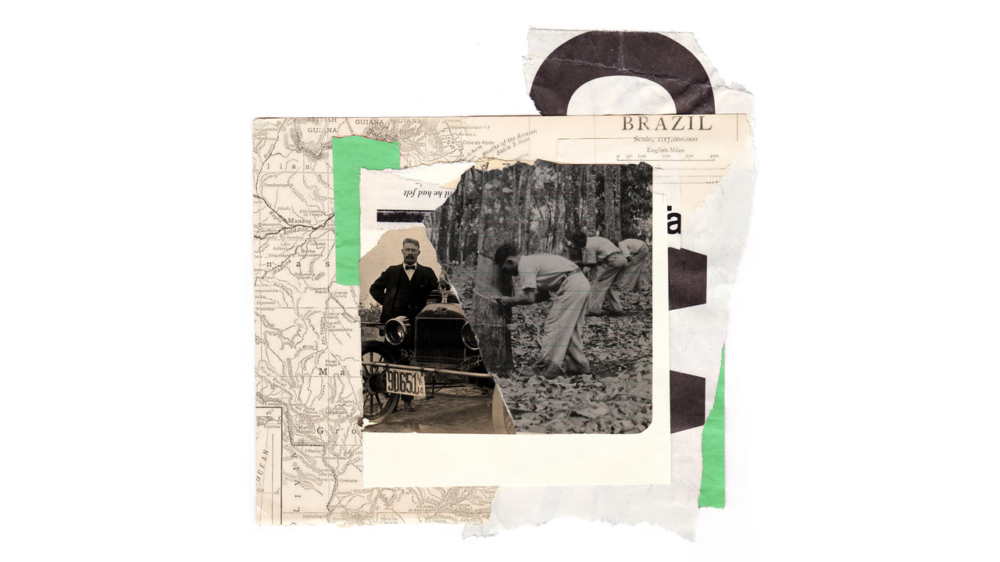

###### A tale of oil and rubber

# What Brazil’s 19th-century rubber crash could teach today’s oil drillers 

##### Two Brazilian booms bookmark the history of the car 

 

> Dec 20th 2022 

One of the mysteries of the Amazonas theatre concerns courtesans. Legend has it that in the 19th century the corridors under this great pink opera house in the rainforest were used to smuggle in sex workers during performances, to liven up “The Magic Flute” for rubber barons in their private boxes.

This legend may or may not be true, says Sigrid Cetraro, the modern-day director of the Amazonas. What is certain is that the opera house in Manaus, which opened in 1896, is a blingtastic testament to the excesses of Brazil’s rubber boom of 1879-1912. 

Nearly all the building materials were imported from Europe: steel from Glasgow, roof tiles from Alsace, marble from Tuscany. The auditorium is shaped like a lyre; the chandeliers are of Venetian glass. Look up at the ceiling and you appear to be under the Eiffel Tower. “The governor [at the time] wanted to show off to the world the riches that were coming from the Amazon,” says Ms Cetraro. Her voice carries easily across the stalls—the acoustics are splendid.

After Charles Goodyear invented vulcanisation in 1839, global demand for rubber exploded. Suddenly latex, the milky fluid that seeps out of rubber trees, could be turned into a durable yet stretchy material, ideal for use in valves, raincoats, condoms and, most of all, tyres, first for bicycles and ultimately for cars. (It was also used on the road outside the opera house in Manaus, to muffle the clatter of carriage-wheels.) 

For most of the 19th century nearly all of the world’s rubber came from Brazil, home of , the Pará rubber tree. Manaus, a city reachable only by sailing 1,450km up the Amazon, became the great rubber hub. The profits brought the city trams, running water and electricity. The biggest rubber traders dreamed up ever wilder means of ostentation. Manaus became the world’s largest market for diamonds. Tycoons reportedly sent their laundry to Lisbon. 

The story of Brazil’s rubber boom is one of profligacy and cruelty, of hubris and nemesis. The planters made easy fortunes from nature’s bounty and bonded labour. They spent their cash on conspicuous consumption, and failed to invest in better technology. After a few decades, they were undercut by cheaper producers in Asia, and the boom turned to crash. 

This fascinating era has a modern parallel. Now, as then, Brazil is enjoying a windfall thanks to nature and the world’s demand for cars: an offshore oil boom. It, too, could end in tears. Your correspondent visited Manaus, the old rubber capital, and Macaé, the modern oil capital, to see what can be learned from two Brazilian booms that bookmark the history of the car. 

First stop is the Museu do Seringal (rubber-tapping museum), which is reachable by river from Manaus. Our boat heads upstream, and turns into creeks that grow steadily narrower, with the jungle pressing in from both sides. Finally, we make landfall at a clearing with a big wooden house, a replica 19th-century general store and all the crude technology that tappers once used to extract rubber from trees. 

It was gruelling work. A  would set off after midnight, when the temperature was cool enough for the rubber to flow, and make a long round of his rubber trees. At each one, he cut a diagonal channel in the bark and attached a cup at the bottom to catch the latex that seeped out. His only light was a paraffin lamp strapped to his head. His nightly circuit was several kilometres long. The rubber trees grew where nature planted them, and a typical tapper would have to tap 100-200 each night. 

When the ’s cups were full, he headed for the smokehouse. This was a cramped wooden lean-to. Inside, over an open fire, he would heat up the latex and wind it around a stick until he had a lump the size of a football. He would then trade it for a reduction of his debt. Most rubber-tappers never saw cash. They bought their food and kit from the boss’s store: cutting tools, lamps, grain—and booze, to foster dependency. Prices were steep; tappers could not shop anywhere else, and were forbidden from fishing or hunting. When they handed over the bouncy fruits of their labour, their debts shrank a bit—but seldom to zero, not least because the boss would typically charge a 50% commission to ship the rubber to Manaus. The boss lived well—in a big house with imported furniture, mirrors and wine decanters. 

In a small wooden church by the store, workers could seek spiritual solace. Sometimes, says Gabriel Leao, a museum guide, the “priest” hearing confessions was in fact a stooge, who reported the men’s transgressions back to the boss, who could then punish them “like slaves”, with beatings or whippings. 

Enrique de Souza, a leathery man in his 80s, worked as a rubber-tapper from the age of eight, when vestiges of the old system still survived. “I never saw money till I was 18,” he recalls, sitting on a porch at the museum. “Everything we produced was paid for in credit or in goods.” He toiled from 1am to 8pm, and lived in a small tent. If his working life was harsh, his father’s and his grandfather’s were harsher. “They used to tell me how cruel their bosses were,” says Mr de Souza. For serious offences, such as damaging the rubber trees, the overseers might “tie a man to a tree and leave him out in the sun for two or three days”. 

Euclides da Cunha, a Brazilian journalist, called the Amazonian rubber trade “the most criminal employment organisation ever spawned”. However, many tappers were not passive victims, argues Barbara Weinstein in “The Amazon Rubber Boom, 1850-1920”. Many flouted rules against fishing or selling their rubber to itinerant traders. Many fought back against abusive bosses by mixing stones or sand into their big rubber balls to inflate the weight. Even debt bondage was looser than it seemed. A tapper could simply disappear into the rainforest, taking with him the supplies his boss had advanced him on credit, and never return. The fact that workers could leave forced even the most heartless bosses to temper their cruelty somewhat. 

Rubber robber

The profits from rubber were vast. It became Brazil’s second-largest export, after coffee. But the boom “proved both short-lived and superficial”, notes Ms Weinstein. In 1876 a British adventurer, Henry Wickham, smuggled 70,000 rubber-tree seeds out of Brazil. He delivered them to the Royal Botanic Gardens in London, which bred plants that were ultimately used to break the Brazilian rubber monopoly. 

The descendants of Wickham’s seeds were sown in neat rows in Asia. British and Dutch plantations in Malaya and Sumatra proved far more productive than the Brazilian jungle, since there were fewer natural parasites and rubber trees could be planted close together without transmitting rubber-blighting insects and fungi to each other. In 1912 Malaya and Sumatra yielded 8,500 tonnes of latex, a quarter as much as the Amazon. Nine years later, it was 370,000 tonnes. 

 


Brazil’s rubber economy imploded. Manaus withered. Its power generators seized up. The opera house was shuttered and “ridiculed as an emblem of folly”, notes Greg Grandin in “Fordlandia: the Rise and Fall of Henry Ford’s Forgotten Jungle City”.

As Mr Grandin describes in his book, the founder of the Ford motor company created an odd postscript to the boom. In 1927, eager to secure rubber for the tyres of his Model ts, Henry Ford bought a concession to a tract of the Brazilian Amazon the size of Tennessee. He thought that with his deep pockets, his management skills and American know-how, he would swiftly tame the forest and turn a profit. “A new and titanic fight between nature and modern man is beginning,” gushed a German newspaper. Many Brazilians expected Ford, the richest man in the world, to win. He lost. 

He tried to recreate a slice of the Midwest in the Amazon. Fordlandia (Fordville) had Michigan-style homes (which were too hot), movie theatres and square dancing. Clearing the jungle was hard, and met local opposition. When the firm wanted to bulldoze villages, it offered to compensate only homeowners with title deeds, which hardly anyone had. Some workers showed up hoping to pocket the famously generous $5-a-day wages that Ford paid in Michigan, and drifted away when they were paid only 35 cents. 

Alcohol was legal in Brazil, but Ford banned it and had workers’ quarters searched for surreptitious bottles. He was also a food crank, who insisted that staff eat oatmeal, tinned peaches and whole-wheat bread. In 1930 workers sick of such dull fare (for which their wages were docked) rioted, smashing machinery and chanting “Kill all the Americans!” 

Leaf blight and caterpillars devastated Ford’s rubber trees. In 1945 his son took over the firm and shut the Amazonian project down. The land, into which $20m (around $400m in today’s money) had been sunk, was sold back to the Brazilian government for less than $250,000. Fordlandia became a ghost town, remaining largely deserted until the 2000s. 


Manaus, after decades of relative obscurity, eventually found a new money tree to tap. The military regime that seized power in Brazil in the 1960s wanted to populate the Brazilian Amazon with Brazilians, so that no neighbouring country might be tempted to encroach on it. So it took advantage of a “free-trade zone” set up in 1957 which allowed goods to escape tariffs so long as they were made or assembled in Manaus. Since the 1970s Brazilian consumers have paid higher prices for motorbikes, televisions, fridges and a host of other goods, in order to create jobs in the Amazon. This makes little economic sense—few firms would spontaneously build factories in such a remote spot—but geopolitics trumps efficiency. 

Today Manaus is a big city, but still has a frontier feel. Half of its 2m inhabitants live in slums; they drift in from other parts of the region, clear land, build shacks, hook up Wi-Fi cables and hope that one day they will be granted title to the homes they occupy. Violence is rampant, as in the old days: in some areas, walls are pocked with bullet holes, mementoes of battles between drug gangs. 

As for Brazil, it has found a new natural resource to get excited about. At first glance the present-day oil boom is very different from the rubber boom a century ago. Oil workers are well-paid. Managers are professional. Oil firms innovate. 

On a dock in Macaé, nearly 3,000km from Manaus, sits a row of gigantic torpedo-like objects. They are a local invention. A metal tube is filled with heavy concrete discs. This “base torpedo” is dropped into the water and plunges to the bottom, dragging a chain behind it. Fins guide it; a long spike on its nose lets it pierce the ocean floor, where it buries itself for ever, helping to anchor a floating oil rig. Petrobras, the state oil firm, has poured oodles of capital into extracting Brazil’s “pre-salt” oil, billions of barrels of which lie far below sea level, beneath a thick layer of salt. 

The world’s thirst for petrol has brought prosperity to Macaé. Until the 1970s it was little more than a fishing town. Now its warm, windy seafront is lined with fancy bars and restaurants. Oilmen carouse on a strip called Praia dos Cavaleiros (Knights’ Beach), next to Praia do Pecado (Sin Beach, which is disappointingly quiet). Downtown shops offer the latest gadgets and the sparkliest jewellery. Workers from all over Brazil flock to Macaé. The population has quintupled since the late 1970s, to around 260,000. 

Dilma Rousseff, Brazil’s president from 2011-16, said the pre-salt oil was “strong evidence” that “God is Brazilian.” Evidence emerged, however, that God punishes hubris. In 2014-15 the oil price crashed, sparking a fiscal crisis and Brazil’s worst recession since 1990, when the country was battling hyperinflation. In good times, Ms Rousseff had splurged much of the oil bounty on vast tax breaks for her pet industries and absurdly lavish pensions for civil servants that spurred women to stop work at 50 and men at 55. In bad times, she was impeached. 

This took place as Brazil’s biggest-ever corruption scandal was unfolding—centred on Petrobras. The national oil firm had long been inefficient: required by the state to hire locals wherever possible and favour local suppliers even if they cost more. It turned out to be filthy, too. Billions of dollars of contracts were padded, kickbacks were pocketed, and half the ruling class seemed to be in on the act. The scandal tarnished three former presidents, dozens of lesser politicians and scores of executives. It disgusted the public and paved the way for the angry populist presidency of Jair Bolsonaro (who lost an election in October). 

It devastated Macaé. Rodrigo Vianna, an economist in the mayor’s office, says the city lost 50,000 jobs between 2015 and 2020, as low oil prices and the graft probe forced Petrobras to hunker down. 

Then the oil price soared again, partly because of Vladimir Putin’s invasion of Ukraine. The Brazilian Oil and Gas Institute, a think-tank, expects oil production in 2031 to be 5m barrels a day, twice what it was in 2015. Luis Inácio Lula da Silva, an ex-president who was jailed for taking bribes during the big corruption scandal, will return to power in January. (His convictions were later overturned.) He is eagerly dreaming up ways to spend the expected bonanza. 

Turning black stuff into grey matter

Yet all this is based on an industry whose long-term future is in doubt. If the world is serious about curbing climate change, petrol cars must eventually give way to electric ones, and gas-fired power plants to nuclear, solar and wind. If demand for hydrocarbons falls, so will the price, and much of Brazil’s reserves may have to be left below the salt. When oil sells for $90 a barrel, more than 95% of Brazil’s proven reserves can be profitably extracted, estimates Rystad Energy, a consultancy. At $30 a barrel, less than half can be. 

What has Brazil learned from the rubber crash? “Nothing,” says Roberio Braga, a historian in Manaus. “The money is being consumed, not invested.” That is too harsh. Much has been wasted, to be sure. But efforts have been made to convert petrodollars into human capital. This is the race that all petrostates face: to turn a windfall into brainpower that will generate sustainable prosperity. Brazil has done better than some, pouring cash into schools and basic health care. Life expectancy rose from 70 to 76 between 2000 and 2018, and Brazilian schoolchildren’s scores on international tests improved in maths, reading and science. (These improvements were partly reversed by the pandemic.)

Mr Vianna says Macaé will become “a capital of knowledge” as well as energy, thanks to local universities and research institutes. He insists it will be better prepared for change than Manaus was when the rubber boom crashed. Oil will still be needed to make plastics for a long time, he predicts, and gas-fired power stations will hum for years. As the world shifts away from fossil fuels, the city will diversify into hydrogen, solar cells, wind power—and tourism, he says. 

Not all are convinced. Jefferson Assis, who manages a bar on Knights’ Beach, moved to Macaé from Espirito Santo, the state next door. He is glad he did: he earns more than he did back home. But he is not investing his savings in Macaé. Instead, he is buying farmland in his home state. “I don’t want to put all my eggs in one basket,” he confides. Also, he has read a bit of history. His fear is that “what happened in Manaus could happen in Macaé—a collapse.” After all, he muses, “Oil is already an outdated kind of energy.” ■

ILLUSTRATIONS: Mel Haasch


