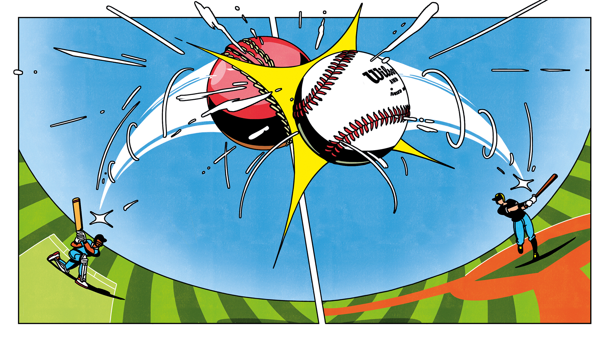
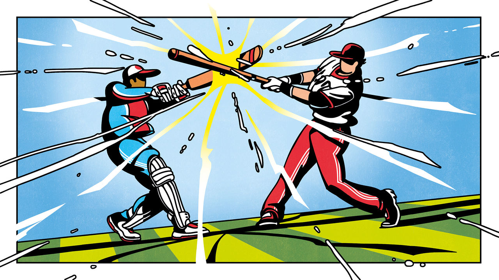

###### Take me out to the ball game

# Why cricket and America are made for each other 

##### The world’s second-most-popular sport and biggest sports market are about to meet 

 

> Dec 20th 2022 

By the middle of September, half a diamond was all that remained of the infield at the AirHogs baseball stadium in Grand Prairie, Texas. The artificial turf was being carted away. The pitcher’s mound was a crater. The dugout had been dug out. The stadium’s tenant, a minor-league team of the same name, disbanded in 2020, a victim of the pandemic.

But on that Sunday the Dallas-Fort Worth area, of which Grand Prairie is part, thrummed with sports. In the car park across the road, souped-up cars were doing timed laps around a traffic-cone circuit. By lunchtime the nearby Olive Garden, a chain restaurant where a $25 meal supplies a day’s calories, was full of diners in jerseys signalling their support for the Texas Rangers, a baseball team. At BoomerJack’s Grill and Bar that evening, half the acreage on the dozens of flat screens was given over to the Dallas Cowboys’ first game of the American football season.

That afternoon, northwest of Dallas, a dozen multimillionaires gathered at a 2,500-acre ranch. Horses bobbed in their stalls before the main house. At the back, manicured gardens were framed by rows of trees receding into the distance. Inside, around a Putinesque conference table, the men discussed their plans to bring a new sport to this sports-saturated country. When the AirHogs stadium reopens in the spring it will be the first home of Major League Cricket (MLC).

All the men were of Indian descent. They and their partners, who include the CEOs of Microsoft and Adobe, have put in $44m and committed another $76m to start the league. As owners of the first six franchises—in Dallas, Los Angeles, New York, San Francisco, Seattle and Washington, dc—they are betting that conditions are right to turn cricket, long seen as a baffling foreign game, into an American pursuit. The first season will run from July 13th to 30th. 

Most Americans may not take cricket seriously—and most of the cricketing world does not take America seriously—but in 2024 the country will co-host (with the West Indies) a cricket World Cup, qualifying the American team automatically. USA Cricket, the governing body in America, wants to include cricket at the 2028 Olympics in Los Angeles. The world’s biggest sports market and second-most popular sport are about to discover what they really think of each other.

Among cricket fans and pub-quizzers, this fact is settled: the first cricket international ever was played between the United States and Canada in Manhattan in 1844 (Canada won). Those of a nerdier bent also know that cricket was popular in antebellum America. The first recorded mention comes from Georgia in 1737, notes Tom Melville in “The Tented Field”, a history of cricket in America. Baseball “remained in a distant second place until after the civil war,” writes John Thorn, the official historian of Major League Baseball, in “Baseball in the Garden of Eden”.

Various reasons have been set forth for cricket’s decline after the civil war. One is that baseball was more conducive to battlefield conditions—it did not need a smooth batting surface. Another is that baseball was, then, a much shorter game. But above all, as Mr Melville writes, “Cricket failed in America because it never established an American character.”

What, though, gave baseball its American character? Scholars agree the sport originated in England; there are references to “base ball” from at least the mid-18th century. In 1905 Albert Spalding, an American baseball pitcher and businessman, set up a commission to investigate the game’s origins. Spalding had “a yearning for grand national stories to match the burning patriotism of the day”, writes Beth Hise in “Swinging Away: How Cricket and Baseball Connect”. The commission returned with the perfect—if bogus—story of Abner Doubleday, a civil-war hero who supposedly laid out baseball’s rules in 1839 in Cooperstown, New York, home today to the baseball hall of fame.

The creators of this origin story “were not mere liars and blowhards”, writes Mr Thorn. They “were trying to create a national mythology from baseball, which they identified as America’s secular religion”. Via email, he elaborates: cricket’s popularity faded “as America’s fervour for the Union coincided with the rise of professionalism in baseball and accompanying superior quality of play. The lower and middle classes embraced baseball, leaving cricket to the upper class, which had time to play and observe” the days-long matches. Cricket was consigned to society’s margins, as a sport fit for toffs and perhaps migrants.

Take me out to the ball games

Today, the conversion of the AirHogs baseball stadium is symbolic of larger trends within the world’s two major bat-and-ball sports. “America’s national pastime” has been declining in popularity for decades, according to Gallup, a pollster. Though 34% of Americans surveyed in 1937 named baseball as their favourite sport, by 2017, the last time Gallup asked the question, just 9% chose it, barely more than the 7% who picked soccer. The main problem is that baseball games have become longer and duller. In 1937 an average major-league game ran for about two hours. The average game now drags on for more than three hours. Yet average runs per game have remained about the same: between eight and ten, according to Baseball Reference, a sports site. 

One culprit is time-wasting by pitchers and batters. Another is statistical-analysis-led strategy, which has robbed the game of some of its most exciting, if inefficient, tactics such as stealing bases. The chief problem is stubborn traditionalism. Changes that have irked fans and officials include radio commentary, stadium floodlighting and electronic decisions on strikes. That makes it difficult for baseball authorities to innovate. 

No such malady afflicts cricket, whose legions of South Asian fans make it the world’s most-watched sport after soccer. As baseball started its long decline, cricket was entering a period of growth and dynamism. In 1971 England were touring Australia for a terrifically dull series of tests—the traditional, five-day version of the game. When the third test was washed out, the teams agreed to play a one-day match. Some 46,000 fans showed up, compared with 42,000 over five days of the first test. (Australia won.)

Cricket tours embraced “one-day internationals” (ODIs) as a regular feature. By 1975 the International Cricket Council had launched an ODI World Cup. In the late 1970s a rogue American-inspired league, “World Series Cricket”, introduced yet more innovations, such as floodlights, colourful uniforms to replace white flannel, and white balls to replace red ones. For a sport thought of by non-fans as a bastion of obscure tradition, cricket has proved remarkably adaptable.

Still, even ODIs were a whole day long. By the 21st century that seemed a bit much. In the early 2000s the English cricket board introduced a shorter form, known as Twenty20 (T20), which took just three hours. It was an instant success.


That was just the beginning of T20’s rise. In 2008 the Indian cricket board launched the Indian Premier League (ipl), a tournament of city- or state-based franchises. It borrowed heavily from American sports leagues, even importing cheerleaders from American football. As Tim Wigmore, a British sports journalist, put it in his book about T20, “The IPL marked the Americanification of Indian cricket: sport as an international event, with the best players from the world over, but with an Indian team always winning.”

This format spread, spawning the Caribbean Premier League, Australia’s Big Bash and more. It is this model that the backers of MLC are adopting, reimporting to America what IPL adapted from it. Cricket and baseball have met in the middle on length, but cricket now provides far more action per minute. The average T20 sees between 250 and 400 runs.

Much else has changed in the century and a half since cricket fell out of favour with Americans, not least the meaning of “Americans”. In 1920 the United States was 89.7% white, 9.9% black and rigidly segregated. Major League Baseball did not see its first black player until 1947. Today white and black people together make up only 73% of the population, and people with American passports speak every major language. Baseball’s biggest star is Ohtani Shohei, a Japanese phenomenon so intent on playing in America that he sacrificed enormous sums to move. The promise of America—in many ways the whole point of America—is that anybody can be American.

To an underappreciated degree, America has kept that promise. In 2019 there were 5.5m South Asians in America, up from 2.2m in 2000 (and just 2,507 in 1920). Indians account for 4.6m, of whom 68% were born outside America. Migrants from cricket-loving former British colonies in the Caribbean—Barbados, Jamaica and Trinidad and Tobago—number another million.

“Every summer the parks of this city are taken over by hundreds of cricketers, but somehow nobody notices. It’s like we’re invisible,” says an Indian origin Trinidadian character in “Netherland”, a novel set in New York’s cricket-playing milieu in the early 2000s. Of course, he adds, “That’s nothing new, for those of us who are black or brown.” usa Cricket, which is responsible for developing the sport and selecting the national team, reckons that 200,000 people play cricket across 400 local leagues. Most are indeed black or brown. Today the American men’s, women’s and under-19s’ national teams are composed entirely of American South Asians and West Indians (and one Briton). Five players on the men’s squad share the Gujarati surname Patel. “I used to play for teams where everyone would pray to Allah…And then another team where everyone would be like, ‘Our Lord, Jesus Christ’,” says Joseph O’Neill, the author of “Netherland”. Many American clubs, he says, are formed on the basis of origin. Some are all-Jamaican. Others are made up of people from a specific village in India or Sri Lanka. 

If passion for cricket is one defining characteristic of Indians in America, another is financial success. The median annual household income for Indian-Americans in 2019 was $119,000, nearly double the national average. Indians are vastly over-represented in Silicon Valley. A few have become wealthy beyond their dreams. And yet something is still missing.

At the ranch outside Dallas, the millionaires were hosted by Anurag Jain, who owns the Dallas team along with Ross Perot Jr, a billionaire. As a 14-year-old in the southern Indian state of Tamil Nadu, Mr Jain says, he was a “really good” fast-bowler and hoped to play professionally. But one day “My father sat me down and said, ‘You know, son, your cricket-playing days are done. I need you to think about being an engineer or a doctor.’” He chose engineering, moved to America for an MBA and succeeded fabulously. But “There was a seed inside me that was unfulfilled.”

Another investor is Satya Nadella, the Indian-born CEO of Microsoft, who was not present that day. As a young man he was a spin bowler whose dream “was to attend a small college, play cricket for Hyderabad, and eventually work for a bank,” he wrote in his book, “Hit Refresh”. A few years after he became ceo, Microsoft announced plans to build a world-class cricket oval on its campus. “When we heard there are a bunch of guys who are thinking about mlc, we thought that there is an opportunity for us to bring the game that we love to this country,” says S. Somasegar, Mr Nadella’s partner in the Seattle franchise. 

The potential rewards are enticing. MLC reckons the domestic television and streaming audience could be as large as 5m. (The founders started and sold a cricket pay-tv channel and streaming service called Willow tV.) The league’s backers also hope to persuade India’s vast audience to tune in, and are in negotiations with global broadcasters. There will be lots of merch, too. 

Venky Mysore, CEO of the Knight Riders, which owns teams of that name in Abu Dhabi, Kolkata and Trinidad and Tobago, says that millions of Indians watch the Caribbean Premier League when his Trinbago Knight Riders play. The Los Angeles Knight Riders will be his fourth team. The real opportunity is “to get the average American fan into it,” says Mr Mysore. “And that’s a bigger challenge.” A further hurdle is presented USA Cricket, which is currently in financial distress because of a covid-afflicted series with Ireland in 2021. More worrying still is that USA Cricket is a relatively new body (it replaced an older, scandal-plagued entity called United States of America Cricket Association). MLC has a commercial agreement with USA Cricket to develop and promote the domestic league.

 


So how do a bunch of techies and businessmen intend to take on the ghost of Abner Doubleday? Their answer is technocratic. MLC isn’t just six major league teams, but also includes Minor League Cricket, a development league with 26 teams, including in places like Sacramento and St Louis. Moreover, MLC is investing in cricket academies to train youngsters and to encourage schools to adopt the sport—a way into the hearts of the American middle class, as field-tested by soccer. MLC will also need to invest in building cricket ovals. Soccer can use American football fields. But there are few cricket grounds in America, and most have lousy batting surfaces and outfields with the wrong grass.

Few, but not none. Around 15 years ago Morrisville, a town of about 30,000 in North Carolina’s Raleigh-Durham metropolis, planned to build four baseball diamonds. But cricket was catching on in town, helped by the fact that over a quarter of residents were Asian (today that’s nearly half). “So we designed it as a proper cricket venue and set it up,” importing clay from Indiana and a pitch curator from New Zealand, says Mark Stohlman, then mayor of Morrisville. Mr Stohlman himself became a convert; he is now a batsman in the local league. At the end of August the ground hosted the minor league finals, in which the Seattle Thunderbolts (mostly Indians and a sprinkling of South Africans) beat Atlanta Fire (Indians and West Indians) by ten runs.

Pitcher perfect

This points to one way for cricket to become an American sport: just by being more visible. More grounds mean more matches, which mean more players like Mr Stohlman. “This is a long-term play, it has to start with investing in infrastructure, investing in players,” says Vijay Srinivasan, one of MLC’s founders. “We know this is not going to happen overnight.”

But there is another way to look at it. Perhaps American cricket does not even need a Doubleday narrative. After all, there are millions of cricket-mad South Asians and West Indians who are as American as any baseball fan. Their presence is a powerful enough incentive to lure the MLC investors. The new league, in turn, is already attracting people who would never otherwise have come to America.


People like Unmukt Chand, who led India’s under-19 team to a world cup victory, but in 2021 accepted a multi-year contract with the Silicon Valley team. Or Liam Plunkett, an English cricketer, who can now live closer to his American-born wife’s family by playing for Philadelphia. Cricketers go to England, Australia or India, too, but for a season, not for a lifetime. “There’s opportunities here,” says Shadley van Schalkwyk, a South African cricketer in Seattle. “Once you get over a few hurdles in the usa, there is a better finish line.”

Seen that way, it matters less whether 330m million people think of cricket as American. By providing opportunity, the prospect of prosperity and, above all, a better future for migrants, the English sport is already imbued with the ideals upon which America was founded. “I cannot be the first to wonder if what we see, when we see men in white take to a cricket field, is men imagining an environment of justice,” writes Mr O’Neill in “Netherland”. For a lot of this planet’s people, that is what America represents, too. ■

ILLUSTRATIONS: Maxime Mouysset


