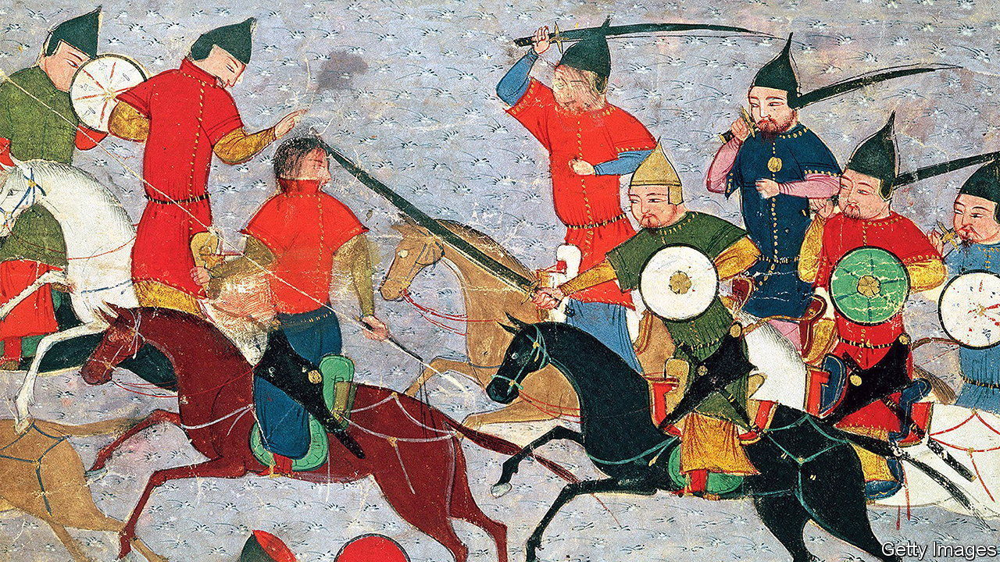

###### A family affair

# A delightful world history, told through influential families 

##### Simon Sebag Montefiore’s moreish chronicle is laced with sex and violence 

 

> Dec 20th 2022 

By Simon Sebag Montefiore. 

Lockdown, for Simon Sebag Montefiore, was not a time for  or box sets. Instead he set about recounting the history of the world through the lives of its most influential families. He begins over 4,000 years ago with the rape and vengeance of Enheduanna, daughter of Sargon, the self-made ruler of the Akkadian empire in Mesopotamia. He ends with the  and the . Sargon’s family faced the same problems that afflicted nearly every dynastic empire that followed: “The bigger it grew, the more borders had to be defended; the richer it was, the more tempting a target it became for less settled neighbours—and the greater was the incentive for destructive family feuds.”

The device of weaving together the past using the most enduring and essential unit of human relations is inspired. It lets readers empathise with people who helped shape historical events and were shaped by them. They have hopes, fears, lusts and ambitions that are familiar, even if they are manifest in ways that border on the psychopathic. The method also allows the author to cover every continent and era, and to give women and even children a voice and presence that they tend to be denied in more conventional histories.

Despite the book’s formidable length, there is never a dull moment. The story moves at pace across terrible battles, court intrigues, personal triumphs and disasters, lurid sexual practices and hideous tortures. Almost every page offers what used to be known in Fleet Street as a “marmalade dropper”. Amid the sensationalism, you find yourself adapting to the cruelties of moral universes that are both alien and, on their own terms, comprehensible.

The technicolour cast includes the , the , the  and the  Between the great, the good, the damned and the merely incompetent or criminal, there are far too many stars to mention. But some stand out:

• Darius the Great defeated eight rivals for the throne of Persia and ensured stability by marrying nearly all his female relations. Ruling with splendour and conquest for nearly 40 years until 486BC, he declared: “I am Darius, King of Kings. Whoever helped my family, I favoured; whoever was hostile, I eliminated.”

• Liu Bang was a hard-drinking peasant nicknamed “Little Rascal” who became a warlord. Through clever generalship and (for the time) enlightened politics, he founded the Han dynasty in 202Bc. It ruled China with only a minor interruption for more than 400 years.

• Aged 56, and still exceptionally beautiful, Empress Zoe, niece of Basil the Bulgar-Slayer, drowned her husband Romanos in his bath in 1034 with the help of a 25-year-old paramour. Despite a brief exile, Zoe was kingmaker and the real power in Constantinople until her death 16 years later.

• Thanks to his family’s obsession with , poor Carlos II, the last Habsburg king of Spain, was born with a brain-swelling, one kidney, one testicle and a jaw so deformed that he could barely chew. Only semi-literate, he died in 1700 of explosive dysentery.

For her ruthless cunning and insatiable appetite for power and sex, this reviewer’s favourite character is Empress Wu, who at 14 was a palace maid and rose to become the most dominant woman in Chinese history. To secure her place as empress consort, she may have strangled her own baby so as to accuse a rival of murder. She died as empress dowager at the age of 81 in 705ad, having seen off internal and external foes for over 50 years, supposedly kept youthful by drinking the semen of much younger (and usually doomed) lovers.

A perennial theme is the dynastic problem caused by having too many sons, who fight each other for the throne—a difficulty exacerbated by the sensual temptations afforded by absolute power. For instance, Ismail, a slave-trading sultan of Morocco, fathered 1,171 children by the time he died in 1727. (His heirs still rule today.) As Nizam al-Mulk, an 11th-century vizier, observed: “One obedient slave is better than 300 sons for the latter desire their father’s death, the former their master’s glory.”

A solution sanctioned by Mehmed II, the conqueror of Constantinople, was to make fratricide an official policy. Having had his own brother strangled, he decreed: “Whichever of my sons inherits the sultan’s throne it behoves him to kill his brothers.” Around 80 Ottoman princes were strangled by bowstring so as to avoid spilling royal blood. 

The author tells these stories with verve and palpable relish for the unbridled sex and inventive violence that run through them. His character sketches are pithy and witty. Mary, Queen of Scots was “a calamitous bungler of impulsive stupidity and unwise passion”. The Duke of Buckingham, a Jacobean playwright, rake and Catholic plotter, was “slippery, graceful and vicious”. The footnotes, often short essays in themselves, have the acid drollery of Edward Gibbon.

As the chronicle reaches more familiar territory some of the zest is lost.  is no Empress Wu; Donald Trump, grandson of Friedrich Drumpf (owner of the Poodle-Dog, a bawdy restaurant in Seattle), seems quite forgiving compared with Genghis Khan. Occasionally the segues are lumpy: “Meanwhile in China…” But overall this book is a triumph and a delight, an epic that entertains, informs and appals in enjoyably equal measure. ■


