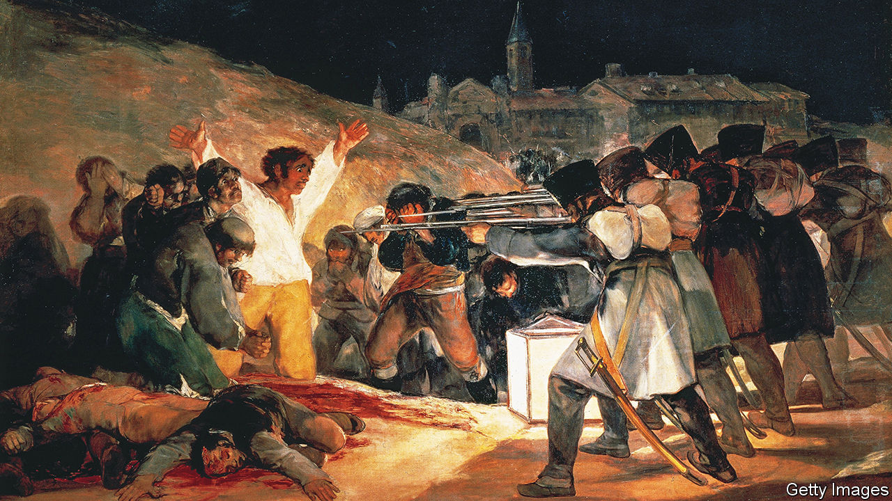

###### Heart of darkness

# Francisco Goya’s vision of war is powerful and urgent 

##### Bleak yet compassionate, his art feels as contemporary as ever 

 

> Dec 20th 2022 

The line of drably uniformed infantrymen, rifles aimed, forms a forceful diagonal across the right side of the painting, a machine of terror. Their target is a terrified rebel in a white shirt, his arms flung upwards in vulnerability and defiance, imitating Christ on the cross. His comrades cover their faces. Several already lie inert on the ground in pools of blood. 

The subject of Francisco Goya’s “The Third of May 1808” (pictured), also known as “The Executions”, is the reprisals exacted by Napoleon’s troops after a rebellion by the populace of Madrid, portrayed in a companion painting, all slashing daggers and sabres. Yet it is also a universal indictment of violence. “It’s a work of today, of Ukraine, of all wars,” says Gudrun Maurer of the Prado museum in Madrid, where it hangs. “You could put it in a square in Kyiv and people would understand it.” 

Almost two centuries after his death Goya seems ever more contemporary, especially amid a . He was not the first war artist but no one has captured its horrors more powerfully. Many of his concerns—the exploitation of women, mental health, human rights and the treatment of prisoners, the power of false beliefs and fake news—resonate today. He was the first Western artist to paint his own ideas, visions, dreams and nightmares, not just external realities. In other words, he was “the first Modernist”, as Robert Hughes, an art critic, called him, and the first Expressionist. His eye is searching, often compassionate and ultimately bleak.

Not surprisingly, Goya is in fashion, though he has rarely been out of it. The Fondation Beyeler in Basel staged a rare blockbuster show devoted to him in 2021. Next summer an exhibition in Oslo will pair works by Goya with those of , whose masterpiece “The Scream” echoes some of the Spaniard’s images. For several contemporary artists, such as Jake and Dinos Chapman, Emily Lombardo and , Goya is a direct point of reference. Last year Philippe Parreno, a French video artist, released “La Quinta del Sordo”, a 40-minute film showing Goya’s late “Black Paintings” in swirling hyper-close-ups, set to a soundtrack of interplanetary roars and moans. The effect is ghoulish and mesmeric. Two Goya portraits will be auctioned at Christie’s in January; they seem guaranteed to smash the record price for his work, currently $7.8m.

Goya was an extraordinarily versatile and innovative artist who lived a long life, dying in 1828 aged 82 in voluntary exile in Bordeaux. He was born in a village near Zaragoza to middle-class parents, his father a professional gilder. He was ambitious—and supremely confident of his abilities. Moving to Madrid, he became court painter to three successive monarchs and director of painting at the Royal Academy of Fine Arts. His early work included the religious paintings that were obligatory for a budding artist. A breakthrough came with commissions for scores of cartoons for the royal tapestry factory portraying scenes of Spanish life. He became an insightful and sought-after portraitist. 

But he retained a lifelong appreciation of demotic tastes—bullfighting, hunting, the fiesta—even as he made friends among the intellectuals of the Spanish Enlightenment. His knowledge of those contrasting worlds, and affection for them, gave him a unique understanding when they came into conflict. “His art is always aimed at more than one side,” says Ms Maurer.

From the 1790s, two things happened to turn Goya into the artist so admired today. One was a mysterious illness, possibly lead poisoning from his paints, that left him deaf. That caused him to look inwards. His paintings began to deal with beliefs and transgressions. A great colourist, his canvases became almost monochrome, dominated by blacks and browns. One series denounced violence against women. Paintings now in the Academy detailed fanaticism in flagellants and the Inquisition, the phenomenon of , the plight of prisoners and fantasies of the madhouse that mocked the “normal” world. Goya also became a prolific printmaker. In “Los Caprichos” (“The Caprices”) he lampooned the church and social hypocrisies.

The second turning-point was the French revolution, with which he sympathised, and ’s invasion of Spain and the long Peninsular war that followed. The ensuing brutality forced him to review his ideas. “Goya goes from being a follower of the Enlightenment who believes in the capacity for regeneration to a person whose experience leads to despair,” according to Javier Portús, the chief curator for Spanish painting at the Prado. 

 was expressed in the “Black Paintings”, executed as frescoes on the walls of La Quinta del Sordo, Goya’s country house, and now occupying Room 67 of the Prado. They were painted for himself, not the public or the court. They are peopled by nightmare figures, crones and paupers in rags, their mouths gaping cavities. It is as if dead souls returned to haunt the living. Yet they are recognisable in the homeless people found in the streets of post-pandemic cities. 

There was despair, too, in a series of prints, “The Disasters of War”, not published until 1863: body parts strewn on trees, piles of corpses, people being clubbed to death. “I saw it,” he wrote on two of the prints. He certainly visited the ruins of Zaragoza after the French siege, and he lived through the famine in Madrid in 1811-12 in which perhaps 20,000 died. Yet the power of his portrayal of war is not as a literal record, but that it cuts to the essence. It is war seen close-up, never heroic.

Each age sees what it wants in Goya, Mr Portús notes. That testifies to his genius in communicating ideas and images. He was of his time; other Enlightenment artists shared his concerns. But he alone transcended that time to speak universal truths about the human condition so directly. ■


