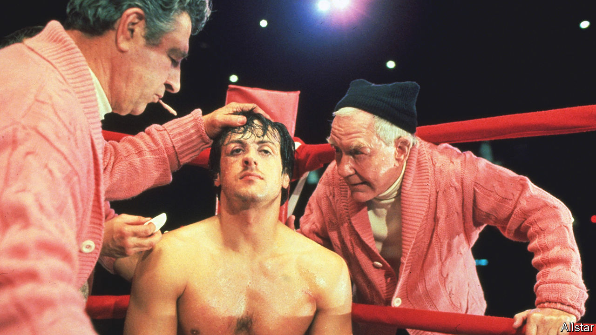

###### Back Story

# The year of the underdogs 

##### From Volodymyr Zelensky to the Moroccan football team, they shone in 2022 

 

> Dec 20th 2022 

Rocky has always been a good fighter. He hits like hell and his nose has never been busted. The trouble is, he never got a break. He lives in a hovel and rarely takes off his fingerless gloves. But lightning strikes, and Apollo Creed, the world heavyweight champion, gives him a shot at the title. “This time”, says the loan shark who employs Rocky as muscle, “Lady Luck may be in your corner.”

“We are the Rocky of this World Cup,” said Walid Regragui, Morocco’s football coach, invoking the latter-day saint of underdogs at the close of what has been the underdog’s year. His team were not the only outsiders to . Saudi Arabia beat Argentina; Japan beat Germany. But the dauntless Moroccans were the underdog kings, seeing off the Belgians, Spanish and Portuguese, three of the favourites, to become the first Arab and African side to reach a semi-final. (In the stands, some Iranian fans, underdogs in a benighted nation, booed their country’s anthem and cried.) 

Morocco proved an essential verity of underdogs: they can triumph even when, technically, they lose—as the Spartans did at Thermopylae and the Finns to the Soviets in the “winter war”. Rocky loses on points to Creed, but shows himself, and the world, that he is more than “just another bum from the neighbourhood”. If you haven’t already seen it, look up the clip of Sofiane Boufal, a Moroccan playmaker, dancing with his mother on the pitch. It is the jig of a champion.

Fictional underdogs prowled two of their habitual environments on screen in 2022. One was the workplace. In “Severance”, office grunts struggled to break free of a shadowy dystopian company.  portrayed a bunch of has-been spies, down but not quite out. In “The White Lotus”, American tourists with more money and libido than sense were rinsed by a pair of Sicilian hookers. In , meanwhile, the sinking of a superyacht turned a minion with survival skills into an overlord.

The other underdog habitat—as always and everywhere—was the family. “Bad Sisters” depicted an abused wife and her officious siblings. A musical adaptation of , Roald Dahl’s underdog revenge fantasy, is out soon on Netflix. True, Matilda has magic powers that most underdogs lack. But she is also a classic product of what psychologists have called “desirable difficulties”.

Riffing on that idea, in his book “David and Goliath” Malcolm Gladwell explores how childhood hardships can sometimes nurture resilience and ingenuity, leading the Matildas of the world to outperform gifted peers who “inherited an excessive amount of psychological health”. The underdog, observes Mr Gladwell, may be liberated by having nothing to lose. “It really don’t matter,” Rocky says of his expected thrashing. “I was nobody before.”

It is not just the ride from the bottom to the top, wilder and more exhilarating than shorter ascents, that makes these stories so rousing. Underdog heroes and heroines do not merely surmount obstacles or defeat adversaries. The best and most moving beat a whole rotten system. They hold out hope that might—or reputation, power and influence—will not always prevail; that even if the rules are rigged, the game can still be won. They suggest life is not predetermined. They make their own fate.

The staggering underdog feat of 2022 involved an actor, but he wasn’t acting.  faced down a nuclear-armed invader with a smartphone camera, rhetoric and guts. Ukrainian civilians lay down in the path of Russian tanks. In his book Mr Gladwell argues that, though he brags like a wrestling villain, lumbering Goliath was always likely to lose to a nimble shepherd, equipped with a sling and those five smooth stones. Unconventional tactics, he notes, often vanquish heavy arms. Likewise, in  Ukraine’s grit and invention have come to seem formidable assets. 

But the contest looked much less even when Russian forces rolled across the border in February. The underdog’s resistance songs became the soundtrack of the year: a rendition of “Let It Go” by seven-year-old Amelia Anisovych in a bomb shelter in Kyiv; Andriy Khlyvnyuk, a Ukrainian rock star, dressed in fatigues and singing “Chervona Kalyna” (“Red Viburnum”), an anthem of defiance, in front of St Sophia cathedral.

To put all that another way: in the end, the loan shark is wrong about Rocky. His story is not about luck; it is about justice. The most inspiring underdogs get only what they deserve. All they needed was a break. 


