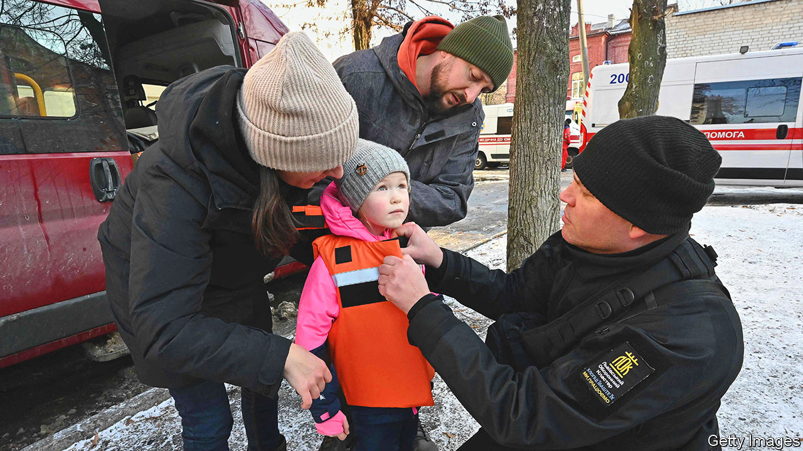

###### Christmas in Kharkiv

# A Ukrainian city celebrates despite the cold and the Russians 

##### Festivities will be underground to avoid incoming shells 

 

> Dec 20th 2022 

The guns are now silent in North Saltivka, a neighbourhood on the north-eastern edge of Kharkiv, but war is everywhere to be seen. Charred, splintered white apartment blocks stick out from the soil like bones in a burial ground. Trenches still cut across play areas and football fields. Among the ruins Yevgeny Zubatov, 32, is walking with his seven-year-old son Danya. He has come to pay respects, he says, to the apartment he abandoned when war broke out on the morning of February 24th. He makes the trip every weekend, bringing a thermos flask so he can drink a cup of tea within his own four walls—or three and a half, as they are now. He has brought some chocolates this time, a nod to the upcoming holiday season. But he says he is in little mood to celebrate. “My New Year is just about my son. We are carrying on for him.” 

Mr Zubatov’s melancholic mood is not unusual in Ukraine’s second city, which lies just 35km (22 miles) from the Russian border. Russian artillery has been pushed back beyond firing range of the city, but it is unclear whether Kharkiv will ever return to its pre-war life. A local enterprise now makes flak jackets for small children (pictured), to wear during evacuation. At least half of the pre-war population of 2m has left, including the vast majority of the 300,000 who lived in North Saltivka. 

In the most affected area, the easternmost Saltivka 3, residents struggle on despite the absence of even basic infrastructure. They warm themselves using wood-burning stoves, ventilated through holes in boarded-up windows. A green tarpaulin “invincibility point”, provided by the central government, provides a last line of support. When Russian rockets took out electricity and water on December 16th, the tent was overflowing with residents looking for a Starlink internet connection and hot drinks. For many of them, alcohol was a quicker route to invincibility. 

Father Valera, an Afghan war veteran turned local priest, says the worry of staying warm has amplified the anxieties of people struggling to come to terms with the war. “I see the spiritual pain in everyone I speak to in Saltivka, including children,” he says. “Their eyes flick all over the place. They shudder when doors slam.” At the height of fighting in February and March, the basement of Father Valera’s chapel became a shelter for over 50 people. Services continued even as missiles blew out the windows above ground. 

Now, the priest is looking for new ways to help his parishioners recover psychologically. Christmas was as good a place as any to start, he said; he expected a delivery of trees and decorations in the coming days. But there are no plans to follow a government proposal to switch observance of Christmas to the Western date of December 25th. Father Valera’s church is part of the controversial, Moscow-aligned branch of the Ukrainian Orthodox church, and so will celebrate on January 7th—just as it always has.

For a long time, city authorities were unsure about their own celebration plans, especially given the blackout orders that have been in place since the early days of war. Mayor Ihor Terekhov, who has promoted himself as the face of Kharkiv’s brave resistance, said at one point he considered cancelling the seasonal programme. In the end, he couldn’t bring himself to do it. “War has taken enough away from our children,” he said. Instead Kharkiv will put on a limited programme of events, all underground. On December 19th the mayor unveiled a tree at the University subway station, just underneath its usual spot on Freedom Square. “There was no way of justifying placing one above ground since there have been direct impacts on the square already,” the mayor said. “The enemy has the co-ordinates.” 

The highlight of Kharkiv’s Christmas programme is a new musical show, “The Ice Lady”, which will be performed thrice daily on the platform of the University station. The director, Alexei Nastachenko, said the show would eschew any mention of war. But the motifs aren’t hard to decipher: in a terrible land, not so far away, a witch has turned everything to ice. One day she resolves to do the same to the play’s hero. The hero resists, and after a valiant struggle is saved by love, friendship and all good things. The witch melts away. “Wartime Kharkiv has been united by a fantastic desire to love one another,” says Mr Nastachenko. “When this all ends, we will be the happiest people on Earth.” 

Sociologists tracking Ukrainian public opinion have noticed trends that back Mr Nastachenko up. Alexei Antipovich, whose Rating polling agency compared the mood before and during the war, says Ukrainians are, paradoxically, surer of their future than before the war began. Having a common enemy has consolidated a once fractured nation: “The difference across religions, geography, language and age has not just become less. It has disappeared completely.” Ukrainians have become more optimistic, and have higher opinions of themselves, their fellow citizens and the state. Fully 97% of them now believe Ukraine will win the war. 

That hope is shared even in the ruins of North Saltivka. The residents who stayed say they learned a lot about their own resilience. “Our story is about realising we are stronger than we thought we were,” says Tatyana Protsenko, who gave birth to a baby daughter in October despite staying in an apartment block that was struck by artillery eight times. Her husband, Yehor Bezuglov, agrees. In the most desperate of times, neighbours found one another: they looked each other in the eye, and liked what they saw. The hope is that now they will be given a chance to rebuild their shattered lives together. But fear of the Russians remains, he says; if anything, it has increased since the guns stopped. “You get used to the guns. Silence is the worst thing. It’s when the fear starts all over again.” ■


