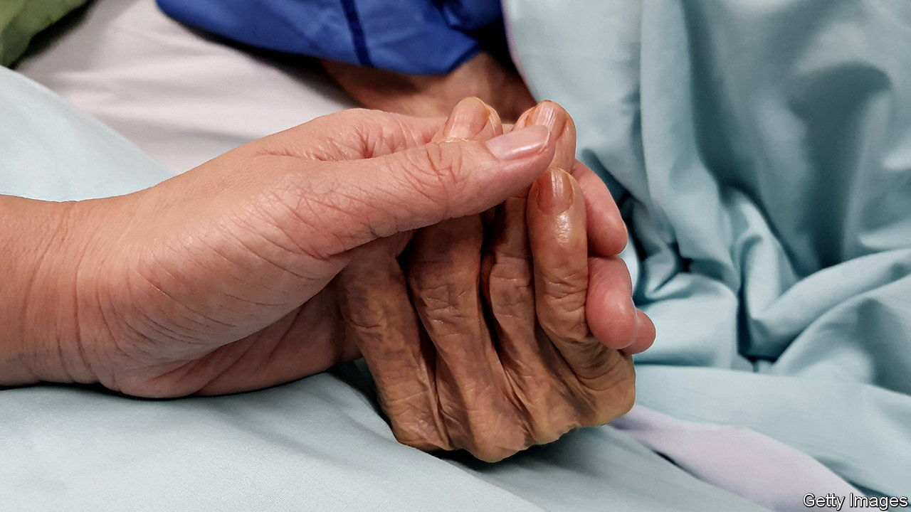

###### The last taboo

# France starts a debate on legalising assisted dying 

##### It is in the hands of a citizens’ assembly, rather than politicians 

 

> Dec 20th 2022 

Few aspects of life are as sensitive as the leaving of it. Such is the taboo about death and how to manage it in many parts of Europe that France has decided that its debate about whether to legalise assisted dying should be taken out of the hands of politicians. On December 9th a citizens’ assembly made up of 150 randomly selected people began a public debate that will shape the way France approaches the legal and medical management of death. 

Over nine weekends between now and the end of March 2023, the newly established citizens’ assembly will meet in Paris. Officially its remit is to discuss the “end of life” rather than “assisted dying”. The question that Elisabeth Borne, the prime minister, set participants when she launched the convention was open-ended: “Is the current framework surrounding the end of life well-adapted to the different situations that arise, or should changes be brought in?” It is clear, however, that what is up for discussion is whether to legalise assisted dying.

France already passed a law (in 2016) that strengthens a doctor’s obligation to respect the wishes of those who are terminally ill and who do not want to prolong life with medical treatment, in order to enable people to “die with dignity”. Doctors can deeply and continuously sedate terminally ill patients who are suffering and close to death. They must make these options available and respect a patient’s wishes to exercise them. French law, however, does not allow assisted dying. This means the supply of lethal drugs, under defined and controlled circumstances, by doctors to terminally ill patients, administered by either the patient or a medic.

Assisted dying is just as controversial in Europe as elsewhere in the world. Only a few countries on the continent currently allow some form of the practice. They include Austria, Belgium, Germany, the Netherlands, Spain and Switzerland. But many countries are debating the issue. On December 9th the Portuguese parliament passed a bill to legalise assisted dying, although previous votes have been overturned by presidential veto. 

President Emmanuel Macron has been careful not to express a view publicly. By setting up the assembly, though, he is implying that the law needs to change. Those close to him say that he thinks that French law should give people greater control over the end of their life, in order to avoid “inhumane situations”, but that he is uneasy with the most permissive legislation. Mr Macron raised the subject on a recent visit to the Pope, who deems suicide a grave sin. (This is, after all, Catholic doctrine.) The Council of Christian Churches in France has called for better use of palliative care, under existing law, rather than anything that assists death. 

This is not the first citizens’ assembly that Mr Macron has set up. A previous one, brought in back in 2019 in response to the  (yellow jackets) uprising against a rise in the carbon tax on motor fuel, was about how France should respond to climate change. But the subject was so vast, and the proposals that emerged so numerous (149), that it lacked focus. Mr Macron also made the mistake of promising upfront to take on board all its recommendations with “no filter”. This pledge was practically unworkable, and irritated parliamentarians, who felt they had been robbed of a job. 

After this more narrowly focused citizens’ assembly reports back in the spring, a law could follow before the end of 2023. The legalisation of assisted dying in France, if that is what is decided, would mark the biggest single piece of social legislation on Mr Macron’s watch. A poll in October found that 78% of the French are in favour, although the debate may yet prove acrimonious. When the previous president, François Hollande, legalised gay marriage, it drew howls of protest from Catholic traditionalists. The challenge for Mr Macron will be to leave his mark on French society without dividing it.■

