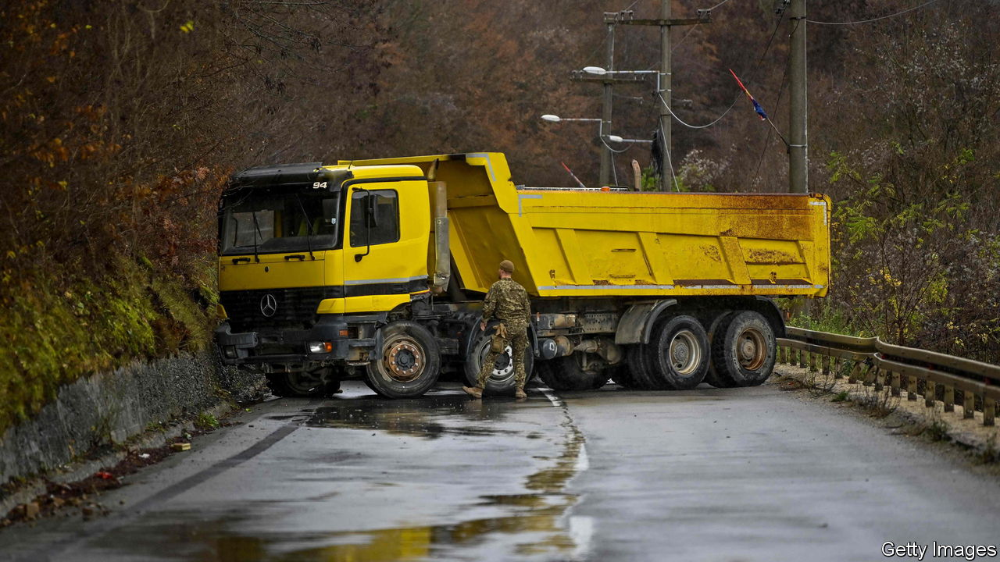
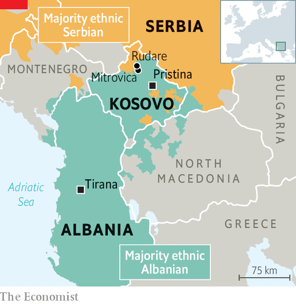

###### Balkan barricades

# Kosovo and Serbia are on the verge of conflict again 

##### Another violent clash is the last thing America or the EU need 

 

> Dec 20th 2022 

In the village of Rudare locals wander in the street and warm their hands on flaming braziers. Lorries block the road. A car disgorges a group of masked men. On December 10th barricades were erected across the north of Kosovo, where most inhabitants are ethnic Serbs. Diplomats from America and the European Union are working overtime to defuse an explosive situation. On the walls of the ethnic-Serbian part of the nearby divided city of Mitrovica, someone has been spray-painting the crest of a mysterious “Northern Brigade”. Whether it is a secret paramilitary organisation or a campaign to make people believe there is one—no one knows. “We are waiting!” says the stencil.

Since the end of the Kosovo war in 1999, crises have come and gone in the country’s north. Diplomats rush in, and the barricades come down. But this one feels more dangerous than usual. In November the representatives of Kosovo’s Serb minority withdrew from the country’s government institutions. That included the ethnic Serbian members of Kosovo’s police force in the north. Kosovo has sent ethnic Albanian policemen to replace them. But Tatjana Lazarevic, editor of KoSSev, a local news site, says they face “huge mistrust” among locals, who see them as an “occupying force”. 

 


Until 1999 Kosovo was a repressed southern province of Serbia with a large ethnic-Albanian majority which wholeheartedly backed separatist guerrillas. During the fighting, Serbia began expelling hundreds of thousands of ethnic Albanians from their own homes. NATO intervened and established a UN protectorate, which declared independence in 2008. 

But Serbia rejects that claim. It is supported by Russia, its longstanding great-power patron, which is allergic to Western interventions anywhere (and not so troubled by ethnic cleansing). The current tensions began in June, when Kosovo changed the rules for people entering with Serbian documents. With war raging in Ukraine, a violent Balkan flare-up would distract America and Europe, and serve the interests of the Kremlin. 

On December 15th Albin Kurti, Kosovo’s prime minister, handed in his country’s application to join the EU. On the same day Aleksandar Vucic, Serbia’s president, asked NATO, which ensures Kosovo’s security, to permit up to 1,000 Serbian troops to return to Kosovo. Such a possibility was envisaged in the UN resolution which ended the Kosovo war in 1999, but today the notion is ludicrous. There is no “time machine” for Serbia to reverse two decades of history, scoffs Mr Kurti. On December 1st Mr Vucic publicly called Mr Kurti “terrorist scum”. “Tensions have never been higher in 20 years, mistrust has never been deeper,” says Miroslav Lajcak, who leads the EU’s diplomacy in the region. 

There is little risk of the Serbian army openly rolling into Kosovo’s north. But the Serbian government could try to emulate the strategy of “little green men” which Vladimir Putin used when he seized Crimea from Ukraine in 2014: infiltrating unmarked soldiers without officially acknowledging their allegiance. Western powers are trying to negotiate an end to the crisis before any violent confrontation takes place. An incident in which either Serbs or Albanians die could spark a conflagration. Diplomats find Mr Kurti stubborn. But Mr Vucic has lost much credit by refusing to apply sanctions on Russia. In September Serbia and Russia signed an agreement to consult on foreign policy. 

Mr Kurti says he is ready to find a solution and normalise relations between Kosovo and Serbia. Yet it is unclear whether he or Mr Vucic can accept the trade-offs that diplomats are proposing. They require that Serbia treat Kosovo like a state, albeit without formally recognising it. Kosovo must implement an agreement it signed in 2013 (though it was rejected by Mr Kurti, who was then in opposition) to form an association of Serb-majority municipalities with autonomy over education, health care and other portfolios. 

The problem, says one diplomat, is that relations are now so bad that the leaders of Serbia and Kosovo “are living on two different planets”. On planet Rudare, meanwhile, many locals are no happier with the stand-off than anyone else. A teacher manning one of the village’s barricades says he was ordered there by his school’s director. “We are hostages of Belgrade and Pristina,” he says, referring to the Serbian and Kosovar capitals. ■

