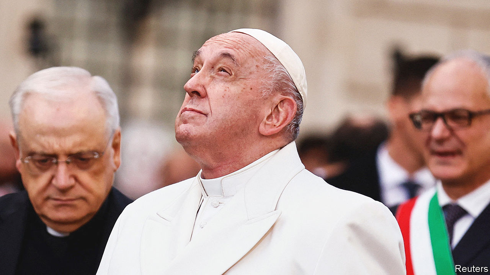

###### No room in the middle

# Pope Francis has failed to be a spiritual mediator in Ukraine 

##### His mistrust of America seems to stop him seeing Vladimir Putin clearly 

 

> Dec 20th 2022 

Whenever pope Francis looks up from his writing, he is reminded of Ukraine. On his desk sits an icon he acquired while archbishop of Buenos Aires as a parting gift from one of his bishops, Svyatoslav Shevchuk, who in 2011 returned to Kyiv to lead the Ukrainian Greek-Catholic church. It was among the few possessions Francis brought to Rome. The depth of his concern for Ukraine became obvious on December 8th when he was moved to tears as he mentioned its suffering at a ceremony in Rome. 

Yet as Christmas nears, it is clear that Francis’s efforts to position himself as a mediator between Russia and Ukraine have failed. The pope is an outsider in a clash between two mostly Orthodox countries. He has also repeatedly antagonised both Ukrainians and Russians with his statements and omissions.

Early in the war, the pope condemned the invasion as “unacceptable armed aggression”, denounced the Bucha massacres and kissed a Ukrainian flag sent to him from the town. In an interview he warned the head of the Russian Orthodox Church, Patriarch Kirill, not to become “Putin’s altar boy”. But he did not identify Russia as the aggressor. In an interview published in June he seemed to reach out to Russian leaders, saying the invasion was “perhaps somehow provoked” and cautioning against viewing the war as a simple tale of good versus evil.

More recently he has been more critical of the Kremlin, particularly after meeting with Archbishop Shevchuk on November 7th. Last month he irked the regime in Moscow by declaring that troops from two ethnic minorities, the Chechens and Buryats, were the cruellest. The Vatican has since issued a highly unusual apology.

This zigzagging reflects some of the outstanding characteristics of Francis’s papacy. He is open to interviews and reluctant to heed the Vatican’s official diplomats, instead forming his views in conversations with a changing circle of interlocutors. But the first Latin American pope also has a deep mistrust of the United States and believes that the Vatican’s place lies somewhere between the West and its enemies. His failure to see the obvious in Ukraine highlights the limits of such attempted equidistance.


