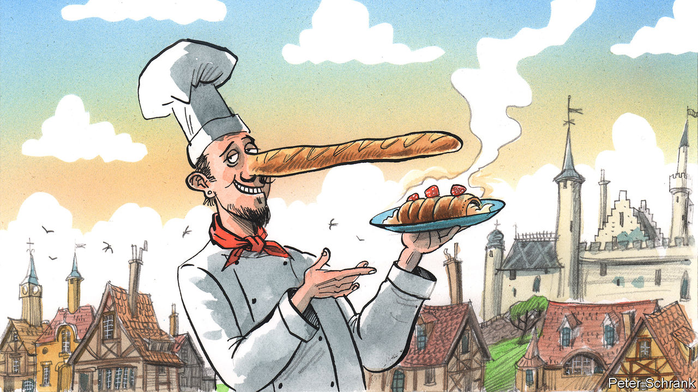

###### Charlemagne

# Why Europe’s traditional foods are not always what they seem 

##### A hungry columnist does some seasonal research 

 

> Dec 20th 2022 

Trudging around Prague’s narrow streets makes for hungry work. What better way to cap off a spot of sightseeing than with a local delicacy? How about a ? Throw a cobblestone in any direction in the Czech capital these days and it is likely to land on a stand peddling the unpronounceable snack. Think of it as a Danish pastry crossed with a rotisserie chicken: sweet dough is wrapped around a metal spit and theatrically twirled over glowing charcoals until browned, then dipped in nuts and sugar. The “old Bohemian speciality” advertised by the jolly vendor warms the hands on a chilly wintertime stroll; in summer it can be used as an ice-cream cone. Either way, for a few tasty minutes one can imagine oneself a burgher of medieval Prague, indulging a sweet tooth while traipsing over Charles Bridge. 

The only glitch in this alluring daydream is the fact that is no local snack at all. Nobody in Prague recalls seeing this supposed Czech staple for sale until about a decade ago. Even today, scent blankets the touristy bits of Prague like a smog, but is hard to find anywhere else. Food sleuths place as a delicacy from Romania or Slovakia, no more authentically Bohemian than a Big Mac. The allure to vendors is clear: the margins flogging a bit of warmed-up dough for 70 crowns (around $3) would have executives at McDonald’s salivating. Tourists see something plausibly authentic—how would they know?—and ask few questions. 

Europe paints itself as a land of food and tradition, and perhaps most of all as a land of food traditions. The French invented the restaurant, Italian food is the world’s most popular and Europeans consider wine made anywhere other than their little peninsula as a variant of rubbing alcohol. France, Spain and Italy hold the record for the amount of time spent at the table each day: an impressive two hours, twice the figure of burger-gobbling Americans. Traditional foods are protected by EU schemes to ensure that only an authorised caste can produce feta cheese, Champagne or ; UNESCO recently lauded the baguette as part of humanity’s cultural heritage. But as with , there is sometimes more to European grub than meets the palate. 

Take . Italy’s now-ubiquitous bread is paraded as a timeless Italian classic, perhaps once baked in the earthen ovens of ancient Rome. In fact the elongated loaf was devised in 1982 by Italian bakers trying to fend off the French baguette. Belgian beers top global league tables, known for their alcohol content, which can exceed that of wine. Is that distinctive feature the outcome of brewing traditions devised by the various monks and friars featured on the beers’ labels? Pish. The strength of low-country beer is a modern regulatory dodge. In 1919 Belgian taverns were banned from selling spirits, a prohibition that lasted until 1983. Drunks in search of an efficient tipple nudged breweries towards making strength beers.  followed soon enough.

The dairy lobby is a keen fabricator of heritage. It is largely down to Big Cheese’s Swiss arm, the , that fondue has emerged as Switzerland’s national dish. Facing a glut of Gruyère and Emmentaler in the 1930s as exports melted, cheese-peddlers proclaimed the Alpine virtues of a dish consisting overwhelmingly of cheese. British farm labourers of yesteryear were unfussy about their mid-day meals. Nevertheless in the 1960s the Milk Marketing Board revived the idea of a cheese-laden Ploughman’s Lunch, now a pub staple. As skimmed milk gained popularity in Ireland in the 1970s, a new way to use surplus cream was needed. Thus Bailey’s Irish Cream (a sickly mix of whiskey, cream and cocoa extract) was born. An Irish meadow on its label suggests centuries of heritage; in fact it is younger than Liam Gallagher.

Governments trying to nudge the populace towards new foods are nothing new. The potato went from South American curio to European favourite thanks in part to 18th-century French efforts to diversify away from wheat. Antoine-Augustin Parmentier, its keenest promoter, stationed armed guards around a potato patch to make it seem valuable and removed them at night so that peasants would steal and plant the tubers. Polish authorities in the 1940s started peddling carp—a bottom-feeding fish that tastes like muddy pond—in the absence of more flavourful fish. “A carp on every Christmas table” was advised; the fish (previously mostly a Jewish delicacy) was handed out to workers as festive bonuses. It has endured as a holiday staple. An even more ambitious fish-peddling scheme was later devised by Norway. In the 1980s supply of salmon exceeded domestic demand. Japan seemed an obvious market, but only tuna and sea bream were considered acceptable to eat as sushi and sashimi: at the time, the Japanese were as likely to eat raw salmon as an Italian to dip his spaghetti in mayonnaise. One marketing blitz (and a few discounted consignments of Norwegian salmon) later, a new tradition of orange sushi was born.

Grubby business

Why label a food traditional when the claim is so dubious? It is a type of marketing to which gourmets are predisposed. “Tradition, whether real or not, does seem to add an extra element of tastiness” to what we eat, says Megan Elias of Boston University, editor of , a journal. Food goes into our bodies, into our faces even. A dish can connect people across time—if the eater believes it to be authentic. 

Cookbooks, those archives of countries’ cuisines, first became popular in the latter 19th century, not coincidentally a golden era of European nation-building. For what forges a people into a nation? Some will say allegiance to a flag, a shared language or currency. Yet Italians are likely to have stronger feelings about how to cook pasta than about the symbols on their banknotes. The mouth and the heart are connected like no other organs. A Greek can enjoy pickled herring and a Finn a pint of Guinness, but not like a Swede or a Dubliner. They will feel no more sense of traditional connection than a Czech biting into a . ■


