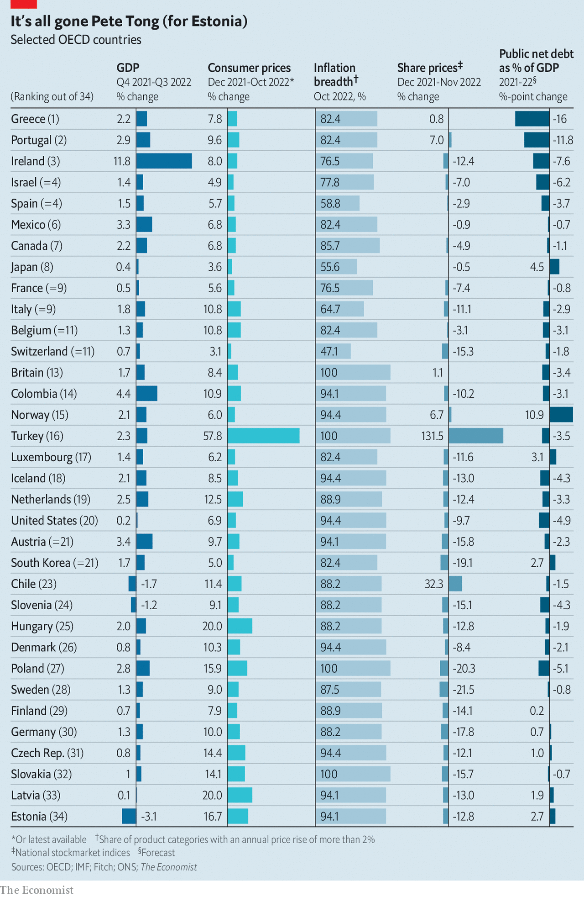

###### Top of the charts

# 2022’s unlikely economic winners 

##### Which countries performed best and worst this year? 

 

> Dec 18th 2022 

In financial terms the past year has been bad for almost everyone.  year-on-year across the rich world has slashed household incomes. Investors have lost out as global stockmarkets have plunged by 20%. Yet this poor aggregate performance hides wide differences: some countries have done pretty well. 

To assess these differences,  has compiled data on five economic and financial indicators—gdp, inflation, inflation breadth, stockmarket performance and government debt—for 34 mostly rich countries. We have ranked each economy according to how well it has done on these measures, and created an overall score. The table at the end of this article shows the rankings. It includes some unexpected results. 

For the first time in a while, the economic party is happening in the Mediterranean. Top of our list is Greece. Other countries that plumbed the economic depths in the early 2010s, including Portugal and Spain, also score highly. They are not the only pleasant surprises. Despite political chaos, Israel did well. Meanwhile, despite political stability, Germany is an underperformer. Two Baltic countries, Estonia and Latvia, which won plaudits in the 2010s for speedy reforms, come bottom. 

gdp, usually the best measure of economic health, is our first indicator. Norway (helped by high oil prices) and Turkey (by a boom in  with Russia) have done better than most. The fallout from covid-19 also looms large. Thanks to strict lockdowns and a collapse in tourism, a year ago much of southern Europe was in dire straits, so the region was due a decent year. Visits to the Balearics recently rebounded beyond their pre-pandemic level. As your correspondent discovered on a recent trip to Ibiza, the island is so busy it is difficult to book a taxi or find a spot at a half-decent restaurant.

Ireland probably had a strong year, though one not nearly as strong as gdp numbers suggest. The activities of big multinational companies, many registered there for tax purposes, have for years distorted the figures. By contrast, America’s gdp numbers are misleadingly weak: in recent quarters official statisticians have struggled to account for the impact of enormous stimulus packages. 

More granular data fill in the picture. Our second measure is the change in the price level since the end of 2021. Away from the world’s attention, some countries have seen low inflation. In Switzerland consumer prices have risen by just 3%. The country’s central bank, helped along by a strong currency, responded rapidly to the rise in prices earlier this year. Countries which have non-Russian energy sources—such as Spain, which gets much of its gas from Algeria—have also done better than average. Those reliant on Vladimir Putin for fuel have truly suffered. In Latvia average consumer prices have risen by a fifth. 

Our third measure also relates to inflation. It calculates the share of items in each country’s inflation basket where prices have risen by more than 2% in the past year. This provides an indication of how entrenched inflation is—and therefore hints at how quickly inflation will fall over the coming year. Some countries that suffer from high headline inflation have nonetheless been able to limit its breadth. In Italy, for instance, average consumer prices have risen by 11% this year, yet “only” two-thirds of its inflation basket has above-target inflation. Japanese inflation also looks like it may fade away. Britain is . The price of every category in its basket is rising fast. 

People’s sense of economic well-being does not just come from prices in the shops. They also look at the value of their pension pots and stock portfolios. In some countries it has been a terrible year for these sorts of investments. Share prices in both Germany and South Korea are down by nearly a fifth in 2022, double America’s decline. Swedish stocks have done even worse. Yet there are a few spots of strength. Norway’s stockmarket is up on the year. So is Britain’s, which is populated by the sort of dull, plodding companies that tend to be rewarded when economic times are tough. A fall in the value of the pound has also increased the value of foreign sales.

Our final measure concerns the change in net government debt as a share of gdp. In the short run ministers are able to paper over economic cracks by increasing spending or cutting taxes. However this can create more debt and thus the need to turn the fiscal screws in the future. Some governments have spent extravagantly to cope with the cost-of-living squeeze. Germany has allocated funds worth about 7% of gdp to help with sky-high energy costs, meaning its debt-to-gdp ratio has risen. Other countries have pulled back from the splurge, helping to right the fiscal ship. Assisted by high inflation, public debt in southern European countries seems to be on the way down. 

Will the gap between 2022’s winners and losers persist in 2023? Before long southern Europe’s economic growth, weighed down by rapidly ageing populations and high debts, will surely fall back to the region’s usual less-than-stellar levels. And there are hopeful signs that in countries such as  and Britain high inflation may finally be easing, which would help them up the rankings. 

Along other dimensions, differences are likely to persist, not least when it comes to those countries reliant on Mr Putin for their energy supplies. Against the odds, many managed to replenish their stores of natural gas before winter set in—but only by paying outrageous prices. With supplies now largely cut off, the coming year will be a lot more difficult. That will be a big concern in the Baltics, but less so on the other side of Europe. It is hard to worry about gas supplies while eating a giant plate of squid on an Ibicencan beach. ■

 


