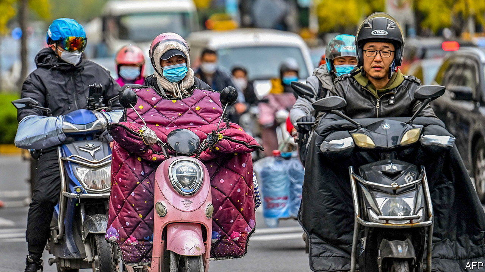

###### To protect and to swerve

# China’s leaders ponder an economy without lockdowns—or crackdowns 

##### Will market-friendly slogans turn into market-friendly policies? 

 

> Dec 20th 2022 

Each december the leaders of China’s Communist Party gather to discuss their “economic work” for the year ahead. The lengthy statement they then release to the public provides a clue to their thinking and priorities. But by the time the leaders met on December 15th and 16th in Beijing, the most fateful economic choice of the next 12 months had .

Whether by accident or design, local officials did not impose lockdowns in November on anything like the scale required to stop a widespread covid-19 outbreak. Their decision, if that is what it can be called, has brought an abrupt end to China’s “zero-covid” policy. Now unable to defeat the virus, China’s central government says it is too mild to be worth vanquishing.

This will be a great boon to China’s economy—eventually. Before the country can reach that happier future, it will have to navigate the world’s last great infection wave. According to hsbc, a bank, growth could fall below zero in the first quarter of 2023, compared with a year earlier.

The economy faces near-term threats to both supply and demand. Some members of the workforce will fall ill; others will take time off to look after stricken relatives. Schools have moved online in parts of China, trapping parents at home. As hospitals fill, local officials may try again to slow the disease’s spread by limiting traffic between regions, gumming up logistics. 

The bigger threat is to confidence and spending. Many Chinese came to resent the “zero-covid” regime, but lots still fear the disease. According to a survey by Bank of America, some 61% will stay home or go out less as infections rise. In November retail sales fell by more than 7%, adjusted for inflation, compared with a year earlier. 

In Beijing, where the virus is spreading rapidly, shopping centres are unusually quiet, even as fever clinics (and some bars) are packed with people seeking relief for their body (or spirit). The threat of infection in the country’s capital is so bad the National Bureau of Statistics cancelled its regular press conference reviewing the month’s economic figures—as good an indicator of China’s predicament as anything the bureau normally publishes.

Thus the country’s leaders will have their economic work cut out in 2023. But you would not necessarily know that from reading their statement. Just as China’s headline economic statistics are often suspiciously smooth, the statements China releases after its economic work conference are also artificially consistent. They repeat phrases (“proactive fiscal policy”) and slogans (“housing is for living in, not for speculation”) from previous years. 

Presumably the aim is to create the impression of . In last week’s statement, China’s abrupt swerve away from the “zero-covid” policy is mentioned only in passing. The statement notes that China will focus on the elderly and vulnerable, and calibrate its response to infections to “get through the latest covid-19 pandemic period smoothly”.

The statement does, though, recognise some of the dangers of a post-zero-covid world. China’s leaders must revive market confidence at home and restore China’s appeal to investors abroad, most of whom have not visited for years. “Improving public confidence and expectations” is listed as a good starting point for economic strategy in 2023. To foreign investors, China’s leaders promise “maximum convenience”.

The statement also provides a rare acknowledgment of criticism, or what it calls “incorrect” interpretations. It addresses the view that China has become inhospitable to private enterprise and indisposed to reforming its big state-owned enterprises. Examples include a clampdown on  and a regulatory blitz that humbled some of the country’s most successful e-commerce firms in 2021. In response, the statement promises China will make clear its adherence to the “two unswervings”, the name the party gives to its double commitment to consolidate the state sector and support the private sector. 

Robin Xing of Morgan Stanley, another bank, thinks China’s regulatory, macroeconomic and covid policies are aligned in favour of growth for the first time in three years. Others are more sceptical. The government’s attempt to repair confidence is like breaking a horse into pieces, reassembling it and expecting it to run again, according to one netizen. The doubters will want to see more evidence that China is as committed to private enterprise as it is to its market-friendly slogans. Official rhetoric is not always a good guide to policy. If it were, China would still be persisting victoriously with zero-covid. ■


