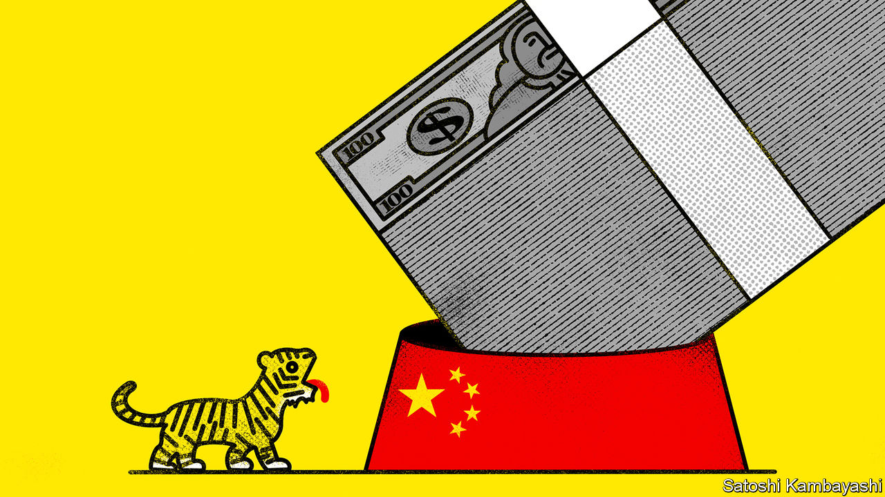

###### Buttonwood

# India’s stockmarkets are roaring. They also have serious faults 

##### Investors may have to look elsewhere for diversification 

 

> Dec 20th 2022 

Few stockmarkets flourished in 2022. Strong performers include ones in commodity-exporting countries like Brazil, Indonesia and the Gulf states, which have benefited from the squeeze on natural resources. They also include an oddity: India. The country’s Nifty 50 and Sensex indices reached record highs at the end of November. Indian stocks are up 4% in local-currency terms this year. Global stocks are down by 20%.

All this means it is a hopeful time for India. Investors are reconsidering their exposure to China, the largest emerging market. Even after a rebound triggered by China’s reversal of its “zero-covid” policies, the msci China index has fallen by a quarter since the start of 2020, reducing its annual return over the past decade to below 1%. To many fund managers desperate for diversification, India looks the most promising alternative.

Yet the country’s markets face problems that will limit its ability to take up this role. The most straightforward is their size. Indian stockmarkets are worth $3.4trn, less than the $6trn accounted for by stocks in Hong Kong and Chinese firms listed in New York—let alone the $10trn in stocks still mostly out of reach to international investors in mainland China. India could only absorb a fraction of any capital redeployed away from Chinese stocks now, and an even smaller share of what investors eventually hope to invest in the mainland.

Optimists argue that the growth of the Indian economy will solve this problem. it firms like Infosys and Tata Consultancy Services will benefit from outsourcing. The decision by Foxconn, a Taiwanese contract manufacturer, to produce iPhones and semiconductors in India hints at the potential for larger manufacturing hubs in the future, featuring home-grown firms. But there is a problem: Indian stocks are expensive. Their forward price-to-earnings ratio of around 22 is more than double Chinese stocks’ multiple of ten and more than three times Brazilian stocks’ multiple of seven. They are even pricey compared with America’s tech-heavy offerings. 

India is an importer of commodities, and the central bank has been forced to raise interest rates in defence of the rupee. This should have reduced valuations; the fact that it has not reflects an outbreak of retail mania. The number of participants in Indian markets has more than tripled since the start of 2022. In the same period retail buyers spent a net 3trn rupees ($36bn) on stocks, a stark rise from the minuscule inflows and occasional outflows recorded between 2015 and 2019. India’s economic prospects are strong, but 2023 looks likely to be a difficult year around the world. A slump in retail interest could see asset prices tumble.

India’s stockmarkets are far more open to foreign investors than mainland China’s. But when you broaden the lens to look at debt and currency trading, its capital markets remain only partly open, reflecting anxiety that speculation could destabilise the economy. Raghuram Rajan, governor of the Reserve Bank of India (rbi) in 2013-16, wanted to internationalise India’s markets and currency. Despite his instincts as a market-minded liberal, he made slow progress. In the past year the rbi has reportedly leaned on domestic banks, discouraging participation in the offshore rupee market, so as to retain more control of the currency’s value against the dollar.

There are signs that India wants to open up more. In October T. Rabi Sankar, deputy governor of the rbi, spoke of the need to entice the capital required to fund Indian growth, despite the reduced control of domestic monetary policy this would inevitably bring. Yet there are logistical hurdles. In the same month JPMorgan Chase decided not to include India in a widely followed bond index, reflecting investor concerns about fiddly registration processes and whether its clearing and settlement systems could handle a surge in inflows. In any case opening up India’s capital markets further would be a brave undertaking at a time when global markets are fragile and American interest rates are rising. 

India has a compelling story. It offers a vibrant it-services industry, a burgeoning domestic tech scene, an increasingly attractive location for global manufacturers—and strong economic growth. This is enticing when the appeal of its mighty neighbour to the northeast has diminished. But a pricey stockmarket and a tentative approach to opening up is preventing the country from achieving its potential in capital markets. Fund managers desperate for diversification should not rely on India alone.


