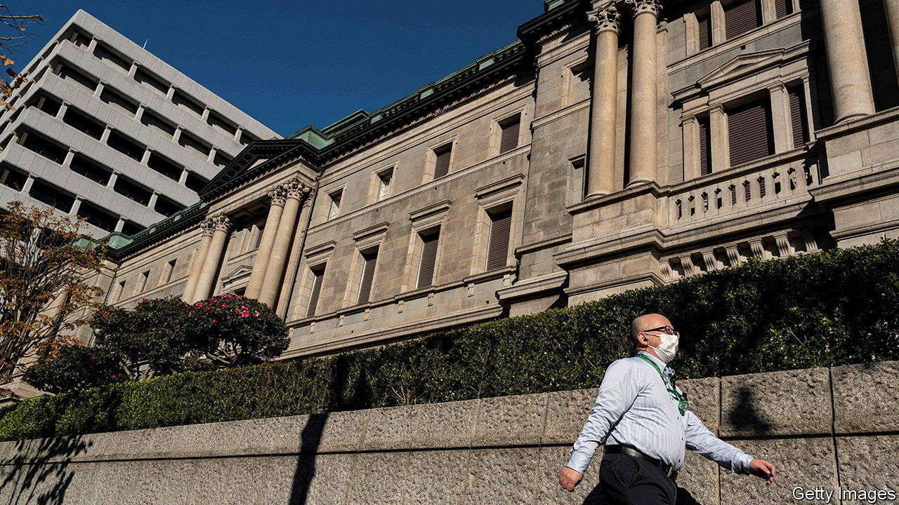

###### No time like the present

# The Bank of Japan shocks investors 

##### By lifting its bond-market peg, the bank may herald a period of tightening 

 

> Dec 20th 2022 

In recent months anticipation had grown that in 2023 the Bank of Japan (boj) would at last tighten monetary policy after years of no-holds-barred stimulus. Almost nobody expected it to happen in 2022. But on December 20th the bank lifted its cap on ten-year government-bond yields from 0.25% to 0.5%. The Christmas surprise caused the yen to surge—and set off speculation about what might come next.

Since 2016 the boj has intervened in bond markets to keep the ten-year bond yield at around 0%, a policy known as “yield-curve control”. Technically, the bank permitted fluctuations of a quarter of a percentage point around the 0% goal. But the upper limit of 0.25% is what mattered, especially this year, as upward pressure on yields built around the globe. Now the boj will allow moves of half a percentage point around zero. After the announcement, the ten-year bond yield surged from 0.25% to 0.4%, its biggest daily shift since 2003.

 


The boj had been a global outlier, maintaining ultra-loose policy even as America’s Federal Reserve and other central banks chose to raise interest rates sharply. Japan’s benchmark interest rate of -0.1% has not moved in almost seven years and the bank owns over half of the government bond market. Yield-curve control was implemented as a way of allowing the boj to control long-term interest rates without running out of bonds to buy. Paradoxically, when central banks credibly promise to peg the price of an asset, they often need not intervene much to enforce the policy. The market implements the peg by itself.

For most of the policy’s history that more or less worked. In 2022, however, the peg has come under considerable pressure as traders have speculated that monetary policy would need to be tightened. The chasm between the policies of Japan and those in the rest of the rich world caused the yen to plunge by 23% against the dollar from the start of 2022 to mid-October. In October, annual inflation was 3.6%, a 40-year high and well above the BOJ’s 2% target. Though most of the inflation was imported, many central banks have been caught out since the covid-19 pandemic by assuming price growth will cool without tighter monetary policy.

Yet it was widely assumed that any pivot by the boj would come after its current governor, Kuroda Haruhiko, leaves in April. That policymakers moved faster makes sense: it spares the boj months of bond-buying to enforce the old cap, and the greater losses it would endure on its bigger bond portfolio. 

How far will Japan’s central bank now go? After the announcement the dollar fell by 3.4% against the yen, but the Japanese currency remains at its weakest level in two decades. Economists are watching the , Japan’s springtime wage negotiations between large companies and trade unions, for more signs of inflation. Japanese firms raised winter bonuses by 9.7%, according to , a business newspaper, the largest such increase since 1975.

Mr Kuroda claims that he has not tightened monetary policy, only responded to volatile market conditions. Yet the announcement was his “ present”, according to Jesper Koll of Monex Group, a Japanese brokerage. “It opens the door for ‘Operation Freedom’ for whoever his successor will be.” Japanese financial markets could be in for a turbulent 2023. ■


