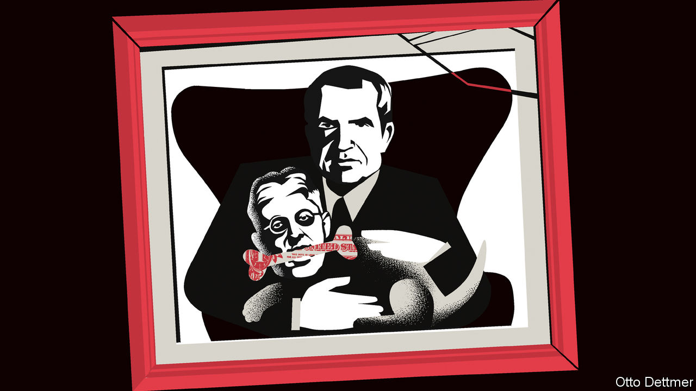

###### Free exchange

# The Federal Reserve’s great anti-hero deserves a second look 

##### Lessons for modern policymakers from Arthur Burns 

 

> Dec 20th 2022 

Since inflation took off, a former Federal Reserve chair has been on the minds of politicians and pundits. A number have argued that Jerome Powell, the current incumbent, must not become the next Arthur Burns. As chair of the Fed in the 1970s, Burns represents central-banking failure: a weak leader who blinked in the face of inflation and steered the economy towards disaster. 

It is not that this warning from history is incorrect. Richard Nixon picked Burns to run the Fed, viewing him as a friend who would do his bidding. Despite stubborn inflation, Nixon pressed Burns to cut interest rates in 1971, thinking it would help him win re-election. Sure enough, the Fed did just that. Nixon was re-elected and inflation soared, hitting double digits by 1974.

But the story is more complicated than the basic outlines suggest, and its complexity contains lessons for today’s policymakers. With the holiday season upon us—and with the Fed approaching a turning point in monetary policy—it is a fine time to reassess the legacy of the much-maligned central banker.

Start with what happened after inflation took off. The Fed jacked up interest rates from 3% in 1972 to 13% in 1974, one of its sharpest-ever doses of tightening, and enough to help tip the economy into a deep recession. Doing so took some of the heat out of price growth, with inflation settling at around 6% for the remainder of Burns’s tenure. This was uncomfortably high, and Burns never delivered the death blow to inflation that Paul Volcker did in the early 1980s. Nevertheless, his initial assault heralded a new era. In 2016 economists from the Fed’s branch in Richmond assessed monetary-policy settings over the years. Their model suggested that the “Volcker shock” had not appeared like a bolt from the blue. Burns had laid the groundwork for it.

He did this in formidable circumstances. An oil shock that began in 1973 led to a near quadrupling in energy prices as well as a surge in food costs. A second oil shock in 1978, just after Burns left the Fed, kicked off another inflationary surge. Given this backdrop, how much of the inflation can truly be blamed on the Fed? A review written in 2008 by Alan Blinder and Jeremy Rudd, two economists, found that supply-side factors were decisive. They calculated that the energy and food crises accounted for more than 100% of the rise in headline inflation relative to its baseline level. The Fed could have reacted more strongly, given that inflation had already been unanchored. But Burns was not responsible for the massive shocks facing the economy.

Burns’s troubles also illustrate the pitfalls of real-time indicators. The Fed today is seen as “data-dependent”. If inflation momentum stays relatively weak, its next rate rise is likely to be one quarter of a percentage point; if inflation shoots back up, a half-point rise may be on the menu. That is entirely reasonable. But consider the head-fake of 1975. Initial data from the first quarter registered a 10% annualised drop in gdp and a remission in price pressure. The Fed cut rates aggressively. Subsequent revisions showed that the gdp loss was only about 5% and that inflation had remained persistent. If this had been known at the time, Burns’s Fed might well have acted differently.

That real-time figures may be flawed is, on one level, not terribly helpful: it is impossible to know whether future revisions will push growth up or down. Yet this uncertainty does counsel against overreacting to limited data. Having tightened policy so much over the past year, the Fed wants to proceed more gingerly. Even if there is an upside surprise in inflation between now and its next meeting in February, sticking to that gradualism may still be the right course—just as Mr Powell has avoided reading too much into an apparent inflation slowdown in November.

The main economic outcome associated with Burns’s Fed is, of course, high inflation. But his relatively loose policy also fuelled an investment boom. Capital expenditures—that is, money spent by businesses on things such as buildings and equipment—reached about a third of American gdp in 1978, which still stands as the highest level since at least 1946. Responding to the supply shocks at the time, much of that went into energy and commodity production. Jeffrey Currie of Goldman Sachs, a bank, recently noted that these investments helped to “de-bottleneck” oil and metals production capacity for decades, setting the economy up for lower inflation in the long run.

Today the world’s economy is at another inflection point. The frayed global trading system, declining immigration and climate change may well constrain America’s productivity, leading to persistently lower growth and higher inflation. There is also renewed debate among economists about whether the Fed should pursue a slightly higher inflation target than 2%. Such a switch could help it to avoid squeezing the economy too hard amid profound challenges. The Fed’s task is to accurately forecast the future shape of the economy and its interaction with monetary policy. The deep effects of the 1970s’ investment boom are a reminder that it must pay heed to the current array of economic structural shifts.

First-degree Burns

The closer one examines Burns’s record, the more that complexities emerge. The former Fed chair carefully managed the dissolution of a major bank in 1974, in an augury of the central bank’s present framework of letting bad firms fail so long as doing so does not precipitate a financial crisis. His advocacy of wage controls is now seen as a classic example of bad policy, doomed to failure. Yet the context was a powerful union movement which had locked in upward cost-of-living adjustments—something that no longer exists. Even his relationship with Nixon is far from straightforward. Burns was no sycophant, and did at least try to resist the president’s bullying. All this provides the final and most important lesson from the Fed’s great anti-hero: historical analogies are useful, but rarely the whole story. ■


