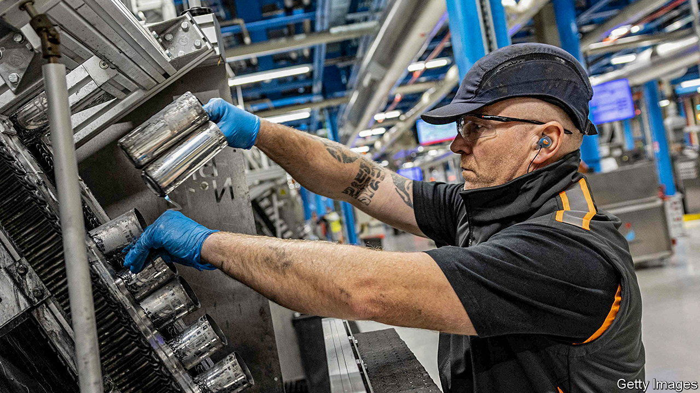
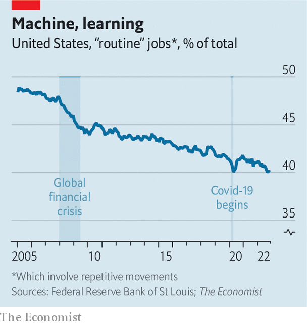

###### Robots and jobs

# The pandemic and the triumph of the Luddites 

##### Covid-19 was meant to lead to job-killing automation 

 

> Dec 20th 2022 

It was meant to be a bloodbath. When covid-19 struck in early 2020, economists warned that a wave of job-killing robots would sweep over the labour market, leading to high and structural unemployment. One prominent economist, in congressional testimony in the autumn, asserted that employers were ”substituting machines for workers”. A paper published by the imf in early 2021 said that such concerns “seem justified”. Surveys of firms suggested they had grand plans to invest in artificial intelligence and machine learning.

Wonks had plenty of reason to worry. Recessions cause many companies’ revenues, but not wages, to fall, making workers less affordable. Some previous downturns had produced bursts of job-killing automation, depriving people of work and leaving them at least temporarily on the economic scrapheap. Covid seemed to pose an extra threat to workers. People get sick; robots do not. Past pandemics, research suggests, have hastened automation.

More than two years on, however, it is hard to find much evidence of job-killing automation. Rather than workers complaining about a shortage of jobs, bosses complain about a shortage of workers. Across the oecd club of mostly rich countries, there is an unusually large number of unfilled vacancies, even as recession nears. In many countries the wages of the lowest-paid, the people thought to be most at risk of losing their job to a robot, are rising the fastest. 

To test the doomsters’ predictions more directly, we dug into occupational data for America, Australia and Britain. Borrowing a methodology developed by the Federal Reserve Bank of St Louis, we divided occupations into “routine” and “nonroutine” buckets. Routine jobs involve repetitive movements, which can be more easily learned by a machine or computer, making them in theory more vulnerable to automation. 

 


Over time, and especially during past recessions, routine jobs have declined as a share of the workforce (see chart). But during the pandemic the rate of decline actually slowed. In the two years before the pandemic automatable jobs in Australia, as a share of the total, fell by 1.8 percentage points. In the two subsequent years they fell by 0.6 percentage points. We find similar trends in Britain, though a recent coding change makes analysis trickier. America today has slightly more routine jobs than you would expect based on pre-pandemic trends. 

Economists are now working on theories which will be less prone to malfunction. Perhaps the routine roles which remain are particularly difficult to automate. Perhaps in some cases technology actually improves, rather than damages, workers’ prospects. For now a simple rule will suffice: next time you hear a blood-curdling prediction about robots and jobs, think twice. 


