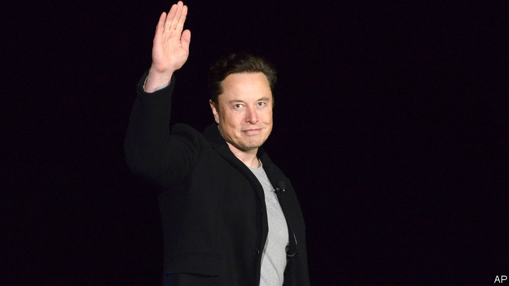

###### Twitter

# Elon Musk’s $44bn education on free speech 

##### He has had a crash course in the trade-offs in protecting free expression 

 

> Dec 19th 2022 

Elon Musk’s two months running Twitter has been an unhappy experiment. The social network’s 250m users have endured a wearying saga in which Mr Musk is the central character. Advertisers have fled. Twitter, which lost $221m in 2021, is now on track to lose $4bn a year, by one estimate. The damage has spread to Tesla, Mr Musk’s carmaker, part of the reason it has lost half a trillion dollars in market value since early September, costing Mr Musk the title of the world’s richest man.

On December 19th it looked as if Mr Musk might throw in the towel, after Twitter users voted for him to step down as chief executive. It has been a costly adventure. But in one sense his  of the social network has done the rest of the world a favour. In two short months Mr Musk has been through a public crash course in the principles of free speech, neatly demonstrating the trade-offs involved in protecting expression online.

From the outside, Twitter seemed simple to someone whose day job was building self-driving cars and space rockets. Mr Musk, a self-described “free-speech absolutist”, had grown concerned (with some justification) that Twitter had been captured by censorious left-wing scolds. Shortly after agreeing to  he explained his approach to moderation: “By ‘free speech’, I simply mean that which matches the law.”

In practice he has found that the right to speech  with other rights. One is safety. Last month Mr Musk said that his commitment to free speech meant he would not ban a Twitter account that tweeted the whereabouts of his private jet, even though he considered this a security risk. But on December 14th he changed his mind after a “stalker” bothered his son. After suspending the jet account, Twitter introduced rules outlawing the reporting of others’ real-time locations.

As well as limiting speech in the name of safety, Mr Musk has curtailed it to avoid the lesser sin of causing offence. In October the number of views of tweets that Twitter deems “hate speech” doubled, as users tested the limits of Mr Musk’s new regime. Rather than allow this legal-but-nasty content, Twitter cracked down. In November hateful tweets recorded one-third fewer views than before the takeover. Earlier this month Twitter suspended the account of Ye, a rapper formerly known as Kanye West, after he posted a picture of a swastika within a Star of David—an image that, however grotesque, is nonetheless permitted by America’s laws.

Mr Musk even limited speech when it was bad for profits. After pranksters sent tweets aping brands like Pepsi (“Coke is better”) and Nestlé (“We steal your water and sell it back to you lol”), Twitter outlawed such behaviour to stop advertisers fleeing. Then, to stem an exodus of users, on December 18th Twitter said it would ban people from linking to rival social networks or posting their usernames. When questions were raised as to whether regulators would consider such a move anticompetitive, Mr Musk apologised and free speech was restored.

All this holds two lessons for whoever follows Mr Musk as Twitter’s boss, should he leave. One is to keep content moderation at arm’s length. The person deciding whether a post is acceptable is compromised if they are also responsible for boosting engagement among users and spending by advertisers. Mark Zuckerberg (whose reputation has risen in light of Mr Musk’s pratfalls) realised this and outsourced Facebook’s biggest moderation headaches to an independent “oversight board” in 2020.

The second lesson is that moderation has no clean solutions, even for “technokings” with strong views on free speech. Free expression is not a problem with a solution bounded by the laws of physics that can be hacked together if only enough coders pull an all-nighter. It is a dilemma requiring messy trade-offs that leave no one happy. In such a business, humility and transparency count for a lot.

These are novel concepts to some in Silicon Valley, who are impatient to tear up the established ways of doing things. But just as cryptocurrency enthusiasts have recently received a bracing lesson in the value of boring old financial prudence, so Mr Musk and his fellow free-speech enthusiasts are learning why free expression has caused many to scratch their heads over the centuries.  have suffered a sharp correction in 2022. It has also been a chastening year for tech egos. ■

